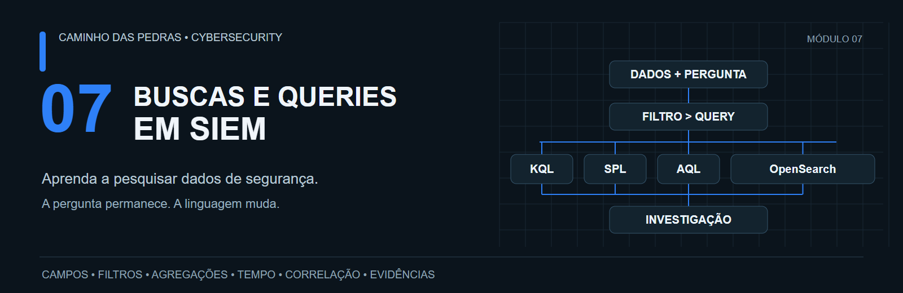
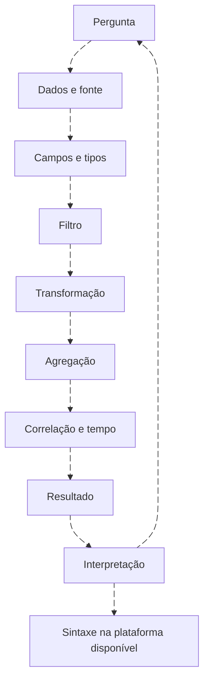
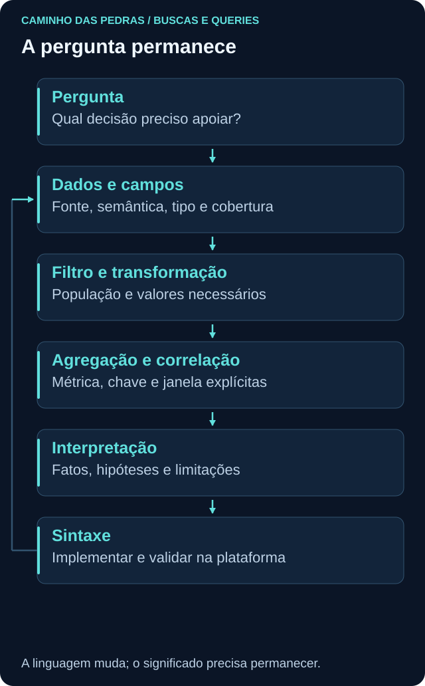

# 07 Buscas e Queries em SIEM

<!-- markdownlint-configure-file {"MD033": {"allowed_elements": ["details", "summary"]}} -->

[← Tópico anterior](../06-SIEM-na-Pratica/README.md) · [↑ Índice do módulo](README.md) · [Página principal](../README.md) · [Próximo tópico →](fundamentos-de-consulta.md)



KQL, SPL, AQL e consultas no ecossistema Wazuh/OpenSearch.

> Você precisa decorar quatro linguagens para trabalhar com quatro SIEMs?

Não. Você precisa transformar uma pergunta de segurança em uma consulta e conferir se a resposta representa os dados disponíveis. A pergunta permanece. A linguagem muda.

O [módulo 06](../06-SIEM-na-Pratica/README.md) explica a plataforma e o caminho dos logs. Aqui você aprende a perguntar aos dados: escolher uma população, definir campos, tratar tempo, agregar, relacionar e interpretar. A [engenharia de detecção](../08-Detection-Engineering/README.md) aprofunda o ciclo operacional depois.

## Pense antes de escolher sintaxe





## Uma pergunta, quatro sintaxes

Quantas falhas de autenticação ocorreram por host nas últimas 24 horas?

| Decisão | Escolha inicial |
| --- | --- |
| Pergunta | Quantas falhas por host? |
| Fonte | Windows Security Log |
| Evento | 4625, com provedor validado |
| Tempo | Últimas 24 horas, relógio e fuso conferidos |
| Agrupamento | Host que registrou o evento, não coletor |
| Métrica | Quantidade de ocorrências representadas |

Antes de executar, leia [campos e schemas](campos-e-schemas.md). SPL e AQL abaixo têm campos de laboratório explicitamente configurados. No indexer, a contagem é de documentos; no QRadar, eventcount considera coalescência. Não compare números sem verificar a unidade.
<details>
<summary>Ver consulta em KQL</summary>

```kusto
SecurityEvent
| where TimeGenerated >= ago(24h) and TimeGenerated < now()
| where EventID in (4625)
| summarize Total=count() by Computer
| order by Total desc
```

</details>

<details>
<summary>Ver consulta em SPL</summary>

```spl
index=windows source="XmlWinEventLog:Security" earliest=-24h latest=now (EventCode=4625)
| stats count AS total by lab_host
| sort 0 -total
```

</details>

<details>
<summary>Ver consulta em AQL</summary>

```sql
SELECT "LabComputer", SUM(eventcount) AS total
FROM events
WHERE "LabProvider" = 'Microsoft-Windows-Security-Auditing'
AND "LabEventID" IN ('4625')
GROUP BY "LabComputer"
ORDER BY total DESC
LAST 24 HOURS
```

</details>

<details>
<summary>Ver consulta em Query DSL no indexer Wazuh</summary>

```json
{
  "size": 0,
  "track_total_hits": true,
  "query": {
    "bool": {
      "filter": [
        {
          "range": {
            "timestamp": {
              "gte": "now-24h",
              "lt": "now"
            }
          }
        },
        {
          "term": {
            "data.win.system.providerName": "Microsoft-Windows-Security-Auditing"
          }
        },
        {
          "terms": {
            "data.win.system.eventID": [
              "4625"
            ]
          }
        }
      ]
    }
  },
  "aggs": {
    "grupos": {
      "terms": {
        "field": "data.win.system.computer",
        "size": 50,
        "show_term_doc_count_error": true
      }
    }
  }
}
```

</details>

KQL filtra e depois agrupa. SPL seleciona o índice e calcula stats. AQL descreve seleção, filtro e agrupamento em cláusulas. Query DSL define filtros e aggregations num objeto JSON. `size: 0` elimina hits da resposta, mas mantém a agregação. Top buckets não garantem inventário completo de hosts; veja [agregações](agregacoes.md).

## O que você aprenderá

| Etapa | Pergunta orientadora | Entrega |
| --- | --- | --- |
| Fundamentos | Onde está o dado e o que cada campo significa? | Contrato de consulta |
| Filtros e transformações | Quais eventos e colunas devem permanecer? | Query com amostra conferida |
| Tempo e agregação | O que a métrica conta e em qual janela? | Resultado explicado |
| Enriquecimento e correlação | Qual chave sustenta a relação? | Timeline com limites |
| Investigação e hunting | Qual hipótese os dados apoiam ou enfraquecem? | Relatório reproduzível |
| Query para detecção | Como testar a lógica antes de operacionalizar? | Matriz de casos e limitações |

## Jornada do módulo

Siga os níveis: 1 encontrar, 2 filtrar, 3 selecionar campos, 4 ordenar, 5 contar, 6 agrupar, 7 criar campos, 8 trabalhar com tempo, 9 enriquecer, 10 relacionar datasets, 11 correlacionar eventos, 12 hunting e 13 apoiar detecções.

- [Fundamentos de consulta: a pergunta primeiro](fundamentos-de-consulta.md)
- [Não existe boa query sem conhecer os campos](campos-e-schemas.md)
- [Operadores e transformações: preserve o significado](operadores-e-transformacoes.md)
- [Strings, caminhos e regex com contexto](strings-e-regex.md)
- [Tempo em queries: intervalos e ordem](tempo-em-queries.md)
- [Agregações: o que exatamente você está contando?](agregacoes.md)
- [Lookups e enriquecimento: contexto verificável](lookups-e-enriquecimento.md)
- [Baseline, raridade e ausência de dados](baseline-e-ausencia.md)
- [Join não é sinônimo de correlação](correlacao-e-joins.md)
- [A mesma pergunta em diferentes SIEMs](traduzindo-queries.md)
- [KQL: tabelas, pipelines e contexto de segurança](kql.md)
- [SPL: pesquisa e transformação no Splunk](spl.md)
- [AQL: perguntar ao Ariel sem presumir SQL genérico](aql.md)
- [Wazuh, OpenSearch e as camadas de pesquisa](wazuh-opensearch.md)
- [Pivot: transforme um achado em outra pergunta](pivot.md)
- [Investigação e timeline: fatos, hipóteses e lacunas](investigacao.md)
- [Threat hunting: da hipótese à revisão](threat-hunting.md)
- [Queries para apoiar detecções](queries-para-deteccoes.md)
- [Performance: medir custo sem mudar a pergunta](performance.md)
- [Troubleshooting: consulta vazia ou ampla demais](troubleshooting-queries.md)

## Laboratórios

Os [dez labs](labs/README.md) começam sem SIEM, com uma tabela fictícia. Avance para consultas, pivôs e investigação multisiem. A execução offline confirma resultados do dataset; não substitui testes em produtos. Use uma plataforma disponível e traduza outra sem afirmar execução que não fez.

## Checklist individual

[Criar minha Issue de progresso](https://github.com/meloalan/Caminho-das-Pedras-CyberSecurity/issues/new?template=modulo-07-buscas-queries-siem.md). Cada pessoa mantém seus próprios itens; nada é marcado automaticamente.

## Entregas para portfólio

Produza uma investigação em duas linguagens, uma tabela de tradução, uma timeline, um hunt documentado e uma query de detecção com hipótese, fontes, campos, lógica, limites, falsos positivos e testes. Publique somente dados fictícios. Registre resultado esperado e obtido separadamente.

## Checkpoint

**Qual parte permanece ao trocar de SIEM?**

<details>
<summary>Ver resposta</summary>

A pergunta, o significado dos campos, a população, a janela, a métrica e a validação. A sintaxe e o mecanismo de execução podem mudar.

</details>

[← Tópico anterior](../06-SIEM-na-Pratica/README.md) · [↑ Índice do módulo](README.md) · [Página principal](../README.md) · [Próximo tópico →](fundamentos-de-consulta.md)
