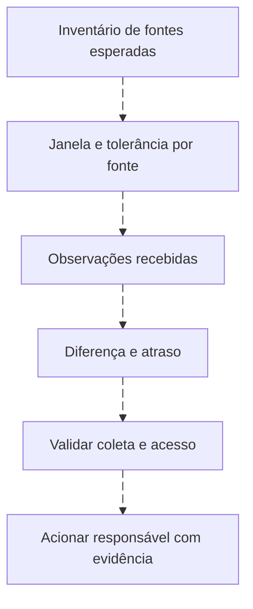
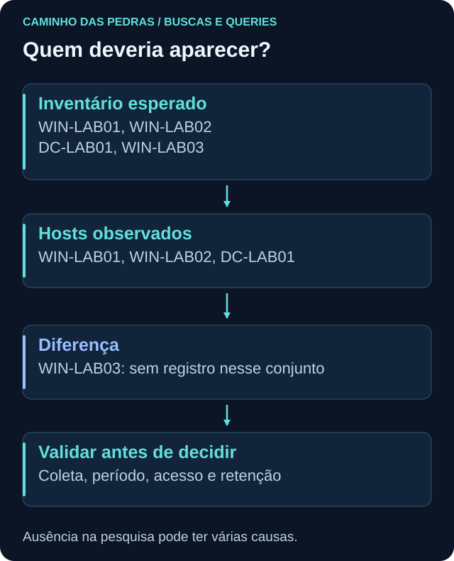

# Baseline, raridade e ausência de dados

<!-- markdownlint-configure-file {"MD033": {"allowed_elements": ["details", "summary"]}} -->

[← Tópico anterior](lookups-e-enriquecimento.md) · [↑ Índice do módulo](README.md) · [Página principal](../README.md) · [Próximo tópico →](correlacao-e-joins.md)

## Baseline não é um valor mágico fixo

Compare com histórico da mesma população: usuário, host, grupo funcional, turno, dia útil e cobertura. Um servidor novo não tem o mesmo histórico de uma estação antiga. Mudanças, incidentes e coleta incompleta também entram no passado observado.

## Comparação simples por dias equivalentes

```kusto
SecurityEvent
| where TimeGenerated >= ago(14d) and TimeGenerated < startofday(now())
| where EventID == 4625
| summarize Falhas=count() by Computer, Dia=startofday(TimeGenerated)
| summarize MediaDiaria=avg(Falhas), Minimo=min(Falhas), Maximo=max(Falhas), DiasObservados=count() by Computer
```

Primeiro forma dias com registros; depois resume esses dias por host. Dias ausentes não viram zeros automaticamente, por isso DiasObservados é essencial. Não compare essa média com uma hora atual. Uma avaliação de produção precisa calendário, cobertura e dias equivalentes. O dataset de dois dias dos labs é deliberadamente insuficiente para afirmar normalidade semanal.

Em SPL, use bin _time span=1d, stats por host/dia e depois stats de média/extremos. Em AQL, DATEFORMAT pode agrupar horas/dias segundo fuso; exporte série completa para comparação estatística quando a transformação não tiver equivalente adequado. Em Query DSL, date_histogram e métricas produzem a série; extended_bounds/min_doc_count podem incluir buckets vazios, mas não demonstram que a fonte estava saudável nesses períodos.

## Raridade precisa de conjunto completo

Processo executado uma vez, usuário novo em host e IP sem histórico são candidatos a perguntas. Compare função do ativo, baseline, implantação e retenção. “Nunca visto” significa “não encontrado no período/dataset acessível”, não nunca ocorrido.

No KQL, compare conjuntos atual/histórico com leftanti usando chave adequada. No SPL, agrupe por relação e acompanhe primeiro/último horário; diferencie um dia recente de toda a retenção. AQL pode ordenar agregados, com contagem eventcount coerente. No indexer, agregações terms mais raras podem ser inexatas; para um conjunto pequeno, percorra todos os documentos, ou use composite paginada compatível.

## O que deveria existir, mas sumiu?

Uma query que agrupa apenas eventos recebidos não encontra hosts totalmente ausentes. Comece com inventário esperado, horário de atividade e tolerância. Faça diferença entre esperados e observados.





No dataset, WIN-LAB03 está no inventário e não tem eventos. Isso ensina diferença de conjuntos, não prova agente quebrado. WQL status=disconnected pode consultar estado de agente, mas é outro indicador: agente ativo ainda pode deixar de coletar um canal específico.

## Prática

Compare [inventário](labs/dados/inventario.csv) e eventos. Liste host observado, última observação e ausente. Depois simule uma restrição de acesso ao índice: a mesma ausência aparente pode ter outra causa. Documente a hipótese e o teste que distingue as duas situações.

## Checkpoint

**Um bucket vazio comprova zero atividade?**

<details>
<summary>Ver resposta</summary>

Não. Pode representar falta de coleta, filtro, acesso ou retenção. Zero confirmado exige cobertura conhecida.

</details>

[← Tópico anterior](lookups-e-enriquecimento.md) · [↑ Índice do módulo](README.md) · [Página principal](../README.md) · [Próximo tópico →](correlacao-e-joins.md)
