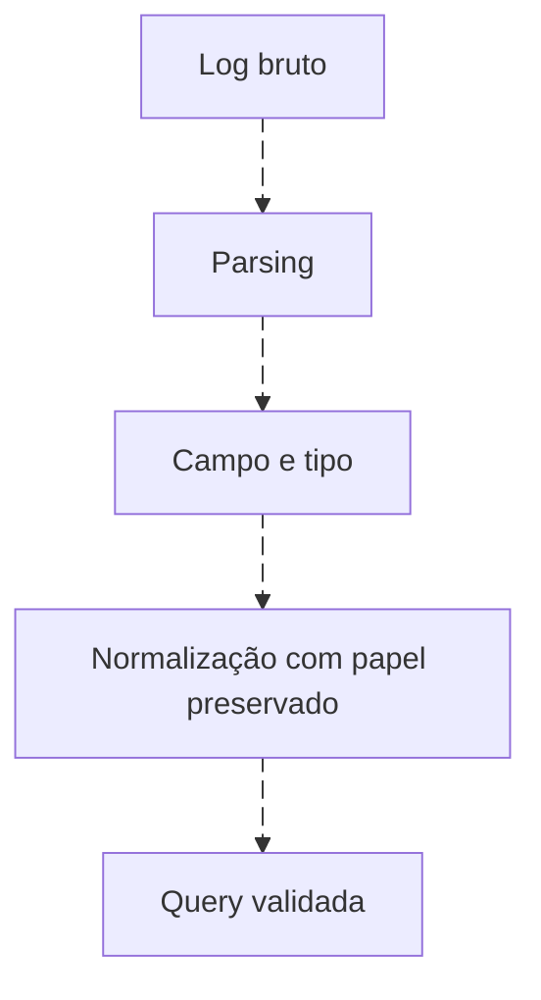
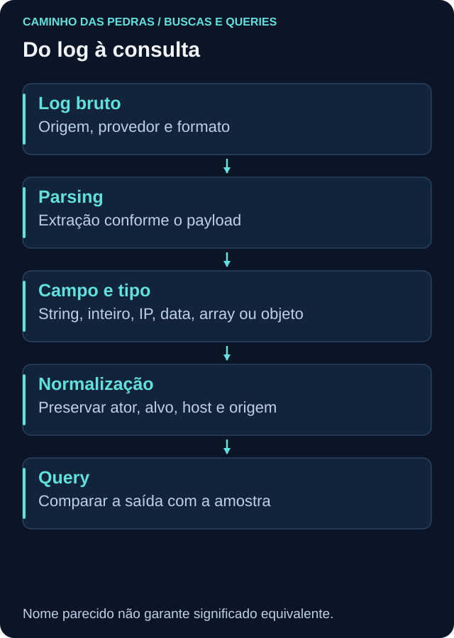

# Não existe boa query sem conhecer os campos

<!-- markdownlint-configure-file {"MD033": {"allowed_elements": ["details", "summary"]}} -->

[← Tópico anterior](fundamentos-de-consulta.md) · [↑ Índice do módulo](README.md) · [Página principal](../README.md) · [Próximo tópico →](operadores-e-transformacoes.md)

## Um nome parecido não é um contrato

`src_ip`, `source.ip`, `SourceIp`, `SourceIP`, `sourceAddress` e `client_ip` podem ter significados próximos ou representar proxy, cliente, sensor e endpoint diferentes. Confira schema, parser, normalização, tipo, origem, significado e documentação. O nome exato do campo depende do parser/schema utilizado.

## Contrato operacional do módulo

Referências consultadas em 25/09/2026: KQL em Azure Monitor/Sentinel; SPL clássico de Splunk Enterprise (não SPL2); AQL documentado para QRadar 7.5/7.6; Wazuh 4.14 e API do indexer. Recursos de OpenSearch latest não são automaticamente suportados pelo indexer instalado. Confirme sua versão.

| Semântica | KQL SecurityEvent | SPL: aliases a configurar | AQL: propriedades customizadas | Wazuh: documento Windows |
| --- | --- | --- | --- | --- |
| Ocorrência | TimeGenerated | _time validado | starttime validado | data.win.system.systemTime |
| Tempo de índice/registro | ingestion_time() quando disponível | _indextime | storage time conforme schema | timestamp pode ser processamento |
| Host original | Computer | lab_host | LabComputer | data.win.system.computer |
| Event ID | EventID: inteiro | EventCode extraído | LabEventID: texto | data.win.system.eventID: texto |
| Conta alvo | TargetUserName | lab_user | LabUser | data.win.eventdata.targetUserName |
| Autoridade alvo | TargetDomainName | lab_domain | LabDomain | data.win.eventdata.targetDomainName |
| Ator | SubjectUserName | lab_actor | LabActor | data.win.eventdata.subjectUserName |
| Origem | IpAddress | lab_source_ip | LabSourceIP | data.win.eventdata.ipAddress |
| Tipo de logon | LogonType | lab_logon_type numérico | LabLogonType texto | data.win.eventdata.logonType |

AQL exige também `LabProvider`, extraído do provedor original; **QID não é Event ID Windows**. Nomes Lab não são colunas nativas universais. Configure extrações no DSM Editor e compare com payload. Para SPL, valide o add-on Windows e aliases; `source="XmlWinEventLog:Security"` é a entrada XML escolhida, não valor garantido em toda instalação.

Para Sysmon, KQL usa WindowsEvent com `Provider`, `EventID` e `EventData` dinâmico. SPL exige source Sysmon e aliases `lab_image`, `lab_parent`, `lab_command`, `lab_process_guid`, `lab_destination_ip`, `lab_query_name`, além de usuário/host. AQL usa propriedades `LabImage`, `LabParent`, `LabCommand`, `LabProcessGuid`, `LabDestinationIP`, `LabQueryName`. No Wazuh, valide `data.win.eventdata.image`, `parentImage`, `commandLine`, `processGuid`, `destinationIp` e `queryName`. Provedor e ID delimitam o significado.

Term/terms e agregações JSON assumem os campos exatos como keyword, sem acrescentar `.keyword` às cegas. Consulte mapping primeiro. Archives precisa estar habilitado e indexado; alerts contém uma seleção produzida por regras, não todos os eventos.

## Papéis específicos de processo, grupo e sessão

Em 4688, mapeie NewProcessName, ParentProcessName, CommandLine e NewProcessId para `lab_image`, `lab_parent`, `lab_command`, `lab_process_id` no SPL e `LabImage`, `LabParent`, `LabCommand`, `LabProcessID` no AQL. O ator vem de SubjectUserName. Para Sysmon, os campos correspondentes vêm de Image, ParentImage, CommandLine e ProcessId; confira provider antes de normalizar.

Em 4728/4732, TargetUserName/TargetDomainName identificam o **grupo alvo**, e MemberName/MemberSid identificam o membro. Os aliases `lab_user`/`LabUser` usados na projeção genérica mostram esse Target, não a pessoa adicionada. Configure `lab_member`/`LabMember` pelo membro e `lab_group_sid`/`LabGroupSID` pelo TargetSid do grupo. Preserve ator separadamente.

Para o caso final, configure `lab_session`/`LabSession` como TargetLogonId em 4624 e SubjectLogonId em 4672. Preserve tipo/provedor e não atribua sessão do sucesso às falhas 4625. No Sysmon, LogonId pode oferecer vínculo com a sessão, mas host, identidade e tempo precisam coincidir. Normalize representação hexadecimal de modo consistente; não transforme strings em números sem conhecer a base.

## Conferência de amostra

1. Recupere um registro conhecido e compare o original com os campos.
2. Confira tipos, valores vazios, arrays, caixa, fuso e campos truncados.
3. Separe Subject/ator de Target/alvo; para Sysmon, User representa identidade do processo.
4. Compare o host original com o nome do agente e do coletor.
5. Salve contrato, versão e uma amostra fictícia como evidência de teste.

## Modelos de normalização ajudam, não apagam diferenças

CIM no Splunk define modelos e convenções sem fazer de todo índice um schema físico idêntico. ASIM no Sentinel usa parsers/modelos para consultas normalizadas; não é obrigatório em toda query KQL. DSM do QRadar interpreta payload e produz propriedades. Decoder Wazuh extrai dados; regra avalia condições; a pesquisa consulta documentos indexados. Nenhum desses mecanismos corrige automaticamente uma semântica errada.

## Dataset comum

O JSON dos labs usa campos pedagógicos simples, como `timestamp`, `host`, `user`, `domain`, `actor`, `process_guid`. Não representa qualquer uma das quatro tabelas nativas. O [guia dos dados](labs/dados/README.md) descreve os tipos, lacunas e resultados. Para ingestão customizada, defina outro contrato e ajuste as queries; não renomeie a tabela para SecurityEvent.

## Referências

- [SecurityEvent](https://learn.microsoft.com/en-us/azure/azure-monitor/reference/tables/securityevent) e [WindowsEvent](https://learn.microsoft.com/en-us/azure/azure-monitor/reference/tables/windowsevent).
- [Splunk Add-on Windows](https://splunk.github.io/splunk-add-on-for-microsoft-windows/).
- [Propriedades DSM](https://www.ibm.com/docs/en/qsip/7.5.0?topic=qradar-properties-in-dsm-editor).
- [Índices Wazuh](https://documentation.wazuh.com/current/user-manual/wazuh-indexer/wazuh-indexer-indices.html).

## Checkpoint

**Posso substituir source.ip por IpAddress sem conferir?**

Ver resposta

Não. Verifique papel, tipo, parser e fonte. O mesmo nome também pode representar informações diferentes.

[← Tópico anterior](fundamentos-de-consulta.md) · [↑ Índice do módulo](README.md) · [Página principal](../README.md) · [Próximo tópico →](operadores-e-transformacoes.md)
