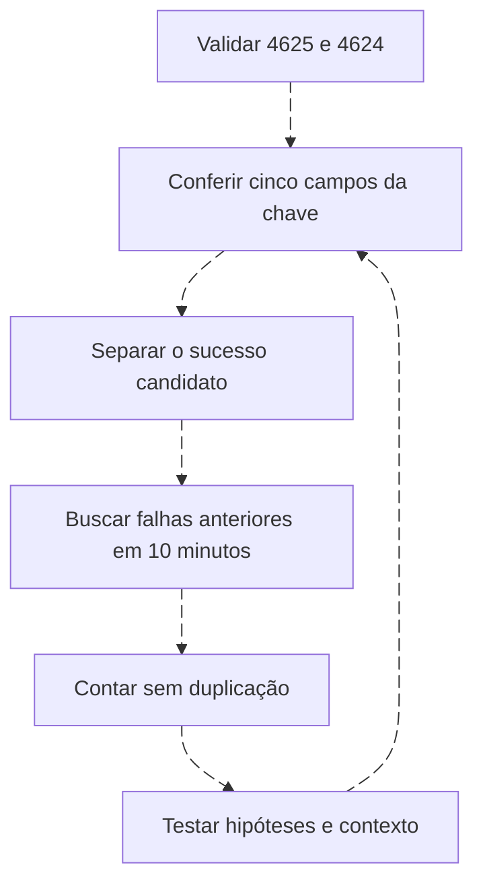

# Join não é sinônimo de correlação

<!-- markdownlint-configure-file {"MD033": {"allowed_elements": ["details", "summary"]}} -->

[← Tópico anterior](baseline-e-ausencia.md) · [↑ Índice do módulo](README.md) · [Página principal](../README.md) · [Próximo tópico →](traduzindo-queries.md)

## Relacionar conjuntos é só uma parte

Join relaciona conjuntos por chaves. Correlação de segurança exige semântica, tempo, cobertura e contexto. Hostname sozinho pode enriquecer um evento com inventário, mas não identifica uma sessão. Compare nomes normalizados com cuidado: dois domínios podem reutilizar o mesmo nome curto.

| Relação | Chave candidata | O que conferir |
| --- | --- | --- |
| Autenticação + inventário | Identificador estável do ativo | Uma linha de inventário por chave e validade histórica |
| Evento + usuários privilegiados | SID/autoridade+conta | Privilégio válido no instante do evento |
| Processo + inteligência | Algoritmo+hash | Origem, expiração, confiança e contexto do indicador |
| Sysmon 1 + 3/22 | Host+ProcessGuid | Mesma execução, cobertura e relógios |

## Inner, left outer e cardinalidade

Inner mantém correspondências. Left outer preserva linhas da esquerda mesmo sem enriquecimento; null significa ausência de correspondência, não baixa criticidade. “Left” costuma abreviar left outer conceitualmente, mas a palavra aceita na linguagem deve ser conferida. KQL padrão innerunique pode deduplicar o lado esquerdo; escolha `kind` explicitamente.

Se duas linhas da esquerda encontram três da direita na mesma chave, inner pode produzir seis linhas. Muitas relações many to many inflam contagens. Conte antes/depois e examine duplicatas no inventário. Não corrija isso com dedup arbitrário após perder informação.

```kusto
let Hosts=datatable(Computer:string, OwnerRole:string)["LAB-01","Equipe de testes"];
datatable(Computer:string, EventID:int)["LAB-01",4625,"LAB-02",4625]
| join kind=leftouter (Hosts) on Computer
| project Computer, EventID, OwnerRole
```

Exemplo preservado do módulo anterior: duas linhas na saída; LAB-01 recebe responsável, LAB-02 fica sem correspondência. Isso é enriquecimento, não detecção. [Lookups](lookups-e-enriquecimento.md) compara as alternativas.

## A pergunta temporal é mais importante que o join

Três falhas seguidas de sucesso podem ser erro de senha, tarefa com credencial antiga ou uso não autorizado. Pergunte: mesma conta e autoridade? Host? Origem? LogonType? Sucesso realmente posterior? Bloqueio? Conta de serviço? MFA/VPN? Qual intervalo e quais lacunas?



## KQL com anterioridade estrita

```kusto
let Base = SecurityEvent
| where TimeGenerated >= datetime(2026-09-23T23:50:00Z) and TimeGenerated < datetime(2026-09-25)
| where EventID in (4624,4625)
| where isnotempty(TargetUserName) and isnotempty(TargetDomainName)
    and isnotempty(Computer) and isnotempty(IpAddress) and IpAddress != "-" and isnotnull(LogonType);
let F = Base | where EventID == 4625 | project Falha=TimeGenerated, TargetUserName, TargetDomainName, Computer, IpAddress, LogonType;
let S = Base | where EventID == 4624 and TimeGenerated >= datetime(2026-09-24)
| project Sucesso=TimeGenerated, TargetUserName, TargetDomainName, Computer, IpAddress, LogonType;
S
| join kind=inner (F) on TargetUserName, TargetDomainName, Computer, IpAddress, LogonType
| where Falha < Sucesso and Falha >= Sucesso - 10m
| summarize Falhas=count(), Primeira=min(Falha), Ultima=max(Falha)
    by Sucesso, TargetUserName, TargetDomainName, Computer, IpAddress, LogonType
| where Falhas >= 3
```

Base busca dez minutos extras antes do período de sucessos. F e S separam papéis. Join exige domínio, usuário, host, IP e tipo. O filtro temporal elimina sucesso anterior e empate. Summarize conta falhas por sucesso/chave. Limiar três é didático. Duplicatas inflam contagem; sucessos distintos com timestamp idêntico podem se fundir no agrupamento. Em produção preserve identificador de ocorrência e trate esses casos.

## SPL com janela móvel

```spl
index=windows source="XmlWinEventLog:Security" earliest=1790207400 latest=1790294400 (EventCode=4624 OR EventCode=4625)
| where len(lab_user)>0 AND len(lab_domain)>0 AND len(lab_host)>0
    AND len(lab_source_ip)>0 AND lab_source_ip!="-" AND isnotnull(lab_logon_type)
| sort 0 _time
| streamstats time_window=10m current=f count(eval(EventCode=4625)) AS falhas by lab_domain lab_user lab_host lab_source_ip lab_logon_type
| where EventCode=4624 AND _time>=1790208000 AND falhas>=3
| table _time lab_domain lab_user lab_host lab_source_ip lab_logon_type falhas
```

`sort 0` preserva todas as linhas na ordenação; `current=f` usa contexto anterior; streamstats separa chaves. Não garante anterioridade estrita quando eventos empatam no mesmo `_time`: o conjunto precisa de resolução suficiente ou tratamento explícito desses empates. Verifique limites de memória/max_stream_window. Não confunda isso com equivalência exata ao join KQL.

## AQL e indexer: obtenha candidatos, valide a sequência

Use a busca 4624/4625 da [Roseta](traduzindo-queries.md), com a mesma chave e janela. AQL agregado não demonstra ordem; para regra operacional QRadar, use CRE e seus testes de estado. Query DSL recupera documentos/agregações; não é join temporal genérico entre eventos. Paginação, completude e ordenação pelo horário original antecedem análise externa. O manager Wazuh possui correlação de regras, mas é outra camada. O [módulo 06](../06-SIEM-na-Pratica/correlation-rules.md) trata essa implementação.

## Matriz de testes

| Caso | Esperado |
| --- | --- |
| E01/E02/E03 antes de E04 | Uma sequência candidata |
| E10 com outro domínio | Não entra na chave |
| Sucesso antes das falhas | Não satisfaz sequência |
| Falhas fora de dez minutos | Não satisfaz janela |
| IP ausente | Lacuna declarada, sem união de vazios |
| Evento duplicado | Identificar inflação antes da decisão |

Confira [streamstats](https://help.splunk.com/en/splunk-enterprise/search/spl-search-reference/9.4/search-commands/streamstats) e [join KQL](https://learn.microsoft.com/en-us/kusto/query/join-operator). Execute o [Lab 05](labs/lab-05-correlacao-temporal.md) e registre limites.

## Checkpoint

**Um join por usuário prova que duas ações têm a mesma causa?**

<details>
<summary>Ver resposta</summary>

Não. Homônimos, domínios, sessões, tempo e origem podem divergir. A relação precisa de evidências adicionais.

</details>

[← Tópico anterior](baseline-e-ausencia.md) · [↑ Índice do módulo](README.md) · [Página principal](../README.md) · [Próximo tópico →](traduzindo-queries.md)
