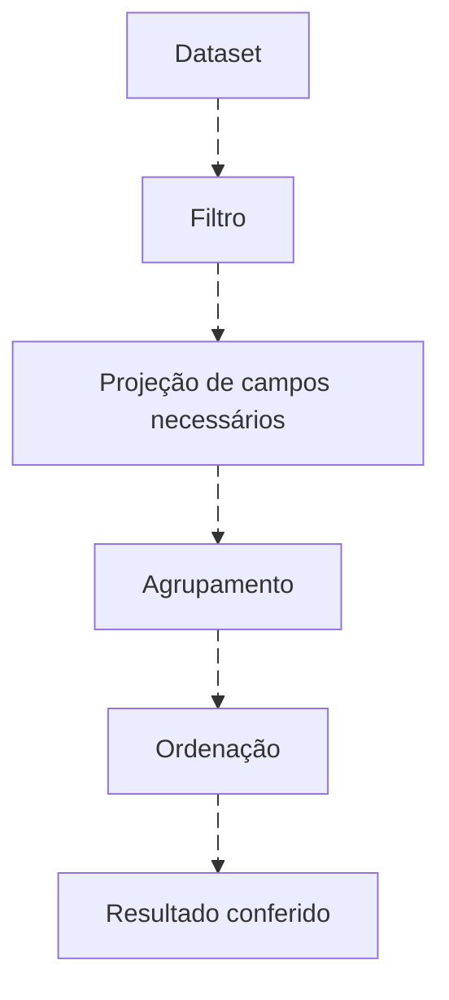

# Fundamentos de consulta: a pergunta primeiro

<!-- markdownlint-configure-file {"MD033": {"allowed_elements": ["details", "summary"]}} -->

[← Tópico anterior](README.md) · [↑ Índice do módulo](README.md) · [Página principal](../README.md) · [Próximo tópico →](campos-e-schemas.md)

## Um contrato antes do código

Uma consulta responde a uma pergunta sobre uma população observável. Escreva: pergunta, fonte, campos, tipos, janela, agrupamento, métrica, saída esperada e limitações. “Investigar login” é amplo; “contar 4625 por host nas últimas 24h” pode ser testado.

| Conceito | Decisão | Erro que evita |
| --- | --- | --- |
| Dataset | Tabela, índice, log source ou conjunto de documentos | Buscar na população errada |
| Campo | Atributo com origem e papel conhecidos | Confundir ator, alvo e coletor |
| Tipo | String, inteiro, boolean, timestamp, IP, array ou objeto | Comparação/conversão inválida |
| Filtro | Quais linhas permanecem? | Ruído ou exclusão silenciosa |
| Projeção | Quais campos aparecem? | Saída sem contexto |
| Transformação | Qual valor derivado é necessário? | Alterar significado sem perceber |
| Agregação | Contar, somar, média, mínimo ou máximo por grupo | Contar grupos como eventos |
| Ordenação | Qual valor vem primeiro? | Confundir amostra com mais recente |
| Limitação | Quantas linhas ou buckets serão exibidos? | Tratar top N como população inteira |
| Tempo | Qual relógio, fuso e intervalo? | Perder fronteiras e atrasos |
| Correlação | Qual chave e contexto sustentam a relação? | Unir eventos só por proximidade |

## Pipeline muda a forma do resultado



KQL e SPL passam resultados entre operadores. Depois de `summarize` ou `stats`, campos não agrupados/agregados deixam de representar eventos individuais. AQL usa SELECT/FROM/WHERE/GROUP BY, sem que a ordem escrita determine toda a execução física. Query DSL usa objetos de filtro e agregação, não uma sequência de pipes intercambiável.

## Exercício KQL preservado e comentado

Este conjunto sintético do módulo anterior continua autossuficiente. Não exige logs reais; rode num editor KQL compatível.

```kusto
datatable(Host:string, EventID:int, SourceIP:string)
[
    "LAB-01", 4625, "192.0.2.10",
    "LAB-01", 4625, "192.0.2.10",
    "LAB-01", 4624, "192.0.2.10",
    "LAB-02", 4625, "192.0.2.20"
]
| where EventID == 4625
| summarize Failures=count() by Host
| sort by Failures desc
```

`datatable` cria quatro linhas; `where` mantém três; `summarize` produz dois grupos; `sort` ordena os grupos. Esperado: LAB-01 = 2, LAB-02 = 1. Resultado obtido no seu editor: a preencher. Falhas não demonstram ataque. Este primeiro conjunto não possui horário nem autoridade da conta; o [dataset completo](labs/dados/eventos.jsonl) acrescenta contexto.

## Prática sem ferramenta

Pegue seis linhas do [Lab 01](labs/lab-01-entendendo-campos.md). Circule as falhas, agrupe por host e conte manualmente. Em seguida explique por que filtrar EventID depois de perder essa coluna numa agregação é uma mudança inválida de raciocínio.

## Checkpoint

**Contar linhas depois de agrupar conta eventos?**

<details>
<summary>Ver resposta</summary>

Não necessariamente. Pode contar grupos. Declare a granularidade em cada etapa.

</details>

[← Tópico anterior](README.md) · [↑ Índice do módulo](README.md) · [Página principal](../README.md) · [Próximo tópico →](campos-e-schemas.md)
