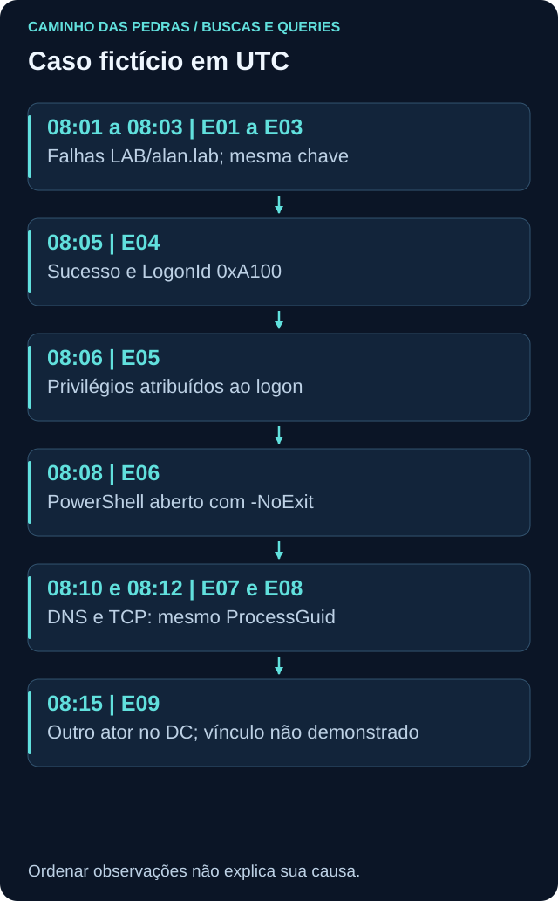

# Investigação e timeline: fatos, hipóteses e lacunas

<!-- markdownlint-configure-file {"MD033": {"allowed_elements": ["details", "summary"]}} -->

[← Tópico anterior](pivot.md) · [↑ Índice do módulo](README.md) · [Página principal](../README.md) · [Próximo tópico →](threat-hunting.md)

## Uma timeline é uma organização, não uma explicação causal

Ordene por horário de ocorrência validado e mantenha fonte/identificador. Ordenação por ingestão pode inverter fatos. Dois registros no mesmo instante podem não ter resolução para ordenar ações. O [dataset](labs/dados/README.md) é fictício e inclui eventos fora de ordem no arquivo para obrigar a conferência.

| UTC, 24/09/2026 | Observação | Vínculo a testar |
| --- | --- | --- |
| 08:01, 08:02, 08:03 | E01/E02/E03, falhas LAB/alan.lab | Cinco campos da chave |
| 08:05 | E04, sucesso RemoteInteractive | Mesma chave; LogonId 0xA100 |
| 08:06 | E05, privilégios especiais | Sessão no mesmo host |
| 08:08 | E06, PowerShell iniciado com -NoExit | Usuário, sessão, pai e ProcessGuid |
| 08:10 | E07, consulta DNS | Mesmo ProcessGuid; resposta ausente |
| 08:12 | E08, TCP para IP documental | Mesmo ProcessGuid; finalidade desconhecida |
| 08:15 | E09, conta de domínio criada no DC | Outro ator; relação não demonstrada |

PowerShell permanece aberto após Get-Date por causa de -NoExit. A linha de criação não descreve comandos interativos posteriores. Os registros DNS/rede são observações sintéticas; não execute tráfego para tentar provar a ficção. A conta de domínio não é automaticamente ligada à sessão anterior.



## Execução da investigação em qualquer plataforma

1. Busque falhas e sucesso pela [Roseta](traduzindo-queries.md), na janela fixa.
2. Valide chaves e anterioridade em [correlação](correlacao-e-joins.md).
3. Consulte 4672 na mesma sessão; diferencie privilégio no logon de inclusão em grupo.
4. Pivote por host+ProcessGuid em [pivot](pivot.md), preservando payload.
5. Busque 4720 separadamente e confira ator, alvo, autoridade e possível mudança autorizada.
6. Registre evidências de apoio e de contradição para cada hipótese.

KQL pode normalizar colunas e fazer union; SPL pode ordenar fontes selecionadas depois de validar aliases; AQL ordena starttime com propriedades e unidade conhecida; o indexer retorna documentos por filtros e sort, sujeitos a paginação. Não una colunas só porque têm o mesmo nome.

## Da autenticação aos privilégios da sessão

Pergunta: quais eventos 4672 pertencem à sessão `0xA100` em WIN-LAB01? Primeiro recupere E04 e confirme TargetLogonId, identidade e host. Depois procure SubjectLogonId no 4672. As consultas abaixo usam essa segunda etapa. No SPL/AQL, `lab_session`/`LabSession` são extrações explícitas do SubjectLogonId para 4672, conforme o [contrato](campos-e-schemas.md).

<details>
<summary>Ver consulta de sessão em KQL</summary>

```kusto
SecurityEvent
| where TimeGenerated >= datetime(2026-09-24) and TimeGenerated < datetime(2026-09-25)
| where EventID == 4672 and Computer == "WIN-LAB01"
| where SubjectLogonId =~ "0xA100"
| project TimeGenerated, Computer, EventID, SubjectDomainName, SubjectUserName, SubjectLogonId, PrivilegeList
| order by TimeGenerated asc
```

</details>

<details>
<summary>Ver consulta de sessão em SPL</summary>

```spl
index=windows source="XmlWinEventLog:Security" earliest=1790208000 latest=1790294400 EventCode=4672
lab_host="WIN-LAB01" lab_session="0xA100"
| sort 0 _time
| table _time lab_host EventCode lab_actor lab_session _raw
```

</details>

<details>
<summary>Ver consulta de sessão em AQL</summary>

```sql
SELECT starttime, "LabComputer", "LabEventID", "LabActor", "LabSession", UTF8(payload) AS registro
FROM events
WHERE "LabProvider" = 'Microsoft-Windows-Security-Auditing'
AND "LabEventID" = '4672' AND "LabComputer" = 'WIN-LAB01'
AND "LabSession" = '0xA100'
ORDER BY starttime ASC LIMIT 50
START '2026-09-24 00:00:00' STOP '2026-09-25 00:00:00'
```

</details>

<details>
<summary>Ver consulta de sessão na API do indexer Wazuh</summary>

Corpo de `POST /wazuh-archives-*/_search`, com indexação e mapping validados:

```json
{
  "size": 50,
  "track_total_hits": true,
  "query": {
    "bool": {
      "filter": [
        {"range": {"timestamp": {"gte": "2026-09-24T00:00:00Z", "lt": "2026-09-25T00:00:00Z"}}},
        {"term": {"data.win.system.providerName": "Microsoft-Windows-Security-Auditing"}},
        {"term": {"data.win.system.eventID": "4672"}},
        {"term": {"data.win.system.computer": "WIN-LAB01"}},
        {"term": {"data.win.eventdata.subjectLogonId": "0xA100"}}
      ]
    }
  },
  "sort": [{"timestamp": "asc"}]
}
```

</details>

O resultado esperado conceitual é E05. No payload real, confira caixa/formato do identificador: o termo exato do indexer não ignora caixa. Compare SubjectUserName/Domain com a identidade do sucesso. O fixture representa essa identidade por user/domain; isso não muda o papel nativo de Subject no 4672. PrivilegeList enumera privilégios atribuídos ao logon e não prova inclusão em grupo.

## Monte a timeline nas quatro abordagens

Use as consultas de autenticação da [Roseta](traduzindo-queries.md), a consulta de sessão acima, o [pivô completo de processo](pivot.md) e a busca 4720, mantendo E09 separado até encontrar vínculo. Cada etapa tem pergunta, contrato e resultado esperado. No KQL, o exemplo union em [kql.md](kql.md) mostra como projetar Tempo/Host/Fonte/ID; troque a janela relativa pela data fixa do exercício. No SPL, preserve source e ordene `_time` após selecionar as fontes e aliases. No AQL, ordene starttime e preserve LabProvider, em vez de unir IDs sem provedor. No indexer, percorra todas as páginas, preserve provider/systemTime e ordene pelo horário original convertido. Não considere apenas os primeiros 50 hits como timeline completa.

**Confira antes de concluir:** a conta, sessão ou execução sustenta cada ligação? Qual observação tem outro ator ou host? Que lacuna impede chamar a sequência de ataque?

## Hipóteses concorrentes

| Hipótese | Evidência de apoio possível | O que ainda falta |
| --- | --- | --- |
| Administração legítima após erro de senha | Contexto de mudança e identidade confirmada | Autorização, comandos posteriores e finalidade |
| Uso não autorizado de credencial | Atividade incompatível com o titular e com o ativo | Evidência de contexto e alcance |
| Eventos parcialmente independentes | Outro ator/host na criação de conta | Vínculo forte ou confirmação de mudança separada |

## Relatório mínimo

```text
Pergunta e escopo:
Fonte, versão/schema e cobertura:
Janela e fuso:
Queries e pivôs, com motivo:
Fatos com IDs dos registros:
Timeline e chaves:
Hipóteses e evidências contrárias:
Lacunas e impacto na confiança:
Conclusão proporcional:
Próximo teste:
```

O [lab final](labs/lab-10-investigacao-multisiem.md) pede essa entrega. Diferencie resultado esperado do fixture de evidência realmente obtida na plataforma. O objetivo é tornar o raciocínio reproduzível.

## Checkpoint

**A conclusão obrigatória do caso é comprometimento?**

<details>
<summary>Ver resposta</summary>

Não. Há sequência e relações observáveis, mas faltam autorização e finalidade. A conclusão deve preservar a incerteza e indicar próximos testes.

</details>

[← Tópico anterior](pivot.md) · [↑ Índice do módulo](README.md) · [Página principal](../README.md) · [Próximo tópico →](threat-hunting.md)
