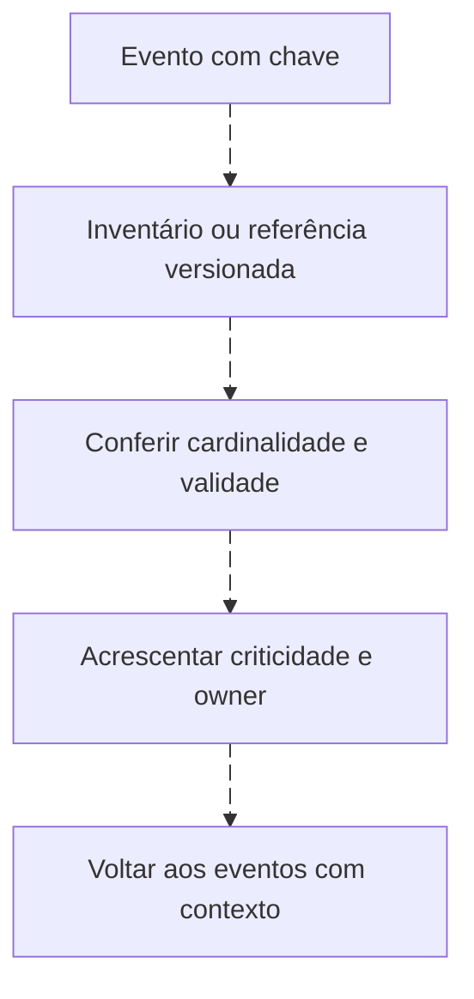
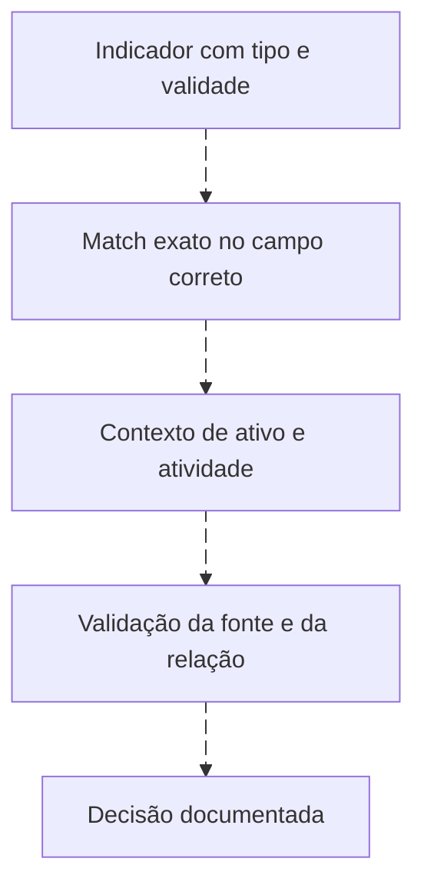

# Lookups e enriquecimento: contexto verificável

<!-- markdownlint-configure-file {"MD033": {"allowed_elements": ["details", "summary"]}} -->

[← Tópico anterior](agregacoes.md) · [↑ Índice do módulo](README.md) · [Página principal](../README.md) · [Próximo tópico →](baseline-e-ausencia.md)

## Acrescente contexto sem fabricar certeza

Um evento em DC-LAB01 pode receber `criticality=high` e `owner=Identity Team` do inventário fictício. Isso aumenta a prioridade de análise, mas não muda o que o evento registrou. Inventário desatualizado também erra.



## Uma relação muitos para um

O [inventário CSV](labs/dados/inventario.csv) tem uma linha por host, incluindo WIN-LAB03, que não aparece nos eventos. Chave duplicada deveria ser corrigida ou resolvida por validade temporal antes de enriquecer. Na comparação de hosts sem dados, o inventário fica à esquerda, preservando o host silencioso.

```kusto
let Inventario=datatable(Computer:string, Criticality:string, Owner:string)
["DC-LAB01","high","Identity Team","WIN-LAB03","medium","Lab Team"];
let Vistos=SecurityEvent
| where TimeGenerated >= ago(24h)
| summarize LastSeen=max(TimeGenerated) by Computer;
Inventario
| join kind=leftouter (Vistos) on Computer
| project Computer, Criticality, Owner, LastSeen
```

O exemplo não declara que todos os hosts devem ter SecurityEvent: essa obrigação vem do contrato de coleta. Null indica nenhum registro nessa pesquisa, que ainda pode estar com filtro, acesso ou período errado.

## Mecanismo adequado em cada plataforma

| Plataforma | Opção | Limite |
| --- | --- | --- |
| KQL | datatable didático, lookup/join ou watchlist conforme ambiente | Watchlists Sentinel não existem em todo editor KQL |
| SPL | lookup com CSV/definição cadastrada | Chave, permissões e OUTPUT/OUTPUTNEW mudam o resultado |
| AQL | REFERENCEMAP / REFERENCETABLE / REFERENCESET conforme modelo | Conjunto de membros não é tabela relacional genérica |
| OpenSearch/indexer | Campo enriquecido na ingestão, aplicação ou recurso da versão | terms lookup busca valores para filtro; não é left join que acrescenta colunas |

Exemplo SPL após cadastrar uma definição chamada `lab_inventory` usando o CSV e seus campos:

```spl
index=windows source="XmlWinEventLog:Security" earliest=-24h latest=now
| lookup lab_inventory host AS lab_host OUTPUT criticality owner
| table _time lab_host EventCode criticality owner
```

Sem cadastrar o lookup, a busca não funciona. Em QRadar, após criar e preencher reference map chamado lab_criticality com host como chave, a expressão `REFERENCEMAP('lab_criticality', "LabComputer") AS criticality` pode acrescentar contexto ao SELECT. Confira tipo e disponibilidade na [referência AQL](https://www.ibm.com/docs/en/qsip/7.6.0?topic=language-aql-data-retrieval-functions).

## Threat intelligence e IOC search



Para IP, confirme direção, NAT e compartilhamento. Para domínio, normalize caixa/ponto final conforme contrato e use validade histórica. Para hash, separe SHA256 de MD5 e extraia o valor do campo composto Hashes antes de comparar. Para usuário, preserve autoridade; para hostname, considere FQDN e renomeação. Não faça substring de hash e chame de igualdade.

IOC match não confirma comprometimento. Hash pode ser de ferramenta legítima; endereço pode hospedar múltiplos clientes; reputação muda. Registre indicador, provedor, data, confiança, expiração e evidência local. A [página de pivôs](pivot.md) mostra como continuar a pergunta sem espalhar associações frágeis.

## Checkpoint

**Um lookup ausente significa ativo sem importância?**

<details>
<summary>Ver resposta</summary>

Não. Significa que não houve correspondência no contexto pesquisado. Investigue a qualidade e validade da referência.

</details>

[← Tópico anterior](agregacoes.md) · [↑ Índice do módulo](README.md) · [Página principal](../README.md) · [Próximo tópico →](baseline-e-ausencia.md)
