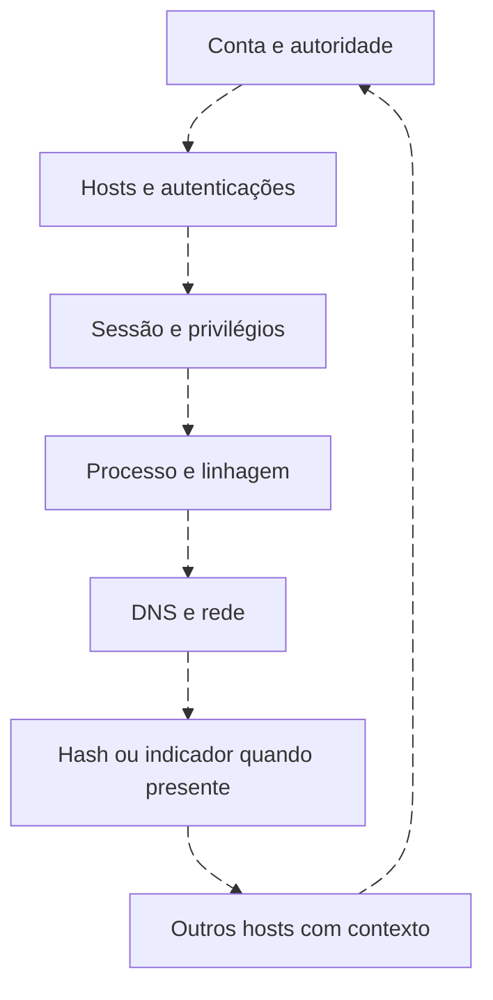
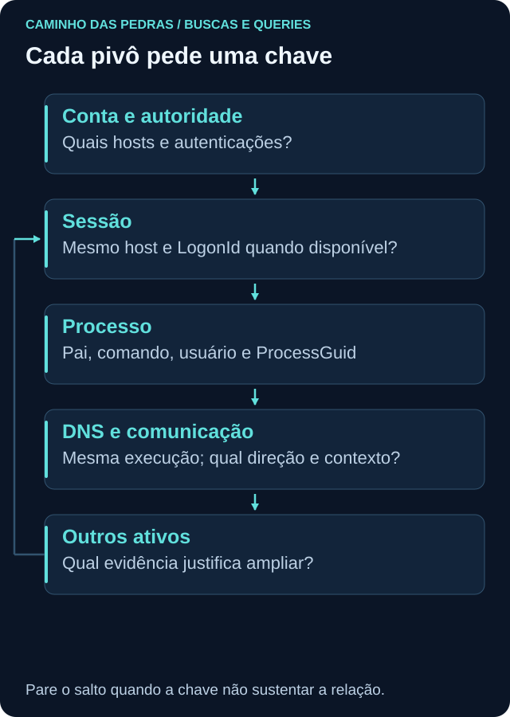

# Pivot: transforme um achado em outra pergunta

<!-- markdownlint-configure-file {"MD033": {"allowed_elements": ["details", "summary"]}} -->

[← Tópico anterior](wazuh-opensearch.md) · [↑ Índice do módulo](README.md) · [Página principal](../README.md) · [Próximo tópico →](investigacao.md)

## A primeira query inicia o caminho

Encontrar alan.lab em 4625 pede autoridade, host, origem, tipo e tempo. Depois pergunte onde mais essa identidade aparece, se houve sucesso, qual sessão, quais processos e comunicações. Cada salto exige uma chave e uma justificativa.





| De → para | Nova pergunta | Chave e limite |
| --- | --- | --- |
| Conta → host | Quais hosts registraram essa identidade? | Conta+autoridade; não misturar homônimos |
| Falha → sucesso | A chave compatível teve sucesso posterior? | Host, origem, tipo e janela |
| Sucesso → 4672 | Quais privilégios foram atribuídos ao logon? | LogonId no mesmo host; não é inclusão em grupo |
| Sessão → processo | Qual processo pertence ao contexto? | LogonId/Guid quando disponíveis, usuário e host |
| Processo → DNS/rede | Quais observações são da mesma execução? | Host+ProcessGuid; PID pode ser reutilizado |
| Hash → outros hosts | Os mesmos bytes foram observados? | Algoritmo+hash; presença não define intenção |
| Domínio/IP → hosts | Quem consultou ou se comunicou? | Tempo, direção e compartilhamento |

## Um pivô por ProcessGuid

```kusto
WindowsEvent
| where TimeGenerated >= datetime(2026-09-24) and TimeGenerated < datetime(2026-09-25)
| where Provider == "Microsoft-Windows-Sysmon" and EventID in (1,3,22)
| where Computer == "WIN-LAB01"
| extend ProcessGuid=tostring(EventData.ProcessGuid)
| where ProcessGuid == "{11111111-2222-3333-4444-555555555555}"
| project TimeGenerated, Computer, EventID, ProcessGuid, EventData
| order by TimeGenerated asc
```

```spl
index=windows source="XmlWinEventLog:Microsoft-Windows-Sysmon/Operational" earliest=1790208000 latest=1790294400 (EventCode=1 OR EventCode=3 OR EventCode=22)
lab_host="WIN-LAB01" lab_process_guid="{11111111-2222-3333-4444-555555555555}"
| sort 0 _time
| table _time lab_host EventCode lab_process_guid lab_image lab_query_name lab_destination_ip
```

```sql
SELECT starttime, "LabComputer", "LabEventID", "LabProcessGuid", "LabImage", "LabQueryName", "LabDestinationIP"
FROM events
WHERE "LabProvider" = 'Microsoft-Windows-Sysmon'
AND "LabComputer" = 'WIN-LAB01'
AND "LabProcessGuid" = '{11111111-2222-3333-4444-555555555555}'
ORDER BY starttime ASC LIMIT 50
START '2026-09-24 00:00:00' STOP '2026-09-25 00:00:00'
```

Na API do indexer, use a seleção Sysmon da Roseta com terms para IDs 1,3,22 e acrescente dois term filters: `data.win.system.computer` igual a WIN-LAB01 e `data.win.eventdata.processGuid` igual ao GUID. Confira mapping e ordene pelo horário original normalizado. Resultado esperado conceitual: E06/E07/E08, sem E12 ou H01. AQL acima procura todos os tipos desse processo, o que pode ampliar a evidência além desses três IDs no ambiente real.

## Pare quando a chave não sustenta o salto

E09 tem outro ator e ocorre num DC; proximidade de E08 não vincula a criação de conta ao PowerShell. Não invente hash ausente nem associe DNS à conexão só porque o relógio é próximo. O dataset não contém resposta DNS; não demonstra que o nome resolveu para o destino TCP.

## Entrega

No [Lab 07](labs/lab-07-pivot.md), registre pergunta inicial, pivô, campo usado, resultado e motivo de continuar/parar. Uma tabela de perguntas é mais auditável que uma sequência de buscas sem explicação.

## Checkpoint

**Por que PID sozinho é fraco?**

<details>
<summary>Ver resposta</summary>

Pode ser reutilizado. Combine host, início e ProcessGuid quando disponível, sem tratar o identificador como prova de intenção.

</details>

[← Tópico anterior](wazuh-opensearch.md) · [↑ Índice do módulo](README.md) · [Página principal](../README.md) · [Próximo tópico →](investigacao.md)
