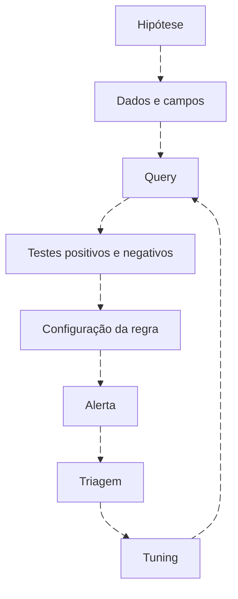

# Queries para apoiar detecções

<!-- markdownlint-configure-file {"MD033": {"allowed_elements": ["details", "summary"]}} -->

[← Tópico anterior](threat-hunting.md) · [↑ Índice do módulo](README.md) · [Página principal](../README.md) · [Próximo tópico →](performance.md)

## Query, detecção, alerta e incidente são coisas diferentes

Uma query retorna dados conforme uma expressão. Para apoiar uma detecção, precisa de objetivo, entidades, janela, lógica testada e contexto para triagem. Agendamento, lookback, agrupamento, atraso, deduplicação e resposta pertencem à implementação da regra. O [módulo 08](../08-Detection-Engineering/README.md) desenvolve o ciclo completo.



## De filtro a condição investigável

`EventID=4625` encontra falhas. Acrescente identidade com autoridade, janela, quantidade, origem, tipo e contexto conforme a hipótese. Um limiar não torna a lógica correta por si só. Não exclua conta de serviço globalmente só porque gera ruído: restrinja exceção a comportamento conhecido, validade e escopo.

## Desafio antes da solução

Encontre contas com mais de dez falhas em cinco minutos. Pense: dataset, evento, autoridade/usuário, host, relógio, agrupamento e janela. Você quer bins fixos no último dia ou o intervalo móvel dos cinco minutos anteriores a agora? São perguntas diferentes.
<details>
<summary>Ver consulta em KQL</summary>

```kusto
SecurityEvent
| where TimeGenerated >= ago(24h)
| where EventID == 4625
| summarize Falhas=count() by TargetDomainName, TargetUserName, Computer, bin(TimeGenerated,5m)
| where Falhas > 10
```

</details>

<details>
<summary>Ver consulta em SPL</summary>

```spl
index=windows source="XmlWinEventLog:Security" earliest=-24h latest=now EventCode=4625
| bin _time span=5m
| stats count AS falhas by lab_domain lab_user lab_host _time
| where falhas>10
```

</details>

<details>
<summary>Ver consulta em AQL</summary>

```sql
SELECT "LabDomain", "LabUser", "LabComputer", SUM(eventcount) AS falhas
FROM events
WHERE "LabProvider" = 'Microsoft-Windows-Security-Auditing' AND "LabEventID" = '4625'
GROUP BY "LabDomain", "LabUser", "LabComputer"
HAVING SUM(eventcount) > 10
LAST 5 MINUTES
```

</details>

<details>
<summary>Ver consulta em Query DSL no indexer Wazuh</summary>

```json
{
  "size": 0,
  "track_total_hits": true,
  "query": {
    "bool": {
      "filter": [
        {
          "range": {
            "timestamp": {
              "gte": "now-5m",
              "lt": "now"
            }
          }
        },
        {
          "term": {
            "data.win.system.providerName": "Microsoft-Windows-Security-Auditing"
          }
        },
        {
          "terms": {
            "data.win.system.eventID": [
              "4625"
            ]
          }
        }
      ]
    }
  },
  "aggs": {
    "dominio": {
      "terms": {
        "field": "data.win.eventdata.targetDomainName",
        "size": 50
      },
      "aggs": {
        "usuario": {
          "terms": {
            "field": "data.win.eventdata.targetUserName",
            "size": 50
          },
          "aggs": {
            "host": {
              "terms": {
                "field": "data.win.system.computer",
                "size": 50,
                "min_doc_count": 11
              }
            }
          }
        }
      }
    }
  }
}
```

</details>

KQL e SPL acima avaliam bins fixos no último dia. AQL e JSON avaliam apenas os cinco minutos anteriores ao momento da busca. Não são equivalentes nas fronteiras nem na população temporal. Para comparar, fixe o mesmo início/fim em todos e retire bin dos dois primeiros. No JSON, a condição min_doc_count seleciona buckets com pelo menos 11 documentos dentro dos limites dos buckets pais; confirme completude antes de usá-lo em detecção.

No fixture atual há apenas cinco falhas no dia, portanto esse limiar não produz candidato. Não altere o dataset silenciosamente para fabricar alerta. A [sequência didática de três falhas](correlacao-e-joins.md) responde outra pergunta e mantém seu limiar separado do catálogo KQL anterior, que usa cinco.

## Teste que pode reprovar a query

| Caso | Verificação |
| --- | --- |
| Dez falhas | Não satisfaz “mais de dez” |
| Onze falhas mesma chave/janela | Satisfaz condição de volume |
| Contas homônimas em domínios diferentes | Não unir identidades |
| Onze eventos duplicados da mesma ocorrência | Tratar duplicação antes de contar |
| Dados na fronteira de bin | Documentar diferença entre bin e janela móvel |
| Origem/tipo ausentes | Declarar perda de contexto |
| Sucesso antes das falhas | Não chamar de sequência falha→sucesso |

## Entrega para portfólio

Preencha hipótese, fonte/schema, campos, janela, query, saída esperada, limitações, falsos positivos, falsos negativos e testes. Registre quais plataformas foram executadas e quais só traduzidas. Use [4720](../queries/account-creation/README.md) como condição simples, mantendo ator e alvo. Nenhuma query deste capítulo cria regra automaticamente.

## Checkpoint

**Por que não prometer a mesma regra nos quatro SIEMs?**

<details>
<summary>Ver resposta</summary>

Estado, agendamento, campos, unidade, agrupamento e respostas diferem. A intenção pode ser traduzida; a operação precisa de testes próprios.

</details>

[← Tópico anterior](threat-hunting.md) · [↑ Índice do módulo](README.md) · [Página principal](../README.md) · [Próximo tópico →](performance.md)
