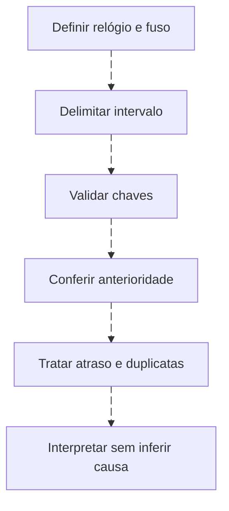
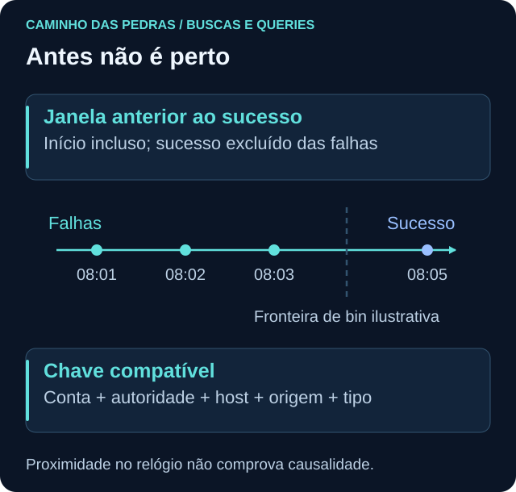

# Tempo em queries: intervalos e ordem

<!-- markdownlint-configure-file {"MD033": {"allowed_elements": ["details", "summary"]}} -->

[← Tópico anterior](strings-e-regex.md) · [↑ Índice do módulo](README.md) · [Página principal](../README.md) · [Próximo tópico →](agregacoes.md)

## Quatro momentos, quatro perguntas

Event time é o horário registrado na origem; ingestion time representa chegada/processamento na plataforma. Horário da pesquisa e horário do alerta são outros momentos. Um evento ocorrido às 08:02 pode chegar às 08:12. Uma regra que só busca os últimos cinco minutos por ocorrência pode perdê-lo.

| Decisão | Exemplo | Cuidados |
| --- | --- | --- |
| UTC | 2026-09-24T08:00:00Z | Z declara UTC |
| Horário local | 05:00 em UTC-03:00 no mesmo instante | Não aplicar deslocamento duas vezes |
| Intervalo | início inclusivo, fim exclusivo | Evita dupla contagem em janelas adjacentes |
| Bin/bucket | intervalos fixos de cinco minutos | Uma sequência pode atravessar a fronteira |
| Sliding window | dez minutos anteriores a cada sucesso | Exige estado ou relação temporal explícita |
| Atraso | ingestão menos ocorrência | Relógio errado pode gerar valor negativo |

## Recente e reproduzível são usos diferentes

O primeiro exemplo do README usa últimas 24h. Nos labs, fixe 24/09/2026 00:00 UTC até 25/09/2026 00:00 UTC. Um dataset antigo não aparece em `ago(24h)` quando você o estuda meses depois.

```kusto
SecurityEvent
| where TimeGenerated >= datetime(2026-09-24T00:00:00Z)
    and TimeGenerated < datetime(2026-09-25T00:00:00Z)
| where EventID == 4625
| summarize Total=count() by Computer, bin(TimeGenerated, 5m)
```

```spl
index=windows source="XmlWinEventLog:Security" earliest=1790208000 latest=1790294400 EventCode=4625
| bin _time span=5m
| stats count AS total by _time lab_host
| sort 0 _time
```

KQL usa datetime UTC; SPL usa epoch em segundos para evitar interpretação de uma data local. `earliest` inclui o início e `latest` exclui o final. AQL usa `START '2026-09-24 00:00:00' STOP '2026-09-25 00:00:00'`; confirme fuso e limites do mecanismo antes de comparar fronteiras. Query DSL usa range gte/lt e datas ISO com Z; date_histogram pode formar buckets de `fixed_interval: "5m"`.

## Por que um bin não comprova sequência?

Falha às 08:04:59 e sucesso às 08:05:01 estão em bins diferentes, embora separados por dois segundos. Um sucesso às 08:01 e três falhas às 08:04 estão no mesmo bin, mas na ordem inversa. Preserve o evento de sucesso e procure falhas estritamente anteriores pela chave correta.





## Aplicação na operação

KQL `ingestion_time()` depende de suporte/política de ingestão e pode retornar null; não é relógio preciso para causalidade. SPL diferencia `_time` de `_indextime`. Em QRadar, valide starttime e metadados de armazenamento com a fonte. No Wazuh, `timestamp` pode ser horário do manager; ordene eventos pelo systemTime original após confirmar formato e tipo. Não faça subtração de strings como se fossem timestamps.

Agendamento sobreposto pode retornar o mesmo sucesso em várias execuções. Um identificador confiável e política de deduplicação pertencem à regra operacional. Busque história adicional suficiente antes do primeiro sucesso elegível.

## Desafio

Desenhe duas falhas antes da fronteira de um bin e outra depois. Qual método conta a sequência inteira? Uma janela móvel por sucesso, com chave e lookback, não apenas GROUP BY do bin.

## Checkpoint

**Eventos próximos pertencem à mesma atividade?**

<details>
<summary>Ver resposta</summary>

Não necessariamente. Confira conta e autoridade, host, origem, LogonType, sessão e identificadores de processo. Proximidade não comprova causalidade.

</details>

[← Tópico anterior](strings-e-regex.md) · [↑ Índice do módulo](README.md) · [Página principal](../README.md) · [Próximo tópico →](agregacoes.md)
