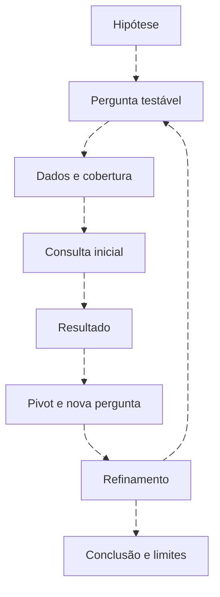

# Threat hunting: da hipótese à revisão

<!-- markdownlint-configure-file {"MD033": {"allowed_elements": ["details", "summary"]}} -->

[← Tópico anterior](investigacao.md) · [↑ Índice do módulo](README.md) · [Página principal](../README.md) · [Próximo tópico →](queries-para-deteccoes.md)

## Uma hipótese que admite contradição

“Pode haver uso incomum de ferramentas administrativas em hosts fora do padrão” é ponto de partida, não conclusão. Defina o que seria incomum, o histórico observável e a evidência que apoiaria uma explicação legítima. Execute consultas que possam contrariar a hipótese também.



## Relações pai/filho pouco frequentes

```kusto
WindowsEvent
| where TimeGenerated >= ago(7d)
| where Provider == "Microsoft-Windows-Sysmon" and EventID == 1
| extend Image=tostring(EventData.Image), ParentImage=tostring(EventData.ParentImage), CommandLine=tostring(EventData.CommandLine)
| where Image endswith @"\powershell.exe" or Image endswith @"\pwsh.exe"
| summarize Execucoes=count(), Primeiro=min(TimeGenerated), Ultimo=max(TimeGenerated), Exemplos=make_set(CommandLine,3) by Computer, Image, ParentImage
| order by Execucoes asc
```

```spl
index=windows source="XmlWinEventLog:Microsoft-Windows-Sysmon/Operational" earliest=-7d latest=now EventCode=1
| where like(lower(lab_image),"%powershell.exe") OR like(lower(lab_image),"%pwsh.exe")
| stats count AS execucoes min(_time) AS primeiro max(_time) AS ultimo by lab_host lab_image lab_parent
| sort 0 execucoes
```

```sql
SELECT "LabComputer", "LabImage", "LabParent", SUM(eventcount) AS execucoes
FROM events
WHERE "LabProvider" = 'Microsoft-Windows-Sysmon' AND "LabEventID" = '1'
AND ("LabImage" ILIKE '%powershell.exe' OR "LabImage" ILIKE '%pwsh.exe')
GROUP BY "LabComputer", "LabImage", "LabParent"
ORDER BY execucoes ASC
LAST 7 DAYS
```

KQL mantém o hunt anterior e seus limites. SPL/AQL acima usam sufixo textual que também pode coincidir com nomes mais longos; valide o nome base antes de concluir equivalência exata. No indexer, filtre Sysmon 1 e caminhos pela [consulta de strings](strings-e-regex.md), depois conte relações completas com paginação adequada; não classifique raridade por um top parcial de terms ascendente. Sete dias são janela ilustrativa, não garantia de baseline suficiente.

## Outras hipóteses, perguntas diferentes

| Sinal inicial | Pergunta seguinte | Explicação alternativa |
| --- | --- | --- |
| Processo raro | Qual pai, comando, usuário e implantação? | Software novo ou manutenção |
| Conexão incomum | Qual processo, destino, direção e histórico? | Serviço compartilhado ou atualização |
| Conta criada | Quem solicitou e aprovou? | Onboarding ou teste autorizado |
| Execução em diretório incomum | O caminho e assinatura correspondem à instalação? | Aplicativo portátil ou política local |
| Autenticação fora do padrão | Qual turno, VPN, MFA e função? | Viagem, plantão ou tarefa agendada |

## Fixture e conclusão

No conjunto completo, a relação PowerShell/explorer aparece em H01 e E06; PowerShell/taskeng aparece uma vez, em E12. Dois dias não sustentam normalidade nem ameaça. A consulta por Sysmon 1 não deve somar E13 como nova execução, pois ele corrobora a mesma criação em outra fonte.

Registre hipótese, pergunta, cobertura, consulta, evidência de apoio/contradição e lacunas. Retorne à coleta quando a telemetria não puder responder. A [query KQL anterior](../queries/kql/06-hunt-powershell.md) continua documentada; o [Lab 08](labs/lab-08-threat-hunting.md) amplia a tradução para outros mecanismos.

## Checkpoint

**Uma relação pai/filho vista uma vez é maliciosa?**

<details>
<summary>Ver resposta</summary>

Não. É rara no conjunto observado. Contexto, cobertura e explicações alternativas continuam necessários.

</details>

[← Tópico anterior](investigacao.md) · [↑ Índice do módulo](README.md) · [Página principal](../README.md) · [Próximo tópico →](queries-para-deteccoes.md)
