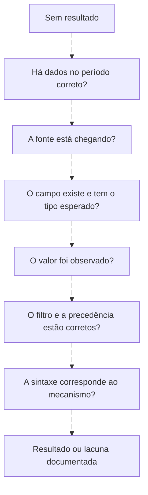
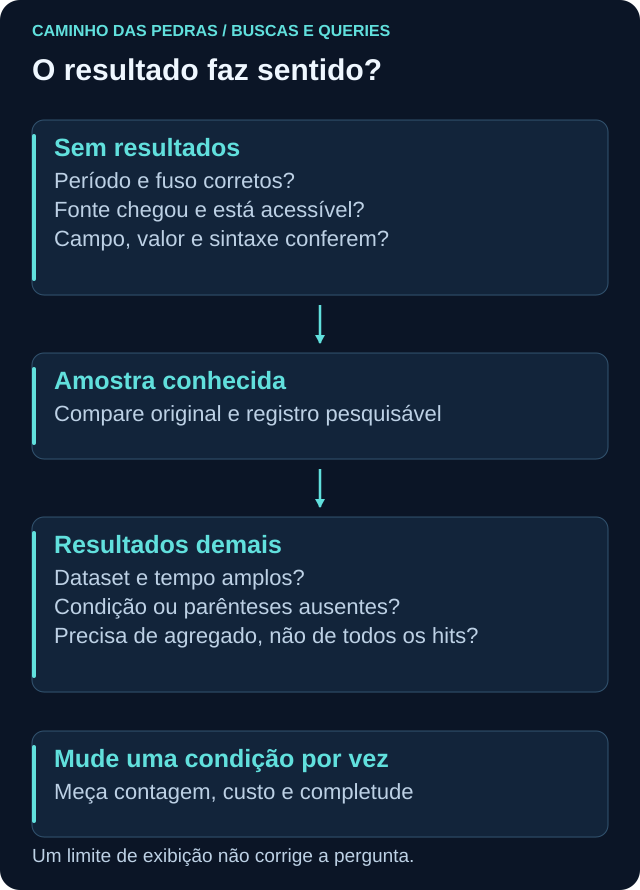
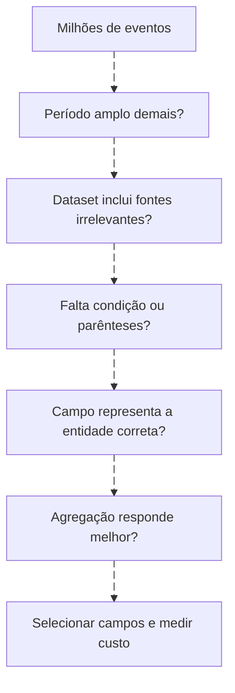

# Troubleshooting: consulta vazia ou ampla demais

<!-- markdownlint-configure-file {"MD033": {"allowed_elements": ["details", "summary"]}} -->

[← Tópico anterior](performance.md) · [↑ Índice do módulo](README.md) · [Página principal](../README.md) · [Próximo tópico →](labs/README.md)

## Vazio não significa ausência de atividade

Volte a uma amostra conhecida. Teste um filtro por vez, na mesma janela. Confira tabela/índice, permissões, retenção e origem. Compare campo ausente com valor vazio. Uma data fictícia fixa não aparece em últimas 24h meses depois. Um evento que existe no endpoint pode não estar indexado.

## Quando retorna demais

Não coloque limite arbitrário e declare solução. Primeiro determine se a pergunta exige eventos ou resumo. Preserve capacidade de voltar ao detalhe.

| Sintoma | Hipótese | Teste |
| --- | --- | --- |
| KQL coluna inexistente | Outro schema/ambiente | getschema ou amostra autorizada |
| SPL stats vazio | Alias ausente ou multivalorado | table _raw e campos relevantes |
| AQL 4625 não aparece | QID confundido com Event ID | Comparar payload e LabEventID |
| Wazuh sucesso não aparece | Busca apenas em alerts | Conferir archives e indexação |
| Campo keyword não existe | Suposição sobre mapping | Ler mapping real |
| Contagem inflada | Duplicação ou many to many | Comparar IDs e cardinalidade |
| Timeline invertida | Ingestão usada como ocorrência | Conferir relógios e fuso |
| Top parece completo | Limite de hits/buckets | Total, paginação e indicadores de truncamento |

## Experimento controlado

Use E09, que não contém SourceIP. Uma query exigindo origem preenchida exclui a criação de conta. Isso não é falha da linguagem: é filtro incompatível com a pergunta. Registre a intenção do filtro e por que ele deve ser retirado ou aplicado apenas a outro tipo de evento.

## Entrega

Salve consulta inicial, amostra de controle, alterações uma a uma, resultado e causa. Nunca publique payload real com segredos ou informações pessoais. A [saúde do SIEM](../06-SIEM-na-Pratica/siem-health.md) explica problemas de coleta; aqui o foco é separar erro de consulta de lacuna de dados.

## Checkpoint

**Qual primeiro teste diante de zero linhas?**

Ver resposta

Validar uma amostra conhecida na fonte, dataset e período corretos, depois acrescentar filtros um a um.

[← Tópico anterior](performance.md) · [↑ Índice do módulo](README.md) · [Página principal](../README.md) · [Próximo tópico →](labs/README.md)
