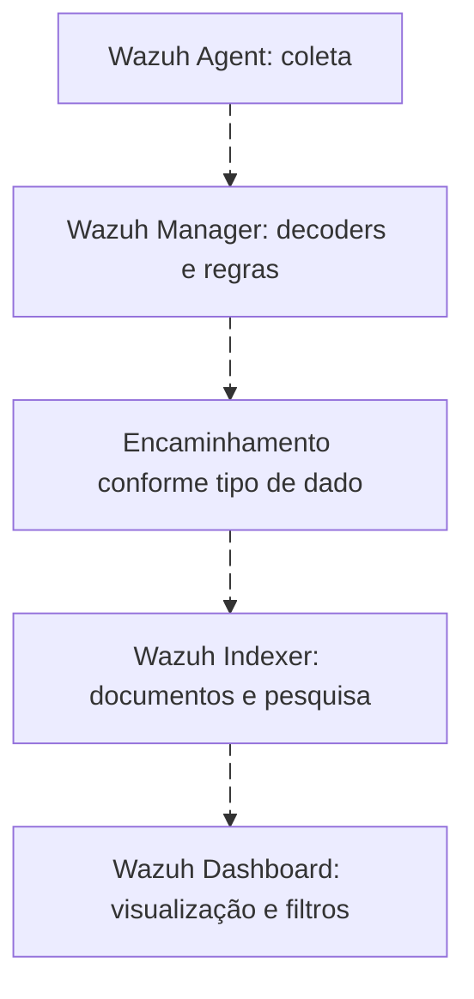

# Wazuh, OpenSearch e as camadas de pesquisa

<!-- markdownlint-configure-file {"MD033": {"allowed_elements": ["details", "summary"]}} -->

[← Tópico anterior](aql.md) · [↑ Índice do módulo](README.md) · [Página principal](../README.md) · [Próximo tópico →](pivot.md)

## Descubra qual serviço responde



No caminho clássico de alertas/archives, o encaminhamento pode usar Filebeat. Outros tipos de dados e versões têm caminhos próprios. Veja a [arquitetura no módulo 06](../06-SIEM-na-Pratica/wazuh.md), sem confundir componentes com linguagens.

| Camada | O que consulta | Mecanismo |
| --- | --- | --- |
| Dashboard, exploração de documentos | Índices e campos acessíveis | Filtros, seletor temporal e sintaxe da barra efetivamente disponível |
| Indexer API | Documentos, mappings e aggregations | Query DSL JSON, endpoints de pesquisa |
| Server API | Agentes, regras, configuração/inventário exposto | WQL no parâmetro q quando suportado |
| Telas especializadas do dashboard | Dados servidos pela server API | WQL em contextos documentados |

A documentação atual Wazuh 4.14 descreve WQL em Endpoint summary, inventário, MITRE Intelligence e gerenciamento de regras/decoders/listas/grupos. Não conclua que toda barra do dashboard usa WQL. Na exploração de índices, confira a linguagem selecionada e use filtros de campos da interface quando não tiver certeza.

## WQL com escopo declarado

```text
GET /agents?q=status=active
GET /agents?q=id=001
```

São requisições relativas à **API do servidor Wazuh**, em cliente autenticado. Consultam estado/identificação de agentes, não logs Windows. Na API, `;` combina AND e `,` combina OR; faça URL encoding dos caracteres reservados. Nas telas WQL documentadas, `and` e `or` minúsculos são aceitos. Não suponha wildcards `*` ou a sintaxe Query DSL nesse contexto.

## Indexes, documents e mappings

Índice agrupa documentos e possui mapping. Documento é um objeto indexado; campos podem ser keyword, text, date, inteiro, IP, boolean, objeto ou arrays. Keyword preserva valor para comparação exata/agregação; text usa análise/tokenização. Um subcampo `.keyword` só existe se definido. Arrays não são tabela relacional; objetos nested exigem mapping e query próprios para preservar associações internas.

Elasticsearch e OpenSearch são projetos distintos, com versões, APIs e recursos que evoluem separadamente. O Wazuh Indexer é um componente distribuído pelo Wazuh; não trate documentação OpenSearch latest ou Elastic como garantia de todo recurso instalado. Confirme versão, endpoint e suporte antes de copiar runtime fields, scripts ou recursos de join.

## Confira o mapping primeiro

```text
GET /wazuh-archives-*/_mapping
POST /wazuh-archives-*/_search
```

O primeiro lê mappings; o segundo recebe um corpo Query DSL como os exemplos da Roseta. Archives exige coleta e indexação habilitadas, além de permissões e retenção. Alertas são outra população: `wazuh-alerts-*` contém documentos derivados de regras, portanto falta de 4624 ali não comprova falta de autenticação.

## Pesquisar agente, regra e evento

Corpo para `POST /wazuh-alerts-*/_search`, assumindo mapping exato dos campos e valores existentes:

```json
{
  "size": 20,
  "query": {
    "bool": {
      "filter": [
        {
          "range": {
            "timestamp": {
              "gte": "now-24h",
              "lt": "now"
            }
          }
        },
        {
          "term": {
            "agent.id": "001"
          }
        },
        {
          "term": {
            "rule.id": "100620"
          }
        }
      ]
    }
  },
  "_source": [
    "timestamp",
    "agent.id",
    "agent.name",
    "rule.id",
    "data.win.system.computer"
  ],
  "sort": [
    {
      "timestamp": "desc"
    }
  ]
}
```

`100620` é ID ilustrativo de regra local, não uma regra padrão garantida. agent.id não é necessariamente o host original. Para eventos brutos Windows, prefira archives e adicione provider+eventID; para usuário, targetUserName; para IP, ipAddress. As consultas completas estão na [Roseta](traduzindo-queries.md). Meça diferença entre agent.name e win.system.computer em encaminhamento WEF.

## Filtro, pontuação e agregações

Term procura valor exato indexado. Match interpreta texto conforme análise. Bool.filter seleciona documentos sem usar relevância como objetivo; sort por tempo responde melhor a timeline que ordenar por score. `size` limita hits, `terms.size` limita buckets. `_source` reduz campos retornados, não muda mapping nem garante leitura física menor. Cardinality pode ser aproximada; paginação precisa preservar contexto e completude.

## Referências e desafio

- [WQL API](https://documentation.wazuh.com/current/user-manual/api/queries.html) e [WQL dashboard](https://documentation.wazuh.com/current/user-manual/wazuh-dashboard/queries.html).
- [API do indexer](https://documentation.wazuh.com/current/user-manual/indexer-api/reference.html).
- [Mappings OpenSearch](https://docs.opensearch.org/latest/mappings/) e [text no Elasticsearch](https://www.elastic.co/docs/reference/elasticsearch/mapping-reference/text).

Desafio: classifique “agente desconectado”, “4625 ontem”, “alerta de regra local” e “mapping de um campo” pela API/população adequada. Uma interface pode exibir os quatro, mas eles não usam necessariamente o mesmo serviço.

## Checkpoint

**WQL é a linguagem universal para pesquisar eventos Wazuh?**

<details>
<summary>Ver resposta</summary>

Não. WQL filtra recursos da API do servidor e telas específicas; documentos indexados usam mecanismos de pesquisa do indexer.

</details>

[← Tópico anterior](aql.md) · [↑ Índice do módulo](README.md) · [Página principal](../README.md) · [Próximo tópico →](pivot.md)
