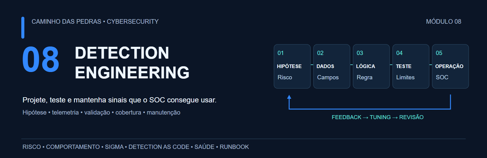
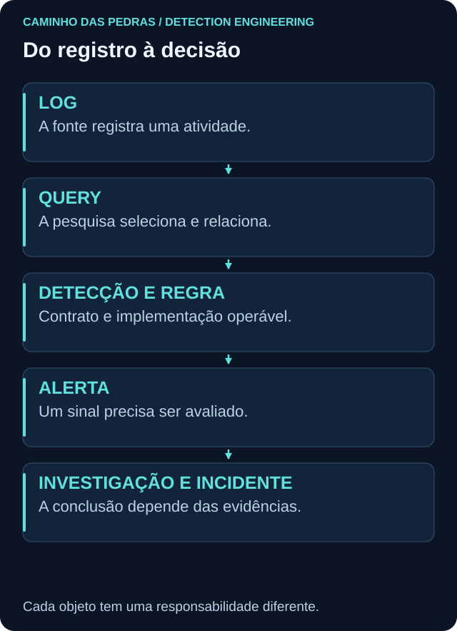
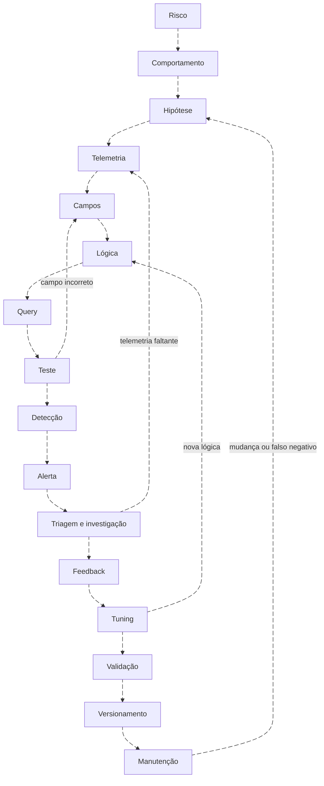
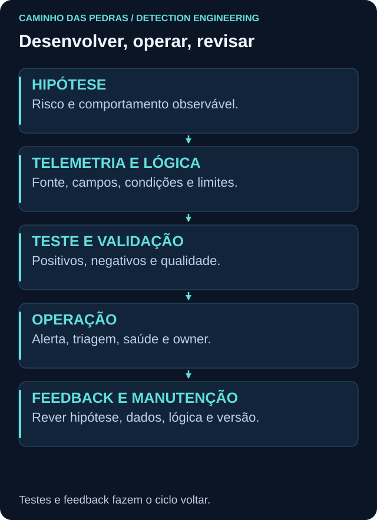
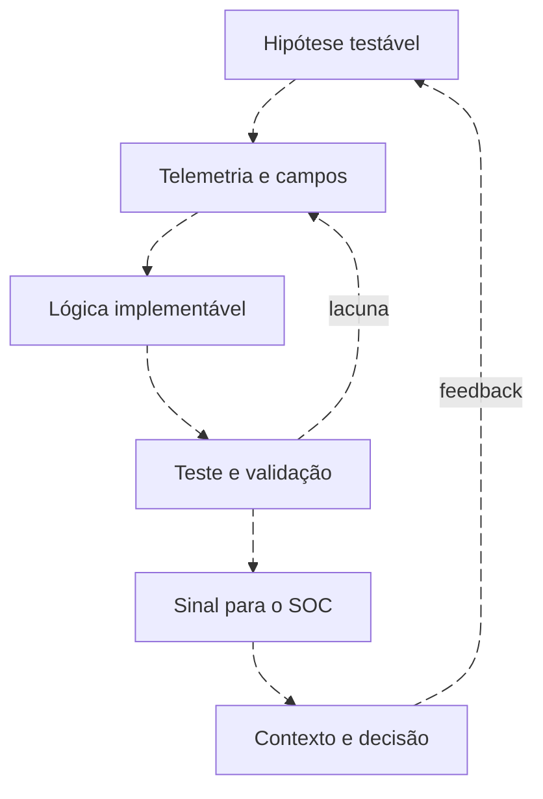

# 08 Detection Engineering

<!-- markdownlint-configure-file {"MD033": {"allowed_elements": ["details", "summary"]}} -->

[← Tópico anterior](../07-Buscas-e-Queries-em-SIEM/README.md) · [↑ Índice do módulo](README.md) · [Página principal](../README.md) · [Próximo tópico →](fundamentos.md)

> Se uma query retorna resultados, isso significa que temos uma boa detecção?

Não. Ainda precisamos definir comportamento, risco, dados, cobertura, atividades legítimas semelhantes, testes, reação do SOC, volume, custo e manutenção.

> Uma query encontra dados. Uma detecção transforma evidência observável em um sinal operacional que pode ser testado, mantido e melhorado.

## O que é Detection Engineering?

É a disciplina de transformar risco e comportamento relevante em capacidade observável, testada e operável. Uma detecção é um produto de segurança: tem hipótese, dependências, lógica, owner, resposta, saúde e critério de aposentadoria. Ela precisa continuar útil quando o ambiente muda.

## Detecção não é sinônimo de query

**Log ≠ query ≠ detecção ≠ regra ≠ alerta ≠ incidente.** Uma query pode responder uma pergunta, apoiar hunting ou compor uma regra. A regra pode gerar alerta. O alerta pode iniciar investigação, que pode terminar sem incidente confirmado. Modelos de agrupamento variam entre plataformas.

## Ciclo contínuo

O trabalho volta a etapas anteriores: tuning altera lógica, investigação revela fonte faltante, teste encontra campo errado, produção muda e um falso negativo exige revisar a hipótese.

Ver o ciclo completo em Mermaid animado

## Da hipótese ao alerta

Começar com “4625 = High” pula a decisão principal. Comece com um padrão de autenticação que mereça investigação; examine conta, autoridade, host, origem, tipo, janela, baseline e contexto de VPN/MFA quando houver essas fontes. Só depois escolha query, regra e ação.

## Como este módulo se conecta

| Módulo | Papel |
| --- | --- |
| [05: SOC e Blue Team](../05-SOC-Blue-Team/README.md) | Operação, triagem e decisão |
| [06: SIEM na Prática](../06-SIEM-na-Pratica/README.md) | Coleta, parser, normalização e arquitetura |
| [07: Buscas e Queries](../07-Buscas-e-Queries-em-SIEM/README.md) | Filtros, agregações, tempo e correlação |
| 08: Detection Engineering | Transformar dados e queries em detecções confiáveis e operáveis |

## O que você aprenderá

| Etapa | Conteúdo | Entrega |
| --- | --- | --- |
| Projetar | Hipótese, ciclo de vida, telemetria e tipos | Contrato e lacunas |
| Implementar | Casos, anatomia, severidade e multisiem | Regra candidata e alerta contextualizado |
| Validar | Positivos, negativos, bordas, atraso e Sigma | Matriz reproduzível |
| Melhorar | Tuning, exceções, FP/FN e métricas | Comparação com perdas explícitas |
| Operar | Runbook, saúde, cobertura e review | Responsabilidade e observabilidade |
| Manter | Versionamento, feedback e aposentadoria | Histórico e transição controlada |

## Uma detecção em quatro plataformas

A baseline de conta Windows criada mantém hipótese e telemetria comuns. [A implementação](multisiem-detection.md) usa Analytics Rule/KQL, saved search/alert/SPL conforme o produto Splunk, CRE no QRadar e regra no servidor Wazuh. AQL e pesquisa no indexer apoiam investigação, mas não são equivalentes ao motor de regras. Nenhum exemplo depende exclusivamente de Sentinel.

## Percurso completo

- [Engenharia de detecção: da demanda à operação](fundamentos.md)
- [Hipóteses que podem ser testadas](detection-hypothesis.md)
- [Ciclo de vida: desenvolver, operar e aposentar](detection-lifecycle.md)
- [Telemetria: contrato, cobertura e lacunas](telemetry-requirements.md)
- [Tipos de lógica e evolução do sinal](detection-types.md)
- [Cinco casos de uso: do sinal à decisão](casos-de-uso.md)
- [Anatomia de uma detecção operável](anatomy-of-a-detection.md)
- [Severidade, confiança e prioridade](severity-and-confidence.md)
- [Classificar resultados sem esconder falsos negativos](false-positives.md)
- [Tuning: reduzir custo preservando o que importa](tuning.md)
- [Validar a capacidade, não só a sintaxe](detection-validation.md)
- [Testes reproduzíveis com dados fictícios](testing-detections.md)
- [Uma especificação de conta criada, quatro implementações](multisiem-detection.md)
- [Sigma: descrição portável, validação específica](sigma.md)
- [Detection as Code: mudança com evidência e reversão](detection-as-code.md)
- [ATT&CK com evidência e escopo](mitre-mapping.md)
- [Cobertura real e dívida de detecção](coverage.md)
- [Quem monitora as detecções?](detection-health.md)
- [Métricas com população e denominador](detection-metrics.md)
- [Do alerta à decisão: runbook de triagem](runbooks.md)
- [Hunting, incidentes e inteligência como entradas](feedback-to-detections.md)
- [Versão, owner e histórico de mudança](versioning.md)
- [Aposentar sem perder rastreabilidade](retiring-detections.md)
- [Doze erros que deterioram uma detecção](anti-patterns.md)
- [Template profissional de detecção](TEMPLATE-DETECCAO.md)
- [Referências e matriz de eventos](referencias.md)

## Laboratórios e portfólio

[Onze labs](labs/README.md) levam da hipótese sem código ao caso final com autenticação, sessão, processo e rede. Incluem um experimento em que 100 → 30 alertas esconde dez casos relevantes e uma alternativa de 40 preserva os positivos do fixture.

Entregas: especificação, Sigma, matriz de testes, relatório de tuning, matriz de cobertura e histórico versionado. O [catálogo detections](../detections/README.md) reúne arquivos executáveis e contratos; as queries detalhadas continuam no módulo 07.

## Checklist de progresso

Abra o [template de progresso](../.github/ISSUE_TEMPLATE/modulo-08-detection-engineering.md) para acompanhar 21 itens. Todos começam desmarcados. Marque apenas o que você efetivamente estudou, executou e registrou.

## Limites dos resultados

Dados são fictícios. Testes locais e parsing de YAML/Sigma/XML não provam execução em SIEM. A integração depende de produto, versão, coleta, campos, agendamento e fila. Nenhum sinal isolado confirma ataque; nenhuma automação de bloqueio é implantada aqui.

## Checkpoint

**Qual é a primeira decisão depois de uma query retornar dados?**

Ver resposta

Conferir se a população e os campos sustentam o comportamento de interesse. Depois avaliar teste, contexto, ação, custo e operação antes de chamar o resultado de detecção pronta.

[← Tópico anterior](../07-Buscas-e-Queries-em-SIEM/README.md) · [↑ Índice do módulo](README.md) · [Página principal](../README.md) · [Próximo tópico →](fundamentos.md)
