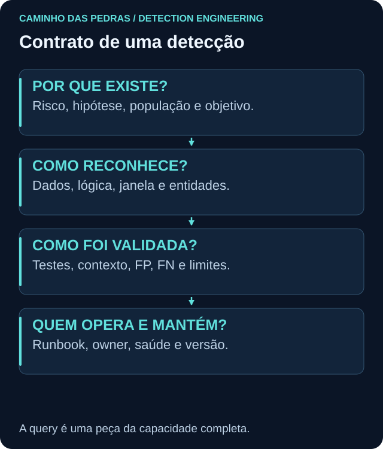

# Anatomia de uma detecção operável

<!-- markdownlint-configure-file {"MD033": {"allowed_elements": ["details", "summary"]}} -->

[← Tópico anterior](casos-de-uso.md) · [↑ Índice do módulo](README.md) · [Página principal](../README.md) · [Próximo tópico →](severity-and-confidence.md)

## As peças precisam concordar

| Parte | Função | Erro que a revisão deve evitar |
| --- | --- | --- |
| Metadata e ID | Identificar artefato e versão | Nome genérico sem rastreabilidade |
| Hipótese e risco | Explicar a razão de existir | Começar pelo Event ID |
| Fonte e campos | Definir o que é observável | Campo copiado de outro produto |
| Query e lógica | Selecionar e relacionar | Resultado certo por coincidência |
| Janela e threshold | Definir população e condição | Intervalo, agendamento e bin confundidos |
| Entidades | Preservar identidade e escopo | Juntar nomes iguais de domínios diferentes |
| Severidade e confiança | Comunicar impacto e evidência | Elevar ambos só pelo nome da regra |
| ATT&CK | Contextualizar comportamento | Tag sem justificativa |
| FP, FN e exceções | Delimitar erros e perdas | Exclusão sem prazo |
| Testes | Demonstrar comportamento esperado | Somente teste positivo |
| Runbook | Orientar a primeira decisão | Alerta sem próximo passo |
| Owner e versão | Sustentar manutenção e rollback | Regra órfã |

## Query versus regra

A query responde “quais registros correspondem?”. A regra determina também quando executar, qual resultado gera sinal, como agrupar e para onde entregar. Exemplo: pesquisar 4720 em um dia fixo é investigação histórica; executá-la a cada cinco minutos sem mudar a data repetiria o mesmo histórico.

Defina lookback, frequência, atraso tolerado, deduplicação e agrupamento separadamente. Uma janela de dez minutos rodada a cada cinco tem sobreposição. Isso pode ajudar com atraso, mas também duplicar resultados. Nenhum dos mecanismos deve ser presumido idêntico entre SIEMs.

## Alerta útil

Título didático: `Windows: conta criada em WIN-LAB01, autorização a verificar`. Corpo: ID e versão da regra, ator/autoridade, alvo/autoridade, host, horário original e ingestão, motivo da correspondência, eventos relacionados, fonte, limites, query ou pesquisa de apoio e link ao runbook. IP ou processo só entram se houver evidência, sem preenchimento inventado.

Para agregações, guarde contagem, intervalo e chaves usadas. Dizer somente “Suspicious Activity Detected” obriga o analista a reconstruir a hipótese antes da triagem.

## Enrichment

Inventário, criticidade, identidade e inteligência podem enriquecer contexto. Registre fonte, data e confiança do enriquecimento. Se o inventário falhar, o sinal não deve desaparecer sem uma decisão explícita; marque o contexto como indisponível. A lógica principal deve continuar legível.

Preencha o [template](TEMPLATE-DETECCAO.md) e confira se o runbook consegue utilizar exatamente os campos que a regra entrega.

## Checkpoint

**O título deve afirmar “conta maliciosa criada” quando só há 4720?**

Ver resposta

Não. Deve comunicar o comportamento observado e a investigação necessária. A classificação exige autorização, finalidade e outras evidências.

[← Tópico anterior](casos-de-uso.md) · [↑ Índice do módulo](README.md) · [Página principal](../README.md) · [Próximo tópico →](severity-and-confidence.md)
