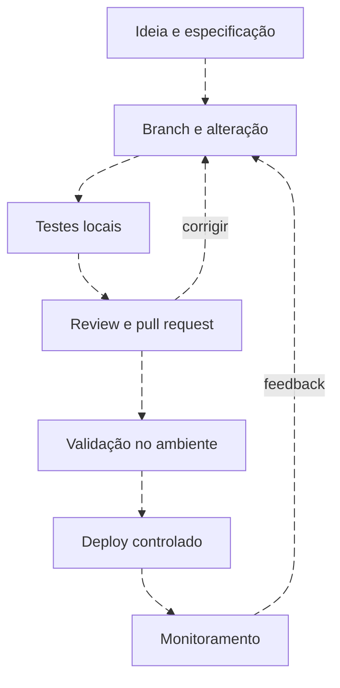

# Detection as Code: mudança com evidência e reversão

<!-- markdownlint-configure-file {"MD033": {"allowed_elements": ["details", "summary"]}} -->

[← Tópico anterior](sigma.md) · [↑ Índice do módulo](README.md) · [Página principal](../README.md) · [Próximo tópico →](mitre-mapping.md)

## O que versionar

Trate especificação, regra, mapeamento, fixtures, testes e runbook como artefatos relacionados. O ID estável conecta versões; o histórico explica por que a lógica mudou. Git ajuda a revisar e reverter, mas um commit não é uma aprovação operacional nem um deploy.



## Estrutura implementada

```text
detections/
  README.md
  windows/
    account-management/
      DET-WIN-ACCOUNT-001.yml
      wazuh-account-created.xml
    process-creation/
      office-powershell.sigma.yml
  tests/
    account-cases.json
    process-cases.json
    tuning.jsonl
    test_detection_logic.py
  tools/
    evaluate.py
    validate_artifacts.py
  requirements-validation.txt
```

O YAML DET-WIN-ACCOUNT-001 é formato educacional deste projeto. A regra com sufixo .sigma.yml segue Sigma. O XML Wazuh é outro artefato. Não envie o YAML de especificação para um importador Sigma ou SIEM.

## Validação simples e segura

Na raiz, em ambiente Python de desenvolvimento, instale as dependências opcionais e execute:

```sh
python -m pip install -r detections/requirements-validation.txt
python detections/tools/validate_artifacts.py
python -B -m unittest discover -s detections/tests -v
```

O primeiro validador usa PyYAML e pySigma para ler artefatos locais, além de analisar XML e campos mínimos do contrato educacional. Os testes comportamentais usam biblioteca padrão. Nada faz deploy, gera ataque ou se conecta ao SIEM. Nenhuma credencial é necessária.

Para Markdown, execute o lint usado no repositório e confira navegação e imagens. Uma futura integração de CI pode executar esses mesmos comandos, mas a aprovação para ambiente real continua separada. Não criamos pipeline de deploy automaticamente.

## Exemplo de review

**Mudança proposta:** excluir atores cujo nome começa com svc_.

**Revisor:** “O teste mostra 100 → 30 alertas, mas TP cai de 30 para 20. Qual risco justifica perder esses dez? A exceção tem escopo, dono e prazo? Temos um teste em que uma conta de serviço executa atividade relevante?”

**Resposta técnica:** substituir a exclusão por correspondência controlada com o registro de mudanças; anexar a matriz 100/30/40; testar validade e registrar que abuso dentro do escopo ainda pode escapar. Review rejeita ganho de volume sem avaliação de cobertura.

## Checklist do reviewer

Hipótese clara, fonte existente, campos e tipos corretos, nulos tratados, janela/threshold testados, exceções restritas, contexto suficiente, ATT&CK justificado, positivos/negativos presentes, owner, rollback e limites declarados. A revisão também confirma se o runbook usa os mesmos campos que o alerta entrega.

Entregue diff, testes, justificativa e decisão de promoção. Depois valide saúde e conteúdo do alerta no produto escolhido.

## Checkpoint

**Merge no Git equivale a implantação bem-sucedida?**

<details>
<summary>Ver resposta</summary>

Não. O repositório registra artefatos. Aplicação no produto, permissões, agendamento, alerta e monitoramento exigem validação separada.

</details>

[← Tópico anterior](sigma.md) · [↑ Índice do módulo](README.md) · [Página principal](../README.md) · [Próximo tópico →](mitre-mapping.md)
