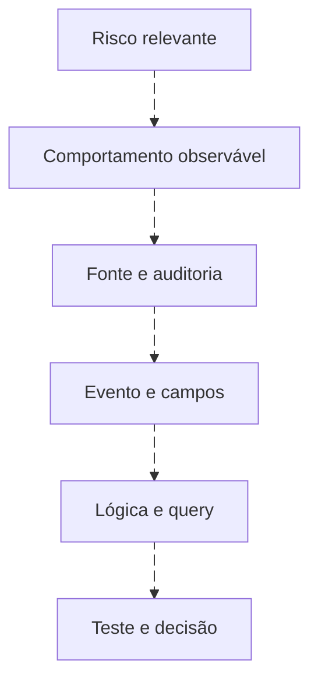

# Hipóteses que podem ser testadas

<!-- markdownlint-configure-file {"MD033": {"allowed_elements": ["details", "summary"]}} -->

[← Tópico anterior](fundamentos.md) · [↑ Índice do módulo](README.md) · [Página principal](../README.md) · [Próximo tópico →](detection-lifecycle.md)

## Do risco ao dado

Comece pelo comportamento, não pela lista de Event IDs. Para risco de persistência por nova conta: descreva criação de identidade, identifique a autoridade e a fonte, examine 4720 e seus campos, consulte e só então estabeleça uma detecção candidata. Criação de conta isolada não comprova persistência adversária.

## Vocabulário útil

| Termo | Exemplo | Pergunta de controle |
| --- | --- | --- |
| IOC | Hash, IP ou domínio de uma fonte de inteligência | Ainda é válido e relevante aqui? |
| Evento | Criação de processo | A fonte e a configuração registram essa atividade? |
| Sinal | Processo fora de um padrão esperado | Qual comparação produziu essa avaliação? |
| Comportamento | Nova conta seguida de inclusão em grupo sensível | As identidades e a ordem têm vínculo? |
| Hipótese | Essa sequência fora de provisionamento aprovado merece investigação | Como seria contrariada por evidência? |
| Detecção | Especificação, implementação e operação desse reconhecimento | Há testes e responsável? |

## Escreva uma hipótese falsificável

“PowerShell é malicioso” não distingue administração de abuso. Uma hipótese mais útil é: “PowerShell iniciado por uma cadeia não esperada para a função do ativo, seguido por comunicação não explicada, pode justificar investigação”. Defina o que significa esperado, qual histórico existe e qual contexto poderia explicar a cadeia.

“4720 é ataque” também falha. Use: “Criação de conta fora do fluxo administrativo aprovado, especialmente se seguida de associação a grupo sensível, exige conferir autorização e uso posterior”. Não possuir ticket no dataset significa contexto ausente, não automaticamente atividade não autorizada.

| Campo da hipótese | Exemplo fictício |
| --- | --- |
| Ativo | WIN-LAB01, estação de laboratório |
| População | Criações de contas locais auditadas |
| Comportamento | Criação que não corresponde a mudança aprovada |
| Evidência mínima | Ator, alvo, autoridade, host e horário |
| Evidência contrária | Mudança aprovada que corresponde exatamente ao evento |
| Ação | Verificar autorização e atividade posterior |
| Lacuna | Ausência de inventário histórico e de logs de identidade externos |

## IOC e comportamento

IOC facilita uma comparação específica, mas tem procedência, confiança e validade. Comportamento pode generalizar melhor, mas depende de mais dados e pode aumentar custo ou ambiguidade. Nenhum é sempre superior: declare o papel de cada um e mantenha a hipótese compreensível sem o feed.

**Exercício:** transforme “origem desconhecida é ataque” em uma hipótese. Defina inventário, data de atualização, condição de pesquisa e uma explicação legítima alternativa. Entregue também uma condição que faria você abandonar a hipótese.

## Checkpoint

**Ausência de aprovação no log prova criação indevida?**

Ver resposta

Não. O log geralmente não contém o processo de aprovação. Consulte uma fonte de contexto independente e registre quando ela não está disponível.

[← Tópico anterior](fundamentos.md) · [↑ Índice do módulo](README.md) · [Página principal](../README.md) · [Próximo tópico →](detection-lifecycle.md)
