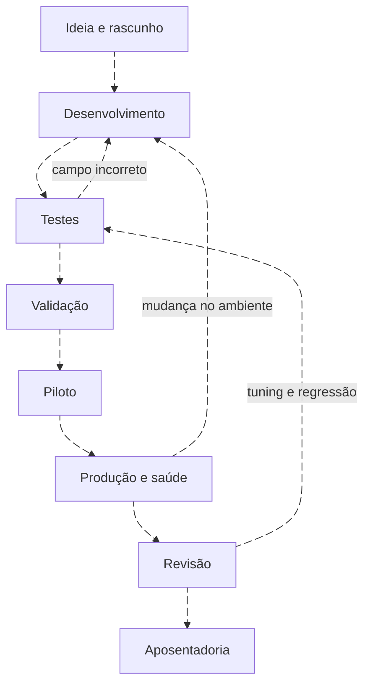

# Ciclo de vida: desenvolver, operar e aposentar

<!-- markdownlint-configure-file {"MD033": {"allowed_elements": ["details", "summary"]}} -->

[← Tópico anterior](detection-hypothesis.md) · [↑ Índice do módulo](README.md) · [Página principal](../README.md) · [Próximo tópico →](telemetry-requirements.md)

## Estados são acordos de trabalho

A tabela é um workflow didático, não um padrão obrigatório. O importante é que cada passagem exija evidência e responsável, em vez de apenas mudar uma etiqueta.

| Fase | Entrega para avançar | Bloqueio comum |
| --- | --- | --- |
| Ideia | Risco e público afetado | Pedido sem comportamento observável |
| Rascunho | Hipótese e dados necessários | Fonte desconhecida |
| Desenvolvimento | Contrato, lógica e protótipo | Campos ou chaves ambíguos |
| Teste | Casos positivos, negativos e de qualidade | Resultado esperado não definido |
| Validação | Evidência no ambiente e revisão | Teste local confundido com SIEM |
| Piloto | Escopo reduzido, SOC ciente e volume acompanhado | Nenhum responsável pela fila |
| Produção | Runbook, saúde, rollback e owner | Automação sem avaliação de impacto |
| Monitoramento | Execução, fonte, campos, atraso e classificação | Silêncio interpretado como sucesso |
| Tuning | Comparação e regressão documentadas | Exclusão ampla |
| Revisão | Risco, dependências e utilidade atuais | Revisão adiada indefinidamente |
| Aposentadoria | Motivo, impacto e substituição | Exclusão silenciosa do histórico |

## Portões práticos

DET-WIN-ACCOUNT-001 começa experimental. Os testes locais permitem revisar a lógica de seleção; não a promovem para produção. Antes de piloto, um responsável valida parser, resultado da busca, agendamento e entrega ao analista. Durante piloto, registra volume e tempo gasto por caso, inclusive positivos benignos.

Se a regra falhar após mudança de schema, o fluxo volta para desenvolvimento. Se uma investigação revelar telemetria ausente, a hipótese pode precisar reduzir seu escopo. Se a fonte for desativada, a capacidade é declarada indisponível até substituição ou aposentadoria.

## Critério de saída

Registre quem aceita a mudança, em qual versão, em quais ativos e com quais testes. Guarde o artefato anterior e o procedimento de reversão. Revise também treinamento e runbook: uma query nova com instrução antiga pode produzir decisões inconsistentes.

Veja [saúde](detection-health.md), [versionamento](versioning.md) e [aposentadoria](retiring-detections.md).

## Checkpoint

**Passar no teste unitário torna uma regra “validada em produção”?**

Ver resposta

Não. O teste cobre uma parte da lógica e um conjunto de entradas. Integração, agendamento, cobertura, volume e resposta precisam de evidências próprias.

[← Tópico anterior](detection-hypothesis.md) · [↑ Índice do módulo](README.md) · [Página principal](../README.md) · [Próximo tópico →](telemetry-requirements.md)
