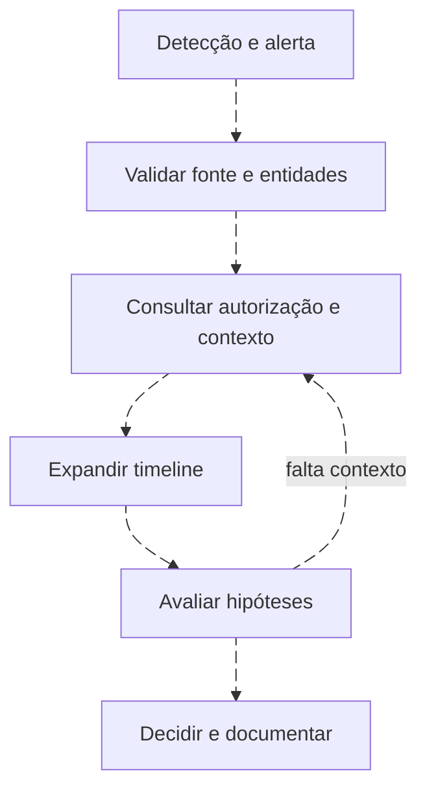

# Do alerta à decisão: runbook de triagem

<!-- markdownlint-configure-file {"MD033": {"allowed_elements": ["details", "summary"]}} -->

[← Tópico anterior](detection-metrics.md) · [↑ Índice do módulo](README.md) · [Página principal](../README.md) · [Próximo tópico →](feedback-to-detections.md)

## O alerta precisa permitir começar

Um runbook orienta decisões com evidência. Ele não deve transformar um sinal ambíguo em bloqueio automático. A primeira pergunta é se a fonte e os campos sustentam o motivo declarado no alerta.



## Runbook de DET-WIN-ACCOUNT-001

| Passo | Ação e evidência | Decisão possível |
| --- | --- | --- |
| 1. Validar fonte | Abrir registro original, provedor, canal e horário | Se faltar dado, abrir problema de qualidade sem negar a criação |
| 2. Identificar entidades | Separar Subject (ator) de Target (conta criada), autoridade e host | Confirmar local versus domínio |
| 3. Consultar contexto | Mudança aprovada, responsável pelo ativo, rotina de provisionamento | Aprovação correspondente enfraquece hipótese adversária |
| 4. Expandir timeline | Pesquisar a conta/SID antes e depois | Procurar associação a grupo, logon e uso posterior |
| 5. Verificar relações | SID do membro, sessão no mesmo host e processo quando disponível | Evitar vínculo baseado só em horário |
| 6. Conferir autorização | Consultar fonte independente e responsável | Ausência de ticket não comprova abuso |
| 7. Coletar evidência | Guardar referências, queries, janela e contexto revisado | Preservar rastreabilidade e minimizar exposição |
| 8. Decidir | Benigno explicado, inconclusivo ou escalar conforme critérios locais | Contenção depende de autoridade e impacto |
| 9. Documentar feedback | Classificação, dados faltantes e tempo gasto | Alimentar tuning, saúde e revisão |

## Quando escalar

Considere escalar se o responsável negar a mudança, houver grupo sensível sem justificativa ou uso posterior incompatível com o contexto. Registre os fatos que sustentam a urgência. Uma conta privilegiada pode exigir verificação rápida, mas excluir ou bloquear sem coordenação pode interromper serviços.

Se o caso for legítimo recorrente, não crie exceção diretamente da fila. Entregue padrão, evidência, escopo, risco e teste à engenharia. Se o caso revelar falta de telemetria, abra uma lacuna com owner.

## Campos de encerramento

```text
ID do alerta e versão da detecção:
Evento e fonte conferidos:
Ator, alvo, autoridade e ativo:
Janela e fuso:
Autorização verificada por:
Atividade relacionada e chaves:
Hipóteses consideradas:
Classificação e confiança:
Decisão, responsável e evidência:
Feedback para a detecção:
```

Os [playbooks anteriores](../playbooks/README.md) continuam úteis. Este runbook adiciona o vínculo explícito com o contrato, os campos e a versão da detecção.

## Checkpoint

**O runbook deve bloquear a conta assim que o evento 4720 aparecer?**

<details>
<summary>Ver resposta</summary>

Não. Ele orienta validação e contexto. Qualquer ação de resposta precisa considerar autoridade, risco e impacto operacional.

</details>

[← Tópico anterior](detection-metrics.md) · [↑ Índice do módulo](README.md) · [Página principal](../README.md) · [Próximo tópico →](feedback-to-detections.md)
