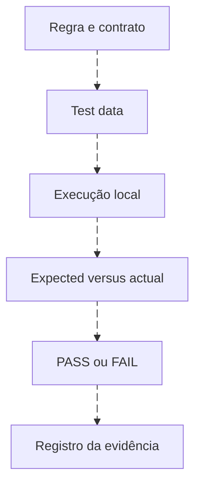

# Testes reproduzíveis com dados fictícios

<!-- markdownlint-configure-file {"MD033": {"allowed_elements": ["details", "summary"]}} -->

[← Tópico anterior](detection-validation.md) · [↑ Índice do módulo](README.md) · [Página principal](../README.md) · [Próximo tópico →](multisiem-detection.md)

## Execute a especificação local

Na raiz do repositório, com Python 3:

```sh
python -B -m unittest discover -s detections/tests -v
python detections/tools/evaluate.py
```

A biblioteca padrão executa os testes comportamentais. O [avaliador](../detections/tools/evaluate.py) é uma referência limitada em Python, não um motor Sigma, KQL, SPL, CRE ou Wazuh. Ele lê fixtures declarados sintéticos; não acessa rede nem implanta regras.



## Arquivos e resultados

| Artefato | Papel |
| --- | --- |
| [account-cases.json](../detections/tests/account-cases.json) | Casos positivos, negativo, provedor errado e contexto nulo |
| [tuning.jsonl](../detections/tests/tuning.jsonl) | Cem criações fictícias com referência de classificação |
| [test_detection_logic.py](../detections/tests/test_detection_logic.py) | Asserções de seleção, ordem, nulos, duplicação, atraso e tuning |
| [Dataset do módulo 07](../07-Buscas-e-Queries-em-SIEM/labs/dados/README.md) | Sequência E01/E02/E03 antes de E04 e controles de identidade |

Para conta criada, 4720 no contrato correto corresponde; 4624 não. Ator nulo não elimina a correspondência, mas aparece em missing_context. Isso separa reconhecimento do evento de prontidão para investigação.

Na correlação, limiares 3, 5 e 10 produzem respectivamente uma, zero e zero sequências no fixture original. A função usa autoridade + usuário + host + IP + LogonType, com início inclusivo e sucesso excluído. Duplicata idêntica é eliminada; ID repetido com conteúdo conflitante provoca erro. Em dados reais, o ID precisa ser composto com fonte, host e canal quando o identificador local não for global.

## Como testar a falha

Faça uma cópia de trabalho e altere o início inclusivo para exclusivo. O teste da borda inferior deve falhar. Depois reverta a alteração. Esse exercício demonstra que o teste consegue perceber um defeito, não apenas repetir a saída atual.

A classificação requires_investigation é ground truth artificial do exercício e nunca entra na condição de tuning. No mundo real, conhecer todos os casos relevantes é muito mais difícil. O relatório deve citar essa diferença.

## Registro de execução

```text
Versão/commit:
Fixture e população:
Comando:
Esperado:
Obtido:
Falhas e causa:
Limitações do avaliador:
Próximo teste no produto:
```

Use [validação](detection-validation.md) para planejar integração e [Detection as Code](detection-as-code.md) para incorporar a evidência ao review.

## Checkpoint

**Um teste de unidade pode substituir o teste do parser?**

<details>
<summary>Ver resposta</summary>

Não. Ele recebe campos já estruturados. O parser deve ser conferido com registro original e saída extraída no produto.

</details>

[← Tópico anterior](detection-validation.md) · [↑ Índice do módulo](README.md) · [Página principal](../README.md) · [Próximo tópico →](multisiem-detection.md)
