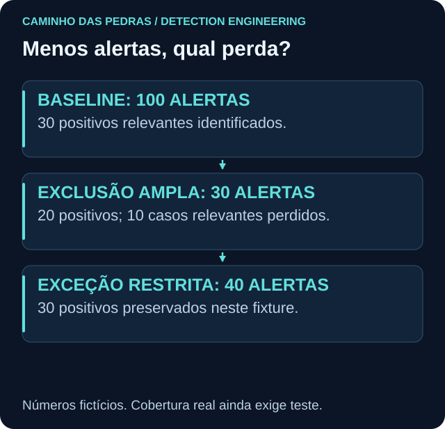

# Tuning: reduzir custo preservando o que importa

<!-- markdownlint-configure-file {"MD033": {"allowed_elements": ["details", "summary"]}} -->

[← Tópico anterior](false-positives.md) · [↑ Índice do módulo](README.md) · [Página principal](../README.md) · [Próximo tópico →](detection-validation.md)

## Tuning não é desligar alerta

Ajuste sinal, contexto, volume e cobertura juntos. Primeiro documente a hipótese, a versão e o problema observado. Depois altere uma condição, execute a regressão e compare o que foi perdido, além do que deixou de incomodar.

## O experimento 100 → 30

Os 100 registros fictícios representam candidatos 4720 em uma janela de mudança. A classificação de referência é “requer investigação”, fornecida pelo exercício, não inferida pelo detector.

| Variante | Alertas | TP | FP | FN | TN |
| --- | --- | --- | --- | --- | --- |
| Baseline, todos os candidatos | 100 | 30 | 70 | 0 | 0 |
| Excluir qualquer ator svc_* | 30 | 20 | 10 | 10 | 60 |
| Exceção restrita de provisionamento | 40 | 30 | 10 | 0 | 60 |

A queda para 30 esconde dez casos relevantes. A variante restrita exclui somente `svc_provision.lab`, em WIN-LAB01, na janela [10:00, 11:00) UTC de 28/09/2026, com correspondência a CHG-LAB-1234 no registro fictício de mudanças aprovadas. Ela preserva todos os positivos deste fixture, não todos os comportamentos possíveis do mundo real.

Se o ator autorizado for comprometido durante a janela e reproduzir o mesmo contexto, a exceção ainda pode ocultar atividade. Teste esse risco antes do piloto. A presença de um número de ticket no payload não basta: a aprovação precisa ser conferida em fonte independente.

## Evolução com ganho e perda

| Mudança | Ganho pretendido | Risco introduzido | Teste necessário |
| --- | --- | --- | --- |
| Elevar threshold 3 → 5 → 10 | Menos rajadas pequenas | Perder tentativas menores/lentas | Contagens 2/3/4, 4/5/6 e 9/10/11 |
| Encurtar timeframe | Mais proximidade | Perder sequência lenta | Bordas e atraso |
| Adicionar conta/autoridade | Evitar homônimos | Perder padrão distribuído | Contas e domínios distintos |
| Adicionar origem/LogonType | Melhor contexto | Campo ausente ou origem variável | Nulos, NAT e mudança de tipo |
| Exigir sucesso posterior | Priorizar uso aceito | Ignorar tentativas sem sucesso | Objetivo separado para falhas |
| Exigir criticidade | Priorizar impacto | Inventário incompleto | Contexto indisponível |
| Agrupar ou suprimir | Reduzir repetição operacional | Ocultar nova entidade ou evolução | Chave, prazo e evento novo |
| Filtrar por horário | Descrever rotina | Abuso no horário permitido | Caso relevante durante a rotina |

## Registro obrigatório de exceção

| Campo | Exemplo fictício |
| --- | --- |
| Motivo e evidência | Provisionamento aprovado, CHG-LAB-1234 |
| Escopo | Ator exato, host exato e janela declarada |
| Owner | Responsável LAB por identidade |
| Criação e validade | 28/09/2026, apenas uma hora neste fixture |
| Risco aceito | Abuso que imite o contexto aprovado |
| Teste | Caso fora da janela e ator svc_backup.lab continuam visíveis |
| Expiração | Retirar quando a janela encerrar; revisar antes de reutilizar |

Uma migração de sete dias exigiria validade explicitamente registrada, não uma allowlist permanente. Evite `NOT user contains "admin"` ou listas sem dono. Não confunda agrupamento de apresentação, supressão de notificações e filtro que remove evidência.

## Relatório de mudança

Anote hipótese, diff, população/período, resultado antes/depois, FP/FN, custo, aprovação, rollback e prazo de revisão. Rode `python detections/tools/evaluate.py` na raiz para reproduzir a tabela. Os números medem o fixture e não a capacidade do SOC real.

## Checkpoint

**A variante de 40 alertas é comprovadamente perfeita?**

Ver resposta

Não. Ela preserva os rótulos positivos do conjunto testado. Precisa de novos contraexemplos, fonte real, agendamento, custo e revisão do risco da própria exceção.

[← Tópico anterior](false-positives.md) · [↑ Índice do módulo](README.md) · [Página principal](../README.md) · [Próximo tópico →](detection-validation.md)
