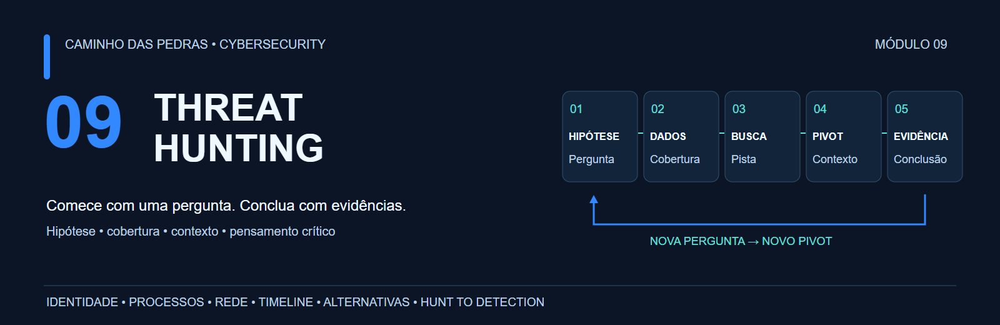
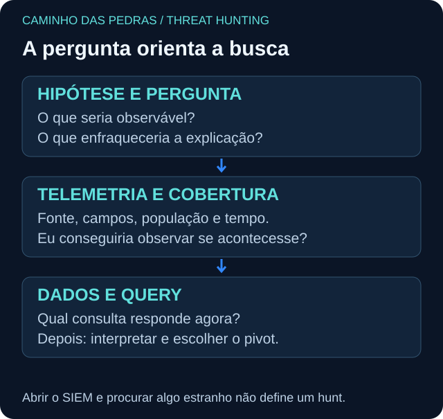
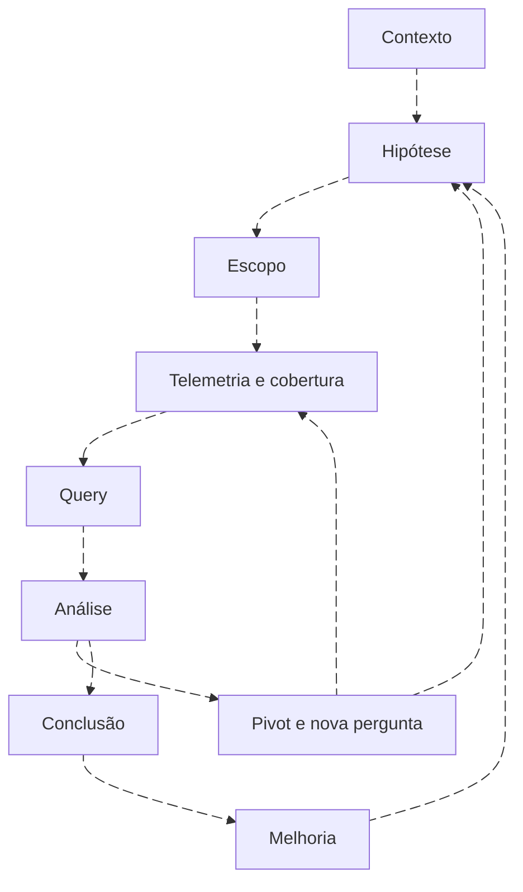
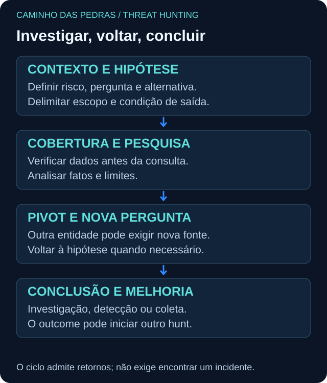

# 09 Threat Hunting

<!-- markdownlint-configure-file {"MD033": {"allowed_elements": ["details", "summary"]}} -->

[← Tópico anterior](../08-Detection-Engineering/README.md) · [↑ Índice do módulo](README.md) · [Página principal](../README.md) · [Próximo tópico →](metodologia.md)

> Se nenhum alerta disparou, significa que não aconteceu nada?

Não necessariamente. Talvez nenhuma atividade relevante tenha ocorrido. Talvez a coleta estivesse ausente, uma regra não cobrisse a manifestação, o threshold não fosse alcançado, uma exceção removesse o sinal ou ainda não existisse detecção para aquele comportamento.

## O que é Threat Hunting?

É uma atividade investigativa e proativa que usa hipóteses, telemetria, contexto e análise para procurar evidências de comportamentos de interesse que podem não ter produzido alertas suficientes. Processos variam entre organizações. O valor está na qualidade da pergunta e na conclusão defensável, não em encontrar um incidente a qualquer custo.

**Threat Hunting começa com uma pergunta, não com uma ferramenta.**

## Hunting não é busca aleatória

| Ação isolada | Como se torna parte de um hunt |
| --- | --- |
| Procurar PowerShell ou eventos raros | Definir comportamento, população, contexto e explicações concorrentes |
| Rodar query da internet | Verificar hipótese, schema, tempo e resultados esperados |
| Consultar IOC ou reputação | Examinar validade, entidade e comportamento associado |
| Executar regra manualmente | Investigar lacunas, limites e novas perguntas além do alerta |
| Ordenar top 10 IPs | Justificar população, denominador e o próximo pivot |

## O ciclo do hunt

O processo retorna à hipótese quando os dados a contradizem; um pivot pode exigir nova fonte e novo escopo. A condição de saída evita uma busca interminável.

Ver diagrama Mermaid animado

## Da hipótese à evidência

Pergunte o que seria observável se a hipótese fosse correta. Confirme se os dados poderiam registrar isso. Só então consulte. Separe **fato observado**, **inferência**, **explicação alternativa** e **conclusão limitada ao escopo**. Zero resultados com coleta ausente é inconclusivo.

## O que você aprenderá

- Escrever hipótese testável e procurar evidências que a enfraqueçam.
- Definir população, período, timebox e cobertura antes de pesquisar.
- Investigar autenticação, identidade, processos, DNS, conexões e mudanças persistentes.
- Relacionar entidades por chaves válidas, mantendo relações apenas possíveis separadas.
- Produzir journal, timeline, relatório e proposta de melhoria para o SOC.
- Executar o mesmo raciocínio em SIEM, EDR/XDR e análise offline.

## Jornada prática

| Etapa | Conteúdo |
| --- | --- |
| 01 | [Metodologia: uma pergunta por vez](metodologia.md) |
| 02 | [Hipóteses testáveis e concorrentes](hipoteses.md) |
| 03 | [Vieses e raciocínio investigativo](bias-e-raciocinio.md) |
| 04 | [Escopo, timebox e condição de saída](scoping.md) |
| 05 | [Telemetria e cobertura antes do hunt](hunting-telemetry.md) |
| 06 | [Baseline é referência, não garantia](baselining.md) |
| 07 | [Raridade, frequência e outliers](rarity.md) |
| 08 | [Pivot: a próxima pergunta](pivoting.md) |
| 09 | [Timeline: ordenar não é explicar](timeline.md) |
| 10 | [IOC: indicador, validade e contexto](iocs.md) |
| 11 | [Táticas, técnicas, procedimentos e custo de mudança](ttps.md) |
| 12 | [Hunting baseado em comportamento](behavior-based-hunting.md) |
| 13 | [ATT&CK como apoio ao raciocínio](hunting-with-attack.md) |
| 14 | [Windows: eventos que respondem perguntas](windows-hunting.md) |
| 15 | [Sysmon: relações de processo e seus limites](sysmon-hunting.md) |
| 16 | [Processos, árvores e administração legítima](process-hunting.md) |
| 17 | [Autenticação: da tentativa ao contexto](authentication-hunting.md) |
| 18 | [Identidade: criação, privilégio e cloud](identity-hunting.md) |
| 19 | [Rede e DNS: relações que os dados permitem](network-hunting.md) |
| 20 | [Mesmo hunt, quatro plataformas](multisiem-hunting.md) |
| 21 | [Catálogo e registro de hunts](hunts.md) |
| 22 | [Hunt Journal: registro reproduzível](hunt-journal.md) |
| 23 | [Conclusão, outcome e encerramento](hunt-outcomes.md) |
| 24 | [Do hunt à detecção e à melhoria de coleta](hunt-to-detection.md) |
| 25 | [Métricas que explicam o trabalho](hunting-metrics.md) |
| 26 | [Template de Hunt Plan e Notebook](TEMPLATE-HUNT.md) |
| 27 | [Template de relatório final](TEMPLATE-RELATORIO-HUNT.md) |
| 28 | [HUNT-WIN-001: exemplo preenchido](exemplo-hunt-completo.md) |
| 29 | [Referências e limites da validação](referencias.md) |

## Laboratórios e portfólio

Os [onze labs progressivos e o laboratório final](labs/README.md) usam dados fictícios. Comece sem SIEM. Depois escolha uma plataforma; não é necessário instalar quatro produtos.

Entregas: Hunt Plan, Hunt Journal, timeline, mapa de pivots, IOC to Behavior, Threat Hunt Report e Hunt to Detection. O [exemplo preenchido](exemplo-hunt-completo.md) demonstra como comunicar incerteza.

## Conexões com a trilha

| Base | Aplicação aqui |
| --- | --- |
| [05: investigação no SOC](../05-SOC-Blue-Team/investigacao.md) | Triagem, decisão e escalonamento |
| [06: SIEM](../06-SIEM-na-Pratica/README.md) | Coleta, parsing e disponibilidade |
| [07: queries](../07-Buscas-e-Queries-em-SIEM/README.md) | Consultas progressivas, tempo e correlação |
| [08: Detection Engineering](../08-Detection-Engineering/README.md) | Validar e operar um padrão candidato |
| [10: Incident Response](../10-Incident-Response/README.md) | Transferir evidências quando o risco exigir resposta |

## Checklist

Use o [template de progresso](../.github/ISSUE_TEMPLATE/modulo-09-threat-hunting.md) numa Issue. Concluir leitura não comprova execução em SIEM. Registre versão, dados, cobertura e resultado realmente obtido.

## Checkpoint

**Qual é a primeira pergunta antes de interpretar zero resultados?**

Ver resposta

Eu conseguiria observar esse comportamento, nessa população e nesse período, com os dados realmente disponíveis?

[← Tópico anterior](../08-Detection-Engineering/README.md) · [↑ Índice do módulo](README.md) · [Página principal](../README.md) · [Próximo tópico →](metodologia.md)
