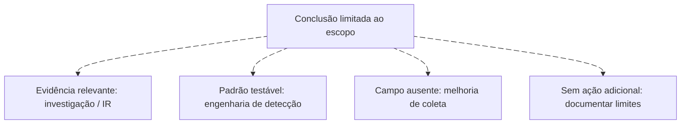

# Conclusão, outcome e encerramento

<!-- markdownlint-configure-file {"MD033": {"allowed_elements": ["details", "summary"]}} -->

[← Tópico anterior](hunt-journal.md) · [↑ Índice do módulo](README.md) · [Página principal](../README.md) · [Próximo tópico →](hunt-to-detection.md)

## Grau de sustentação não é status de execução

| Conclusão sobre a hipótese | Uso adequado |
| --- | --- |
| Sustentada ou parcialmente sustentada | Evidências apoiam a proposição delimitada, com limites explícitos |
| Enfraquecida | Evidências favorecem alternativas ou contradizem parte da previsão |
| Refutada no escopo | Evidência suficiente contradiz a proposição específica testada |
| Inconclusiva | Dados, cobertura ou contexto não permitem decidir |

Evite confundir “sequência observada” com “abuso sustentado”. Um hunt pode estar completed como trabalho, mas sua hipótese permanecer inconclusiva. Estados draft, in progress, completed, inconclusive, converted to detection e escalated são sugestões deste projeto, não padrão universal. Registre separadamente conclusão e andamento.

## Destinos possíveis

| Outcome | Entrega e responsável a definir |
| --- | --- |
| Nenhum achado relevante | Escopo, cobertura e limitações arquivados |
| Nova hipótese | Pergunta, evidências motivadoras e novo escopo |
| Telemetry gap | Fonte/campo faltante, ativos, período, responsável e teste de aceite |
| Detection gap ou tuning | Manifestação não coberta, exemplos e contrato para engenharia |
| Investigação/IR | Evidência, risco, entidades e linha do tempo para equipe autorizada |
| Documentação | Baseline/contexto útil para novas pesquisas |

Um hunt pode gerar mais de um outcome. Não abra incidente só para melhorar uma métrica. Quando a evidência e o risco exigirem resposta, preserve registros, comunique escopo e encaminhe ao [módulo 10](../10-Incident-Response/README.md); não continue indefinidamente em modo exploratório.

## Resultado negativo com valor

Se WIN-LAB03 não cobre o período, registre inconclusivo para aquele ativo e uma melhoria de coleta. Se controles positivos e cobertura forem suficientes e a previsão não se verificar, explique o enfraquecimento restrito ao escopo. Não escreva “ambiente livre de ameaça”.

## Maturidade didática

Este projeto sugere evolução de buscas por IOC para queries estruturadas, hipóteses explícitas, comportamento, baseline e feedback contínuo. É um modelo didático, não framework oficial nem escada rígida. Mesmo uma equipe madura utiliza IOCs quando úteis. A evolução se demonstra pela qualidade da evidência e das decisões.

## Decisões após a análise

Ver diagrama Mermaid animado

## Checkpoint

**Um hunt inconclusivo pode estar encerrado?**

Ver resposta

Sim. Se a condição de saída foi atingida e as lacunas foram documentadas/encaminhadas, o trabalho pode terminar sem conclusão sobre a intenção investigada.

[← Tópico anterior](hunt-journal.md) · [↑ Índice do módulo](README.md) · [Página principal](../README.md) · [Próximo tópico →](hunt-to-detection.md)
