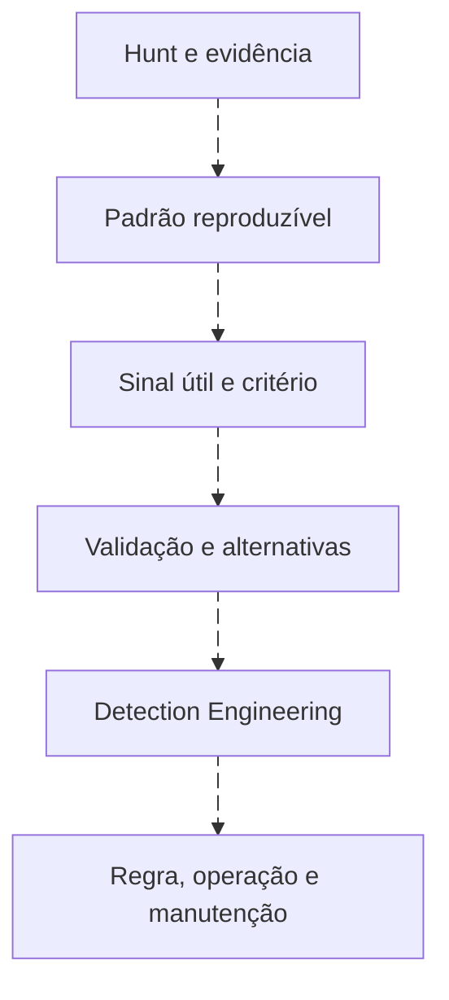

# Do hunt à detecção e à melhoria de coleta

<!-- markdownlint-configure-file {"MD033": {"allowed_elements": ["details", "summary"]}} -->

[← Tópico anterior](hunt-outcomes.md) · [↑ Índice do módulo](README.md) · [Página principal](../README.md) · [Próximo tópico →](hunting-metrics.md)

## Nem todo achado vira regra

Ver diagrama Mermaid animado

Antes de automatizar pergunte: o padrão é repetível, observável, acionável, testável e tem volume aceitável? O SOC consegue responder? Dados e contexto usados manualmente existem em produção com qualidade e latência suficientes?

## Pacote de transferência

| Item | Exemplo do hunt de autenticação |
| --- | --- |
| Hipótese observável | Falhas seguidas de sucesso na mesma chave, com contexto posterior a revisar |
| Evidências | E01/E02/E03/E04 e controles E10/E11 fora da chave |
| Campos | Autoridade, conta/SID, host, origem, tipo e timestamp |
| Lógica candidata | Três falhas nos dez minutos anteriores, como ponto inicial didático |
| Limites | Origem compartilhada, latência, contas de serviço, chaves ausentes |
| Alternativas | Digitação, credencial expirada, tarefa administrativa |
| Testes | Positivo, negativo, homônimo, host diferente, janela, atraso, nulo e duplicata |
| Operação | Severidade/confiança separadas, owner, runbook, saúde e revisão |

Preencha o [template de detecção](../08-Detection-Engineering/TEMPLATE-DETECCAO.md). O [avaliador local do módulo 08](../detections/tools/evaluate.py) demonstra uma lógica limitada sobre dados fictícios; não é motor de SIEM. Reutilize seus testes como evidência de raciocínio, sem declarar prontidão de produção.

## Quando o melhor resultado é coleta

Hipótese → preciso de command line → campo ausente → telemetry gap. Registre fonte, configuração esperada, população e evidência de aceite. Não crie regra que dependa de um campo inventado ou constantemente nulo. Encaminhe à trilha de [SIEM](../06-SIEM-na-Pratica/README.md).

## Quando o melhor resultado é IR

Achado relevante → preservação → ampliação controlada → investigação/IR. Anexe fatos, grau de confiança, chaves e contexto. Uma regra futura não substitui resposta a um risco atual.

## Critério de aceite da candidata

Ela deve passar por validação, tuning, revisão de cobertura, versão e operação no [módulo 08](../08-Detection-Engineering/README.md). Escrever uma query e anexar uma tag não conclui essa transferência. A candidata do Lab 11 permanece proposta até ter esses testes e execução no ambiente.

## Checkpoint

**Um achado único sempre deve virar detecção?**

Ver resposta

Não. Pode justificar investigação, coleta ou documentação. Automatizar exige repetibilidade, observabilidade, teste e capacidade de resposta.

[← Tópico anterior](hunt-outcomes.md) · [↑ Índice do módulo](README.md) · [Página principal](../README.md) · [Próximo tópico →](hunting-metrics.md)
