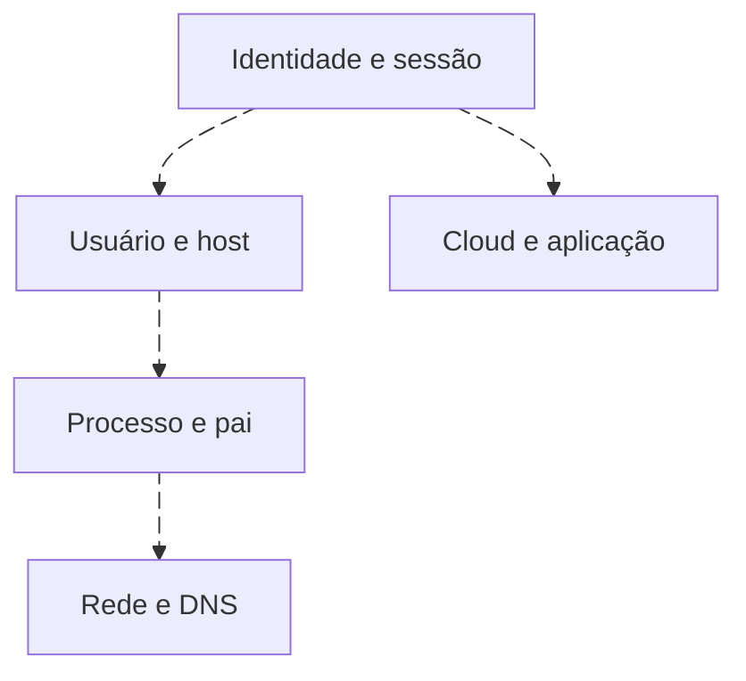
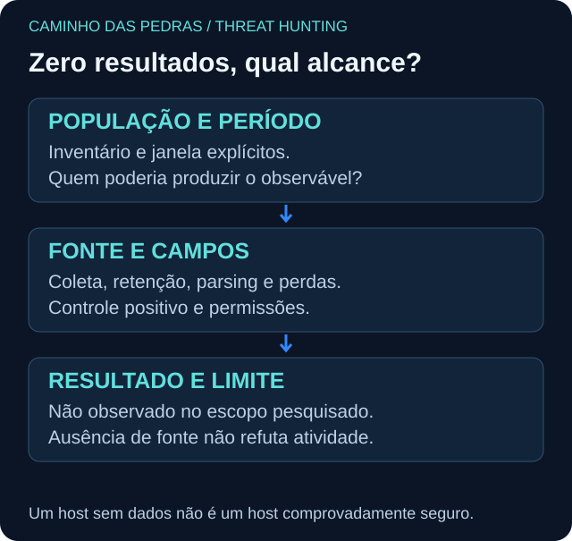

# Telemetria e cobertura antes do hunt

<!-- markdownlint-configure-file {"MD033": {"allowed_elements": ["details", "summary"]}} -->

[← Tópico anterior](scoping.md) · [↑ Índice do módulo](README.md) · [Página principal](../README.md) · [Próximo tópico →](baselining.md)

## A pergunta de controle

> Eu conseguiria encontrar esse comportamento se ele tivesse acontecido?

| Domínio | Fontes possíveis | Campo ou relação a confirmar |
| --- | --- | --- |
| Endpoint | Security, Sysmon, EDR, audit e logs Linux | Identidade, processo, pai, tempo, host |
| Identidade | AD, provedor cloud, MFA, VPN | Conta estável, sessão, resultado, dispositivo |
| Rede | DNS, proxy, firewall, NDR, NetFlow | Origem/destino, ação, duração e bytes quando disponíveis |
| Cloud | Audit logs, control plane e workload | Ator, API, recurso, tenant/projeto e request ID |
| Email | Auditoria, entrega e acesso a mensagens | Remetente, destinatário, message ID e ação |

Nem todas são obrigatórias. A hipótese determina quais são necessárias. Um log de plano de controle não mostra automaticamente execução dentro de um workload; NetFlow não contém necessariamente conteúdo da aplicação.

## Prove disponibilidade e qualidade

1. Compare ativos esperados com ativos observados.
2. Confira coleta, versão/configuração, eventos habilitados e filtros.
3. Verifique retenção no período e continuidade da ingestão.
4. Inspecione evento bruto e campos extraídos, tipos, nulos e truncamento.
5. Distinga tempo de ocorrência, coleta e ingestão; avalie atraso e relógio.
6. Teste uma ocorrência conhecida ou um dado sintético autorizado.
7. Registre perdas, escopo de permissões e limites de consulta/exportação.

Agente ativo não comprova todos os eventos. Um heartbeat comprova presença em algum momento, não completude. Ver o primeiro e o último evento não elimina uma lacuna entre eles.

## Matriz do laboratório

Use [cobertura.csv](labs/dados/cobertura.csv): WIN-LAB01 tem Security e Sysmon no intervalo; WIN-LAB02 tem Sysmon 1, mas 3/22 estão desabilitados; WIN-LAB03 não tem Sysmon e sua retenção começa depois do período investigado; DC-LAB01 tem auditoria de identidade. Esses são controles simulados separados da mera presença de eventos.

Ver diagrama Mermaid animado

As setas são perguntas de pivot, não relações automaticamente demonstradas. Identidade → cloud exige tenant, principal ou sessão realmente compatíveis.

## Não encontrei nada. E agora?

Pode ser que a atividade não tenha ocorrido no escopo observado; que tenha ocorrido de outra forma; que a telemetria não a tenha registrado; ou que a pesquisa não tenha conseguido identificá-la. Documente qual possibilidade foi testada e qual permanece aberta. “Zero resultados” não significa “zero atividade maliciosa”.

Detalhes de coleta e parsing permanecem no [módulo 06](../06-SIEM-na-Pratica/README.md).

## Checkpoint

**Um host sem Sysmon 3 pode ser considerado sem conexões?**

Ver resposta

Não. Falta a fonte necessária para essa conclusão. Procure outra fonte capaz de observar a conexão e registre a lacuna.

[← Tópico anterior](scoping.md) · [↑ Índice do módulo](README.md) · [Página principal](../README.md) · [Próximo tópico →](baselining.md)
