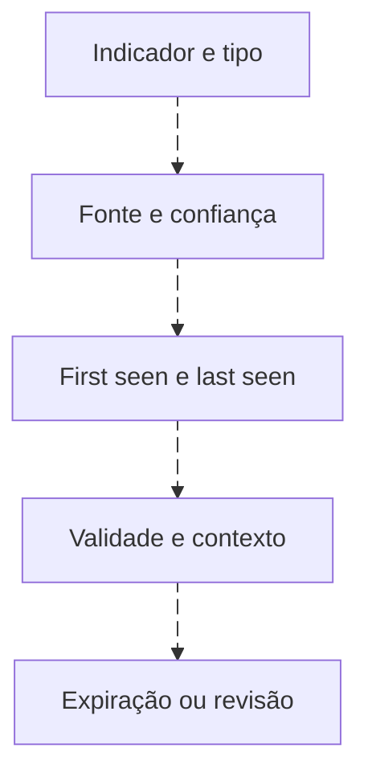

# IOC: indicador, validade e contexto

<!-- markdownlint-configure-file {"MD033": {"allowed_elements": ["details", "summary"]}} -->

[← Tópico anterior](timeline.md) · [↑ Índice do módulo](README.md) · [Página principal](../README.md) · [Próximo tópico →](ttps.md)

## Correspondência é ponto de partida

IP, domínio, URL, hash, filename, endereço de email e fingerprint de certificado podem funcionar como indicadores. Sua utilidade depende da origem, precisão, validade e contexto. **IOC match não confirma comprometimento.**

IPs podem ser compartilhados, realocados, VPN, CDN ou cloud. Um hash pode identificar um binário legítimo usado de forma indevida; também pode apontar a conteúdo sem execução. Filename é facilmente reutilizado. Um domínio recém-observado internamente não é necessariamente recém-registrado.

## Ciclo de vida

Ver diagrama Mermaid animado

Registre tipo, valor, fonte, motivo, confiança declarada pela fonte, first seen, last seen, validade, expiração, responsável e revisão. A confiança da fonte não substitui avaliação local. Separe datas do provedor de inteligência e datas observadas no ambiente.

O [indicadores.json](labs/dados/indicadores.json) contém updates.example.test e 198.51.100.20, ambos fictícios, sem reputação adversária real. O domínio tem validade durante o exercício e confiança baixa. O IP está expirado: um match pode servir para pesquisa histórica contextualizada, não para tratá-lo como indicador ativo.

## Do indicador ao comportamento

Domínio → hosts → processos → usuários → respostas IP → frequência. IP → hosts → processos → usuários → outros destinos e domínios. Hash → hosts → paths → execuções → usuários → rede. Exija os campos de ligação em cada transição.

Em E07, o domínio leva a E06/E08 pelo ProcessGuid. Não há resposta DNS; não atribua o IP ao domínio. Não há hashes neste dataset, logo o pivot por hash é uma proposta de coleta, não um resultado obtido.

## Limites e entrega

Não publique dados privados nem envie arquivos ou logs sensíveis a serviços externos. Nos labs use somente os valores sintéticos. Entregue ficha de indicador, resultados, hipóteses concorrentes e expiração/revisão. Preserve o conceito do registro original: indicador é pista com contexto, não veredito.

## Checkpoint

**Um indicador expirado é inútil para toda pesquisa?**

Ver resposta

Não. Pode ter valor histórico na janela em que era pertinente, com sua origem e limites documentados. Não deve ser promovido automaticamente a evidência atual de comprometimento.

[← Tópico anterior](timeline.md) · [↑ Índice do módulo](README.md) · [Página principal](../README.md) · [Próximo tópico →](ttps.md)
