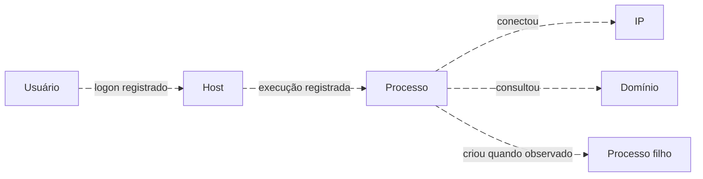
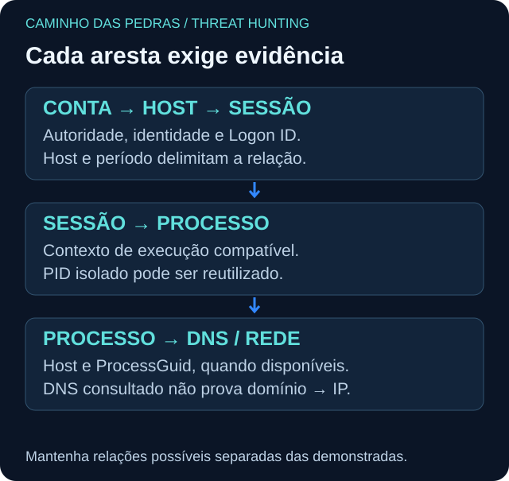

# Pivot: a próxima pergunta

<!-- markdownlint-configure-file {"MD033": {"allowed_elements": ["details", "summary"]}} -->

[← Tópico anterior](rarity.md) · [↑ Índice do módulo](README.md) · [Página principal](../README.md) · [Próximo tópico →](timeline.md)

## Relação verificável, não proximidade

A primeira query encontra uma pista. O hunt avança quando sabemos qual pergunta fazer depois. Cada pivot registra entidade inicial, chave, fonte seguinte, janela, resultado e limite.

| Partida | Próxima pergunta | Chave e cuidado |
| --- | --- | --- |
| Conta | Em quais hosts autenticou? | SID/autoridade e nome; homônimos existem |
| Sucesso 4624 | Quais privilégios e processos na sessão? | Host + Logon ID e ciclo de inicialização; não universal |
| Processo | Qual pai, filhos, DNS e conexão? | Host + ProcessGuid dentro da telemetria Sysmon |
| Hash | Outros hosts, paths e usuários? | Algoritmo + hash; cópias não provam execução |
| IP | Que processos, usuários e destinos relacionados? | Tempo, NAT/VPN/proxy e direção da conexão |
| Domínio | Quem consultou e houve conexão? | Processo e resposta DNS; cache/DoH podem limitar |
| Host | Quais usuários, arquivos e mudanças? | Identificador estável e intervalo; hostname pode mudar |
| Cloud | Qual aplicação ou recurso a identidade alterou? | Tenant/projeto + principal + request/session ID |

## PID, GUID e sessão

PID pode ser reutilizado. Se só houver PID, mantenha host, início/fim da execução e evidência adicional; sem isso a relação é candidata. ProcessGuid estabiliza a execução Sysmon, mas não é um identificador universal entre produtos. ParentProcessGuid permite buscar o pai quando o evento de criação correspondente foi coletado. Campos ausentes não autorizam preencher relações por adivinhação.

Ver diagrama Mermaid animado

O grafo expressa relações com rótulos distintos. Um domínio consultado e um IP conectado pelo mesmo processo não demonstram que aquele domínio resolveu para aquele IP.

## Do caso pequeno à expansão

E01/E02/E03 → E04: conta, domínio, host, origem, tipo de logon e tempo compatíveis. E04 → E05: sessão 0xA100 no mesmo host. E05 → E06: mesma sessão declarada. E06 → E07/E08: mesmo ProcessGuid e host. E09 está no DC e envolve outras identidades; não pertence automaticamente à cadeia.

E10 tem nome igual, mas autoridade OUTRO. E11 tem host e conta diferentes. Ambos demonstram por que nome ou minuto não bastam.

## Multi-host e multi-user

Depois de uma relação sustentada, pesquise a entidade em outros hosts dentro de janela justificada. Compare usuários, pais e destinos antes de unir resultados. Um IP compartilhado pode levar a várias contas legítimas. Guarde arestas confirmadas pela telemetria separadas de relações que ainda precisam de prova.

Entregável: mapa com cada aresta ligada a IDs de evidência e uma lista explícita de relações recusadas.

## Checkpoint

**Podemos ligar E07 a E08 como resolução DNS confirmada?**

Ver resposta

Não. O fixture não contém a resposta DNS. Ambos estão ligados à execução, mas domínio → IP continua não demonstrado.

[← Tópico anterior](rarity.md) · [↑ Índice do módulo](README.md) · [Página principal](../README.md) · [Próximo tópico →](timeline.md)
