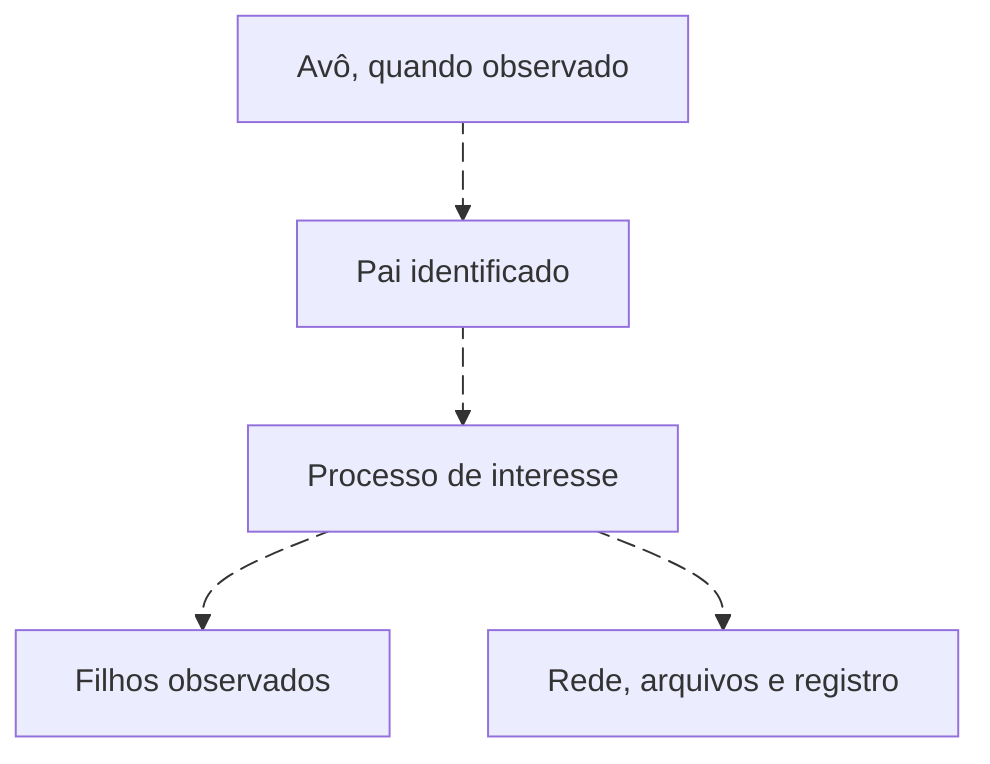

# Processos, árvores e administração legítima

<!-- markdownlint-configure-file {"MD033": {"allowed_elements": ["details", "summary"]}} -->

[← Tópico anterior](sysmon-hunting.md) · [↑ Índice do módulo](README.md) · [Página principal](../README.md) · [Próximo tópico →](authentication-hunting.md)

## O nome é apenas uma entrada

PowerShell, cmd, rundll32 e certutil podem ter usos legítimos e abusivos. LOLBins são binários legítimos que podem ser utilizados em atividades indevidas. O hunt observa contexto e comportamento, sem precisar reproduzir técnicas ofensivas.

Ver diagrama Mermaid animado

Cada aresta depende de telemetria. Não reconstrua um avô com base somente no nome mais comum. Em EDR/XDR, confira o identificador de execução do produto; não imponha ProcessGuid Sysmon a outro schema.

## Sequência de perguntas

1. Qual Image, caminho, hash e assinatura, quando disponíveis?
2. Qual pai, avô e filhos confirmados por identificadores?
3. Qual command line foi registrada, sem confundir criação com comandos posteriores?
4. Qual usuário, sessão, host e função administrativa?
5. É primeiro observado, raro ou prevalente no histórico elegível?
6. Existem DNS, conexões, arquivos ou alterações de registro associados?
7. Qual mudança ou aplicação explica a cadeia? Que evidência a contradiz?

## Duas execuções, duas perguntas

N04 registra WINWORD.EXE → powershell.exe para finance.lab com Get-Date; a relação incomum pede contexto de automação de documentos, não prova malware. E12 registra taskeng.exe → powershell.exe para svc.lab, com ocorrência histórica. O histórico favorece investigar primeiro N04, mas não absolve E12.

O contexto C02 confirma um exercício benigno para N07 com host, conta e horário delimitados. Não estenda essa aprovação a N04, outra conta, outro pai ou outra execução.

## EDR/XDR além do SIEM

Árvores de processo, arquivos, registro, rede e identidade podem estar num console EDR/XDR. Documente retenção, cobertura de sensores, permissões e exportação. Uma detecção do produto é uma avaliação, não substitui o evento e sua evidência. Ações de isolamento ou coleta ativa ficam fora destes labs; o exercício usa leitura de dados fictícios.

Use os hunts de [processo incomum](../hunts/process/hunt-03-processo-incomum.md), [PowerShell](../hunts/process/hunt-04-powershell.md) e [explicações concorrentes](../hunts/process/hunt-10-administracao-abuso.md).

## Checkpoint

**Get-Date explica automaticamente uma conexão registrada depois?**

Ver resposta

Não. A linha de criação não descreve necessariamente toda a vida de um processo interativo. A conexão precisa de contexto próprio.

[← Tópico anterior](sysmon-hunting.md) · [↑ Índice do módulo](README.md) · [Página principal](../README.md) · [Próximo tópico →](authentication-hunting.md)
