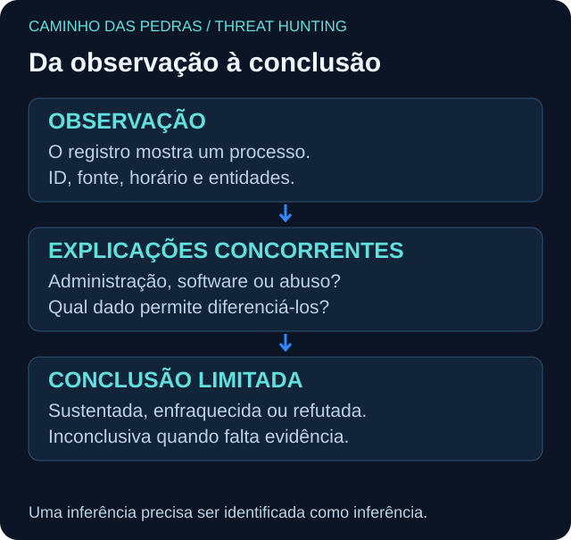

# Timeline: ordenar não é explicar

<!-- markdownlint-configure-file {"MD033": {"allowed_elements": ["details", "summary"]}} -->

[← Tópico anterior](pivoting.md) · [↑ Índice do módulo](README.md) · [Página principal](../README.md) · [Próximo tópico →](iocs.md)

## Três tempos e uma chave de evidência

Registre tempo original, timezone, tempo normalizado em UTC e, quando disponível, ingestão. Ordenar por ingestão pode inverter eventos atrasados. Empates e relógios imprecisos exigem cautela. ID serve para reencontrar o registro, não para provar causalidade.

| UTC, 24/09/2026 | Evidência | Observação | Relação |
| --- | --- | --- | --- |
| 08:01 a 08:03 | E01/E02/E03 | Três falhas de LAB/alan.lab | Mesma chave de autenticação |
| 08:05 | E04 | Logon bem-sucedido em WIN-LAB01 | Candidato após falhas |
| 08:06 | E05 | Privilégios especiais na sessão 0xA100 | Não é inclusão em grupo |
| 08:08 | E06 | PowerShell criado | Mesmo host e sessão declarados |
| 08:10 | E07 | Consulta updates.example.test | Mesmo ProcessGuid |
| 08:12 | E08 | Conexão para 198.51.100.20:443 | Mesmo ProcessGuid; domínio-IP não demonstrado |
| 08:15 | E09 | Conta novo.lab criada no DC | Não associada à sessão anterior |

## Observação, inferência e conclusão

| Tipo | Exemplo correto |
| --- | --- |
| Fato observado | E06 registra powershell.exe em WIN-LAB01 |
| Hipótese | A execução pode pertencer à administração esperada ou a uso indevido |
| Evidência discriminante | Pai, comando, sessão, operador e autorização independente |
| Inferência | A sequência merece revisão por reunir autenticação e atividade posterior |
| Conclusão | Sequência observada; intenção e autorização ainda inconclusivas |

“O atacante baixou uma ferramenta” excederia os dados. A linha de criação Get-Date não explica comandos interativos posteriores e não prova download. O evento de rede não informa o conteúdo transferido neste fixture.

## Método de construção

Preserve os arquivos originais. Ordene uma cópia por timestamp; anote fuso e precisão. Mantenha IDs, fonte e entidades. Separe cadeias por chave; marque intervalos sem cobertura e relações possíveis. Não retire atividade legítima só para produzir uma história visualmente limpa.

Use o [Lab 09](labs/lab-09-timeline.md) para ordenar dados embaralhados. E12 e E13 são duas fontes da mesma criação, não duas execuções independentes.

## Checkpoint

**Duas linhas consecutivas na timeline formam uma cadeia causal?**

Ver resposta

Não. A ordem temporal é necessária em algumas hipóteses, mas precisa de chaves e evidência contextual para sustentar a relação.

[← Tópico anterior](pivoting.md) · [↑ Índice do módulo](README.md) · [Página principal](../README.md) · [Próximo tópico →](iocs.md)
