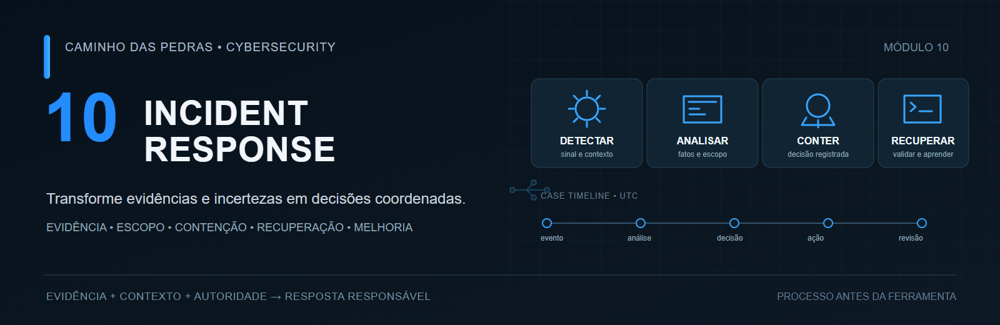
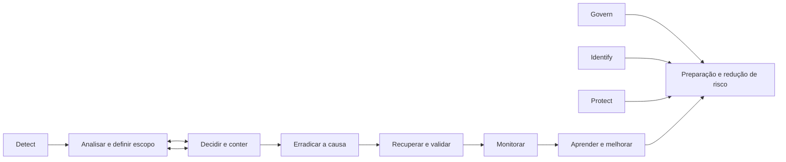

# 10: Incident Response

[← Módulo 09: Threat Hunting](../09-Threat-Hunting/README.md) · [Página principal](../README.md) · [Módulo 11: MITRE ATT&CK](../11-MITRE-ATTACK/README.md)



> Transforme evidências e incertezas em decisões coordenadas para limitar impacto, preservar informações, remover a causa, recuperar serviços e melhorar a organização.

Responder a incidente não é clicar em “isolar dispositivo”. Uma ação precisa considerar evidência, escopo, impacto, urgência, autoridade, continuidade, reversibilidade e risco. Rapidez importa, mas não substitui contexto. Investigar indefinidamente também não é resposta: registre o que se sabe, decida o próximo passo e defina quando reavaliar.

## Modelo atual e modelo operacional

O [NIST SP 800-61 Rev. 3](https://csrc.nist.gov/pubs/sp/800/61/r3/final), finalizado em abril de 2025, orienta resposta a incidentes de segurança dentro do [NIST Cybersecurity Framework 2.0](https://www.nist.gov/cyberframework). As seis funções do CSF são Govern, Identify, Protect, Detect, Respond e Recover. Elas são funções organizacionais contínuas, não seis fases sequenciais de resposta. Govern, Identify e Protect sustentam a preparação e a redução de risco; Detect, Respond e Recover descrevem resultados centrais durante a resposta. A melhoria contínua atravessa as funções e aparece, entre outros lugares, na categoria ID.IM. Veja também o [projeto oficial de Incident Response do NIST](https://csrc.nist.gov/projects/incident-response).

Preparation, Identification, Containment, Eradication, Recovery e Lessons Learned continuam úteis como conceitos operacionais. A sequência abaixo é a organização didática deste projeto, inspirada em práticas tradicionais. Ela não é apresentada como as seis fases atuais do NIST:



Análise, ampliação de escopo e contenção podem se sobrepor e se repetir. Um novo fato pode mudar a hipótese, a severidade ou uma decisão anterior. Preserve o registro do que mudou e por quê.

## De um sinal a uma resposta coordenada

```text
EVENTO ≠ ALERTA ≠ INVESTIGAÇÃO ≠ INCIDENTE ≠ CRISE
```

| Termo | Significado prático |
| --- | --- |
| Evento | Registro de que algo ocorreu, por exemplo uma autenticação. |
| Alerta | Condição que merece atenção. Pode ser falso positivo, atividade esperada ou sinal incompleto. |
| Investigação | Processo de reunir fatos, contexto e explicações possíveis. |
| Incidente | Situação tratada como incidente segundo critérios e autoridade definidos pela organização. |
| Crise | Situação que pode exigir coordenação executiva, continuidade, comunicação externa e estruturas adicionais. |

Um indicador isolado não prova comprometimento, e um alerta não vira incidente automaticamente. Confirme qualidade e contexto do sinal, aplique os critérios locais e registre incertezas. Se a situação ultrapassar os critérios, escale para quem tem autoridade. Os critérios exatos dependem do ambiente e do impacto potencial.

O SOC pode receber e enriquecer o sinal, mas a resposta pode envolver Incident Response, infraestrutura, rede, IAM, cloud, endpoint, aplicações, jurídico, privacidade, continuidade, comunicação, RH, liderança e fornecedores. A composição depende do caso. Os módulos [05: SOC e Blue Team](../05-SOC-Blue-Team/README.md), [06: SIEM](../06-SIEM-na-Pratica/README.md), [07: buscas e queries](../07-Buscas-e-Queries-em-SIEM/README.md), [08: Detection Engineering](../08-Detection-Engineering/README.md) e [09: Threat Hunting](../09-Threat-Hunting/README.md) fornecem contexto complementar. Aqui, consultas servem a uma decisão de resposta, sem repetir a formação em SIEM ou hunting.

## Roteiro de estudo

| Etapa | Página | Pergunta que ajuda a responder |
| --- | --- | --- |
| 1 | [Preparação](preparation.md) | Temos pessoas, autoridade, acessos, dados e continuidade prontos? |
| 2 | [Papéis e responsabilidades](roles-and-responsibilities.md) | Quem investiga, decide, executa, aprova e precisa saber? |
| 3 | [Detecção e análise](detection-and-analysis.md) | O que foi observado e quais explicações ainda são plausíveis? |
| 4 | [Classificação e severidade](classification-and-severity.md) | Qual urgência e prioridade fazem sentido para o impacto conhecido? |
| 5 | [Timeline](incident-timeline.md) | Que sequência podemos sustentar com fontes e horários? |
| 6 | [Escopo](scoping.md) | O primeiro ativo é o único afetado? |
| 7 | [Registro de decisões](decision-log.md) | Por que escolher esta ação, agora, e quando reavaliar? |
| 8 | [Contenção](containment.md) | Como limitar dano considerando evidência e continuidade? |
| 9 | [Tratamento de evidências](evidence-handling.md) | Como coletar e preservar sem alterar ou expor indevidamente? |
| 10 | [Erradicação](eradication.md) | Como remover a causa confirmada e validar o resultado? |
| 11 | [Recuperação](recovery.md) | Como restaurar serviço confiável e monitorar recorrência? |
| 12 | [Encerramento](closure.md) | Que condições permitem concluir e transferir pendências? |
| 13 | [Comunicação](incident-communications.md) | Como informar cada público sem especular? |
| 14 | [Gestão do caso](case-management.md) | Como manter situação, dono e próximo passo visíveis? |
| 15 | [Handoff](handoff.md) | O próximo turno consegue continuar sem repetir trabalho? |
| 16 | [Escalonamento](escalation.md) | Quem precisa decidir diante de impacto, incerteza ou obrigação? |
| 17 | [Playbooks e runbooks](playbooks-and-runbooks.md) | Como adaptar o guia à situação real sem automatismo cego? |
| 18 | [Noções de DFIR](dfir-basics.md) | Quando a aquisição forense exige especialista e procedimento formal? |
| 19 | [Automação](automation-in-ir.md) | Que tarefas podem ser assistidas e quais exigem autorização humana? |
| 20 | [Métricas](incident-metrics.md) | Como medir capacidade sem incentivar decisões ruins? |
| 21 | [Lições aprendidas](lessons-learned.md) | Que mudanças terão dono, prazo e teste de eficácia? |
| 22 | [Tabletop](tabletop-exercises.md) | Como praticar decisão e coordenação sem afetar sistemas reais? |
| 23 | [Fluxos com Detection e Hunting](feedback-loops.md) | Como transformar achados do caso em perguntas, sinais e melhorias? |

## Playbooks e laboratórios

Os [playbooks defensivos](playbooks/README.md) cobrem identidade, endpoint, phishing, ransomware e identidade cloud. Os [11 laboratórios progressivos e o exercício final](labs/README.md) usam somente dados sintéticos e trabalham triagem, timeline, escopo, contenção, identidade, endpoint, phishing, recuperação, tabletop, melhoria e resposta completa.

Modelos copiáveis: [incidente](TEMPLATE-INCIDENTE.md), [SITREP](TEMPLATE-SITREP.md), [handoff](TEMPLATE-HANDOFF.md), [registro de decisões](TEMPLATE-DECISION-LOG.md), [lições aprendidas](TEMPLATE-LESSONS-LEARNED.md) e [relatório pós-incidente](TEMPLATE-RELATORIO-INCIDENTE.md).

## Limites e segurança

Os exercícios são defensivos: não contêm malware funcional, ransomware, roubo de credenciais, persistência, evasão, exploração destrutiva ou payload malicioso. Faça exercícios apenas em ambiente autorizado. Nomes LAB, domínios `example.com` e endereços de documentação representam dados fictícios. Preserve privacidade e acesso mínimo ao tratar evidência real. Decisões regulatórias ou jurídicas devem ser encaminhadas às áreas responsáveis. Para o contexto brasileiro, consulte a [orientação da ANPD sobre comunicação de incidentes](https://www.gov.br/anpd/pt-br/canais_atendimento/agente-de-tratamento/comunicado-de-incidente-de-seguranca) e a [Resolução CD/ANPD nº 15/2024](https://www.gov.br/anpd/pt-br/acesso-a-informacao/institucional/atos-normativos/regulamentacoes_anpd); a aplicabilidade depende do caso e da avaliação competente.

## Fontes de referência

- [NIST SP 800-61 Rev. 3](https://csrc.nist.gov/pubs/sp/800/61/r3/final), publicação e PDF oficial.
- [NIST Cybersecurity Framework 2.0](https://www.nist.gov/cyberframework), estrutura e recursos oficiais.
- [NIST Incident Response Project](https://csrc.nist.gov/projects/incident-response).
- [NIST CSF 2.0 FAQ](https://www.nist.gov/cyberframework/faqs), sobre resultados não prescritivos e funções do framework.

---

[↑ Índice do módulo](README.md) · [Página principal](../README.md) · [Próximo módulo: MITRE ATT&CK →](../11-MITRE-ATTACK/README.md)
