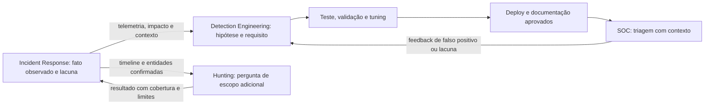
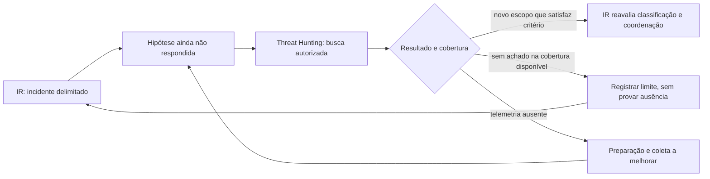

# Fluxos de melhoria: Incident Response, Detection e Hunting

[← Lições aprendidas](lessons-learned.md) · [↑ Índice do módulo](README.md) · [Página principal](../README.md) · [Tabletop →](tabletop-exercises.md)

Uma resposta pode revelar lacunas de detecção ou perguntas que merecem busca mais ampla. Isso cria colaboração entre funções, sem misturar seus objetivos: Detection Engineering constrói e mantém sinais; Threat Hunting testa hipóteses sobre atividade que pode não ter alertado; Incident Response coordena um caso que atende critérios organizacionais.

## Incidente para melhoria de detecção

No fluxo com Detection, compartilhe observações minimizadas, fontes e lacunas. A equipe de detecção traduz isso em hipótese, requisitos de telemetria, teste e mudança conforme seu processo. Uma regra nova não deve ser implantada diretamente durante o caso sem governança de mudança.

## Incidente para pergunta de Hunting

O hunting continua guiado por hipótese e cobertura, conforme [módulo 09](../09-Threat-Hunting/README.md). O IR continua dono da coordenação do caso; um achado potencialmente relevante é devolvido com fonte, janela e limitações para reavaliação formal. A ausência de correspondência não encerra automaticamente incidente.

## Registro de interface entre equipes

Compartilhe apenas o necessário: ID interno do caso, pergunta, entidades minimizadas, janela e timezone, fontes autorizadas, significado de resultado, restrição de divulgação, responsável e como devolver achados. Defina controle de acesso. Não publique evidência real em issues ou portfólio.

---

[← Lições aprendidas](lessons-learned.md) · [↑ Índice do módulo](README.md) · [Página principal](../README.md) · [Tabletop →](tabletop-exercises.md)
