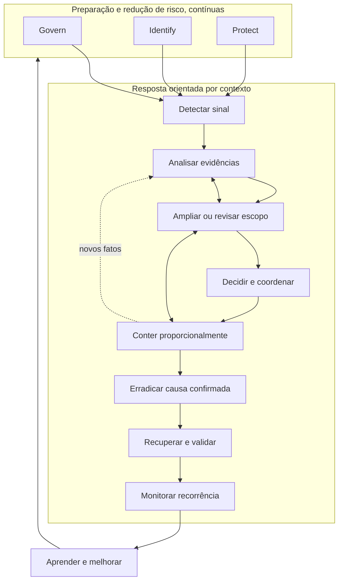
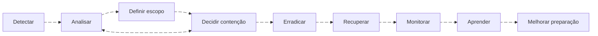

# Framework de resposta

[← Índice do módulo](README.md) · [Página principal](../README.md) · [Preparação →](preparation.md)

## Um modelo, não uma receita

O NIST SP 800-61 Rev. 3 foi finalizado em 2025 e integra resposta a incidentes ao CSF 2.0. O guia relaciona preparação e gestão de risco às funções Govern, Identify e Protect, e resultados de resposta às funções Detect, Respond e Recover. O CSF descreve resultados desejados, não uma sequência obrigatória de tarefas nem uma estrutura única de equipe. Organizações adaptam os resultados ao risco, setor, porte, obrigações e capacidade.

Este curso mantém Preparation, Identification, Containment, Eradication, Recovery e Lessons Learned porque são conceitos operacionais úteis. São a organização pedagógica local deste módulo, não “as seis fases do NIST atual”. A publicação anterior, SP 800-61 Rev. 2, descrevia um ciclo de quatro fases. Consulte a publicação atual antes de copiar modelos antigos para políticas.



O fluxo abaixo anima apenas a passagem entre etapas. A animação é uma ajuda visual; a resposta pode voltar a analisar ou ampliar escopo. Se o visualizador não suportar animação, a sequência continua legível pelas setas.



Fonte e renderização vetorial: [diagrama SVG](../assets/images/10-incident-response/response-flow.svg) · [fonte Mermaid](../assets/images/10-incident-response/response-flow.mmd). A fonte oficial descreve [animação de arestas Mermaid](https://mermaid.js.org/syntax/flowchart.html).

Uma situação urgente pode demandar contenção antes de uma investigação completa. Nesse caso, registre o fato que justifica a urgência, o que continua desconhecido, quem autorizou, qual risco operacional foi aceito e quando a decisão será revista. Preservação de evidência e limitação de dano devem ser consideradas em conjunto. Uma exigência imediata de segurança ou continuidade pode prevalecer, com documentação do impacto na evidência.

## Ciclo operacional usado neste repositório

```text
Preparar → detectar e identificar → analisar e delimitar
       → decidir e conter → erradicar → recuperar e validar
       → monitorar → aprender e melhorar a preparação
```

Use isso para ensinar a coordenação. Na prática, o ciclo não é linear: novas evidências mudam escopo e decisões. A análise de risco, a comunicação e o registro ocorrem ao longo do caso. As páginas deste módulo detalham cada capacidade e os laboratórios integram várias delas.

## Resultado de uma boa resposta

No encerramento, a equipe deve conseguir explicar, dentro das limitações: o que aconteceu; qual evidência sustenta a conclusão; quais ativos e pessoas podem ter sido afetados; que ações foram tomadas e por quem; como a causa foi removida; como a recuperação foi validada; o que permanece desconhecido; e quais melhorias têm responsáveis e critérios de conclusão.

## Referências

- [NIST SP 800-61 Rev. 3](https://csrc.nist.gov/pubs/sp/800/61/r3/final).
- [NIST Cybersecurity Framework 2.0](https://www.nist.gov/cyberframework).
- [NIST Incident Response Project](https://csrc.nist.gov/projects/incident-response).
- [Mermaid flowchart syntax](https://mermaid.js.org/syntax/flowchart.html), documentação oficial para animações de arestas.

---

[← Índice do módulo](README.md) · [Página principal](../README.md) · [Preparação →](preparation.md)
