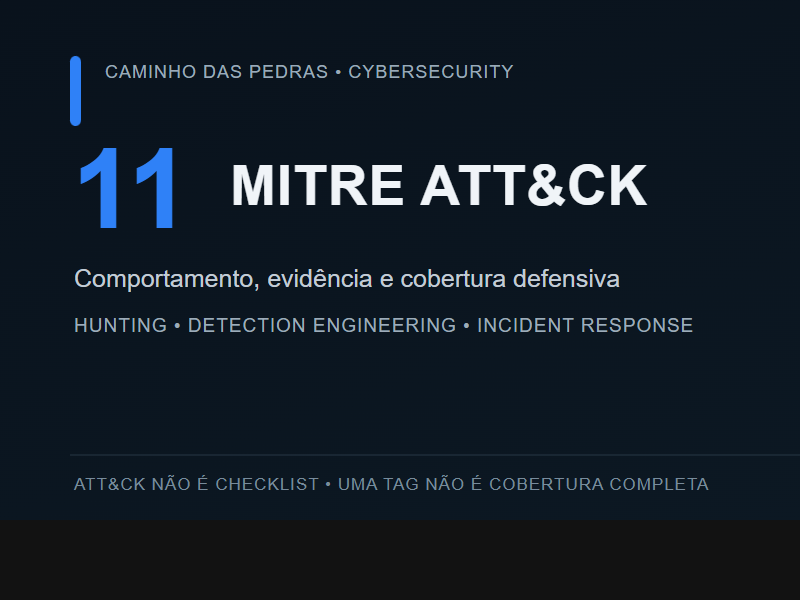
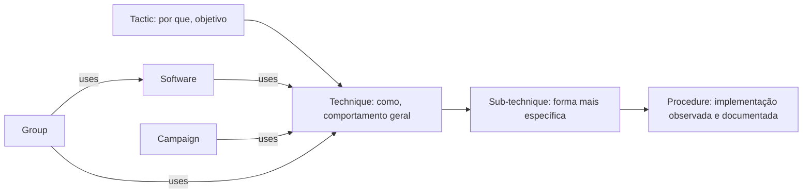
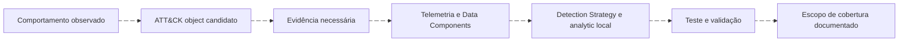
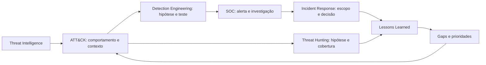

# 11: MITRE ATT&CK

[← Módulo 10: Incident Response](../10-Incident-Response/README.md) · [Página principal](../README.md) · [Próximo módulo: labs práticos →](../12-Labs-Praticos/README.md)



> Se uma regra possui a tag `T1059.001`, isso significa que temos cobertura contra PowerShell?

**Não.** Uma regra pode detectar apenas uma manifestação estreita associada à subtécnica. A tag é uma hipótese de mapeamento que precisa ser sustentada pelo comportamento observado. Cobertura depende da plataforma, dos dados coletados, dos campos disponíveis, da lógica, do deployment e de testes.

**ATT&CK version: 19.2**

**Data da validação: 2026-09-29**
Domínio prioritário: Enterprise. A validação é uma fotografia editorial. Não existe atualização automática neste material. Consulte o [versionamento](versioning-attack.md) antes de reutilizar exemplos.

## ATT&CK não é checklist

```text
Técnica mapeada ≠ técnica coberta por completo
Todas as células coloridas ≠ ambiente protegido
100% da matriz ≠ objetivo defensivo universal
```

Uma matriz menos colorida e honestamente documentada pode ser mais útil que uma matriz inteira marcada sem validação. O ATT&CK organiza conhecimento sobre comportamentos observados. Não mede sozinho a segurança, maturidade, probabilidade de ataque ou eficácia da sua equipe.

## O que é MITRE ATT&CK?

MITRE é a organização sem fins lucrativos que mantém vários programas de pesquisa. **ATT&CK** é uma base de conhecimento sobre táticas, técnicas e comportamentos adversários observados. A sigla significa *Adversarial Tactics, Techniques, and Common Knowledge*. Trate o acrônimo como contexto, não como conteúdo para decorar.

O projeto separa domínios. **Enterprise** é o foco aqui por sua relação com endpoints, identidade, cloud, redes, SOC, hunting e engenharia de detecção. **Mobile** descreve comportamentos em dispositivos e ecossistemas móveis. **ICS** aborda sistemas de controle industrial, ativos e processos próprios de ambientes operacionais. Não transfira um mapeamento entre domínios sem validar objeto, plataforma e contexto.

## Como o ATT&CK se organiza



Uma técnica pode estar associada a várias táticas e plataformas. Procedures são exemplos de uso descritos no conteúdo e nas relações, não uma classe independente de objeto STIX. Relações publicadas não são prova sobre seu ambiente. Veja [procedures](procedures.md).

## Behavior → Telemetry → Detection



Comece pelo que a regra ou investigação realmente observa. Depois descreva o comportamento, escolha o objeto ATT&CK mais preciso que a evidência suporta, registre os dados necessários e declare o limite de cobertura.

## ATT&CK como linguagem comum



Os módulos anteriores têm papéis distintos: [05 SOC](../05-SOC-Blue-Team/README.md) coordena triagem; [06 SIEM](../06-SIEM-na-Pratica/README.md) fornece contexto de telemetria; [07 buscas](../07-Buscas-e-Queries-em-SIEM/README.md) ensina consultas; [08 Detection Engineering](../08-Detection-Engineering/README.md) constrói e valida detecções; [09 Threat Hunting](../09-Threat-Hunting/README.md) testa hipóteses; [10 Incident Response](../10-Incident-Response/README.md) conduz casos. Este módulo fornece uma linguagem versionada para conectar resultados sem substituir esses conteúdos.

## O que você aprenderá

| Etapa | Pergunta | Entrega |
| --- | --- | --- |
| Fundamentos | O que o objeto descreve e em qual domínio? | Leitura de técnica com contexto e versão |
| Comportamento | Que evidência sustenta o mapeamento? | Registro observação → comportamento → ATT&CK |
| Telemetria | Que dado e campo podem observar a manifestação? | Mapa de telemetria e limitações |
| Detecção | O que uma Detection Strategy e um analytic local cobrem? | Mapeamento testável e independente de SIEM |
| Cobertura | Quais lacunas permanecem? | Assessment e layer com legenda |
| Operação | Como ATT&CK apoia SOC, Hunting e IR? | Relatórios com pergunta e decisão explícitas |

## Conteúdo

- [Fundamentos](fundamentals.md)
- [Táticas Enterprise](tactics.md)
- [Técnicas](techniques.md) e [subtécnicas](sub-techniques.md)
- [Procedures](procedures.md) e [Software, Groups, Campaigns](software-groups-campaigns.md)
- [Data model](attack-data-model.md), [plataformas](attack-to-telemetry.md) e [leitura de técnica](reading-attack-technique.md)
- [Detection Strategies e Analytics](detection-strategies.md), [mapeamento](detection-mapping.md) e [cobertura](detection-coverage.md)
- [Navigator](attack-navigator.md) e [três layers de exemplo](navigator-layers/README.md)
- [ATT&CK para SOC](attack-for-soc.md), [Detection Engineering](attack-for-detection-engineering.md), [Threat Hunting](attack-for-threat-hunting.md) e [Incident Response](attack-for-incident-response.md)
- [Mitigações](mitigations.md), [STIX e dados legíveis por máquina](attack-data-and-stix.md), [anti-patterns](mapping-anti-patterns.md)
- [Labs](labs/README.md), [template de mapping](TEMPLATE-ATTACK-MAPPING.md) e [assessment de cobertura](TEMPLATE-COVERAGE-ASSESSMENT.md)

## Checklist

- [ ] Entendi o objetivo do ATT&CK.
- [ ] Diferenciei tática, técnica, subtécnica e procedure.
- [ ] Entendi que ATT&CK não é timeline nem checklist.
- [ ] Validei versão e estado do objeto.
- [ ] Parti de comportamento e evidência, não de uma ID.
- [ ] Relacionei telemetria e Data Components.
- [ ] Diferenciei Detection Strategy de analytic.
- [ ] Documentei cobertura parcial e gaps.
- [ ] Usei layer com legenda e comentário.
- [ ] Completei o assessment de cobertura.

## Referências principais

- [Version history](https://attack.mitre.org/resources/versions/) mostra a versão corrente e arquivos históricos.
- [Updates](https://attack.mitre.org/resources/updates/) explica releases recentes e seus changelogs.
- [Enterprise tactics](https://attack.mitre.org/tactics/) apresenta as táticas válidas no catálogo atual.
- [ATT&CK Data Model](https://mitre-attack.github.io/attack-data-model/schemas/) documenta objetos STIX e relações.
- [Navigator](https://mitre-attack.github.io/attack-navigator/) permite abrir e anotar layers.

---

[← Módulo 10: Incident Response](../10-Incident-Response/README.md) · [↑ Índice do módulo](README.md) · [Página principal](../README.md) · [Labs práticos →](../12-Labs-Praticos/README.md)
