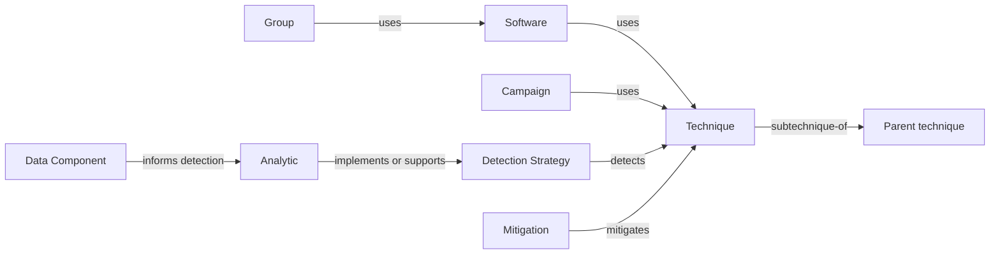

# Modelo de dados ATT&CK

[← Índice do módulo](README.md) · [STIX e dados](attack-data-and-stix.md) · [Procedures](procedures.md) · [Versionamento](versioning-attack.md)

## Objetos ligados por relações

O ATT&CK pode ser entendido como um grafo versionado. Objetos incluem táticas, técnicas, subtécnicas, grupos, software, campanhas, estratégias de detecção, Analytics, Data Components e mitigações. Relações indicam associações tipadas entre objetos. Procedures não constituem uma classe independente de objeto no STIX ATT&CK. São exemplos concretos descritos em conteúdo e relações do conhecimento. Isso não transforma cada associação publicada em prova para qualquer ambiente.

As relações concretas são definidas pelo modelo e pelos dados de cada objeto. O diagrama é conceitual. A relação `detects` entre Detection Strategy e técnica é do vocabulário ATT&CK atual. A associação de Analytics a estratégias e de Data Components à lógica é explicada na documentação defensiva; não leia todas as setas ilustrativas como tipos literais de relacionamento STIX.

## Identificadores

Um ID ATT&CK legível, como `T1136.002` ou `DET0003`, é um identificador externo associado ao objeto. Objetos STIX têm IDs UUID, e relacionamentos também têm IDs próprios sem um ID ATT&CK legível equivalente. IDs ATT&CK devem ser interpretados com domínio e versão porque o contexto importa.

Consulte a especificação oficial do [ATT&CK Data Model](https://mitre-attack.github.io/attack-data-model/schemas/) para tipos e campos e o guia sobre [ATT&CK IDs](https://mitre-attack.github.io/attack-data-model/schemas/attack-ids/) para a diferença entre IDs de objetos.

## Por que o grafo importa

Uma técnica pode ter várias subtécnicas. Uma estratégia pode apontar para técnica e reunir Analytics adequados a plataformas específicas. Componentes descrevem dados relevantes à detecção. Groups, Software e Campaigns trazem contexto de inteligência. Mitigações sugerem formas de reduzir risco. Cada ligação ajuda a fazer perguntas, mas a resposta operacional depende das fontes, versão e ambiente da equipe.

## Exercício

Escolha uma técnica do exemplo e trace um caminho até uma fonte de dados disponível no seu laboratório. Marque cada aresta como relação publicada pelo ATT&CK, associação explicativa do material ou inferência local. Identifique onde a evidência termina e onde começa a hipótese.
