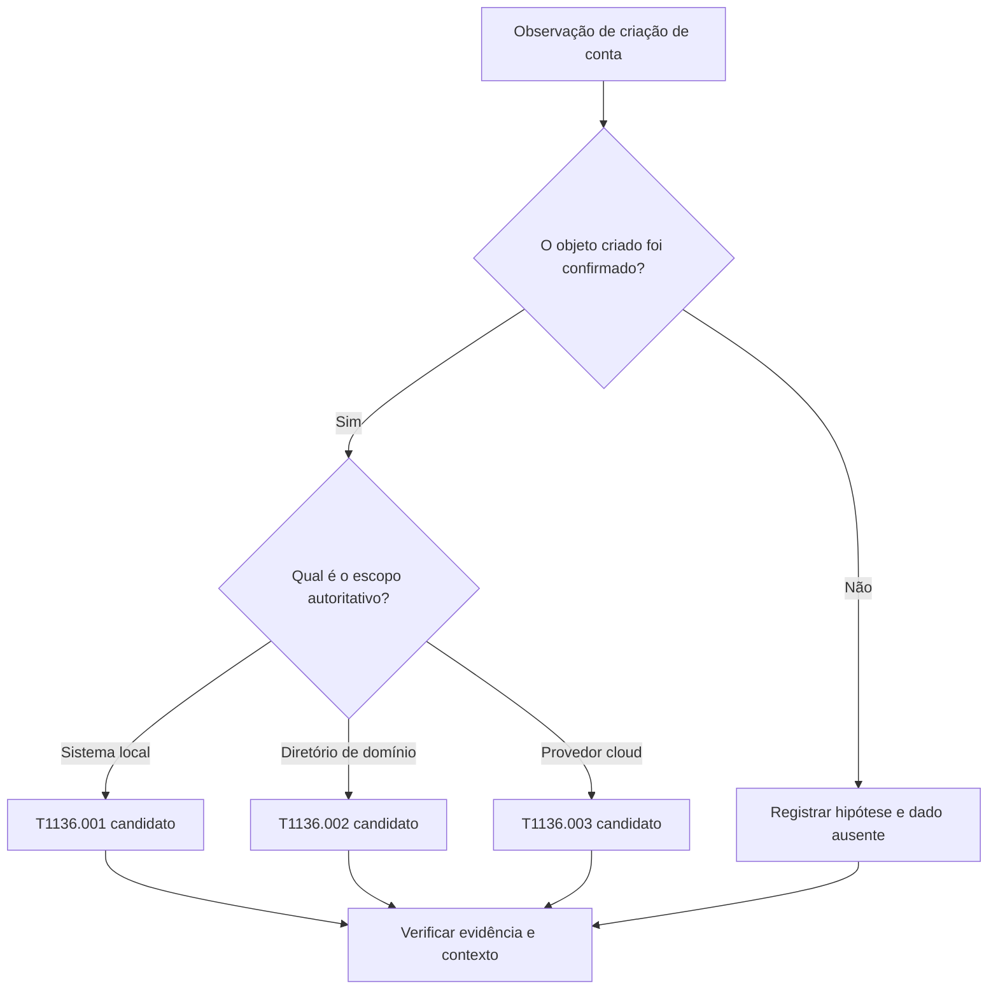

# Subtécnicas

[← Índice do módulo](README.md) · [Técnicas](techniques.md) · [Procedures](procedures.md) · [Página principal](../README.md)

## Mais precisão exige mais evidência

Uma subtécnica descreve uma forma mais específica de uma técnica. Use-a quando os fatos sustentam a distinção. Se os dados provam apenas que uma conta foi criada, mantenha o mapeamento em [T1136, Create Account](https://attack.mitre.org/techniques/T1136/) até confirmar o tipo de conta.

| ID atual | Nome | Escopo conceitual |
| --- | --- | --- |
| [T1136.001](https://attack.mitre.org/techniques/T1136/001/) | Local Account | Conta criada no contexto local de um sistema. |
| [T1136.002](https://attack.mitre.org/techniques/T1136/002/) | Domain Account | Conta criada no contexto de domínio. |
| [T1136.003](https://attack.mitre.org/techniques/T1136/003/) | Cloud Account | Conta criada em provedor ou serviço de identidade em nuvem. |

Os três objetos e seus nomes foram conferidos na versão Enterprise 19.2 em 2026-09-29. O ID não informa por si só se a ação foi autorizada nem qual intenção ela serviu.

## Event ID 4720 não escolhe a subtécnica

O evento Windows 4720 informa que uma conta de usuário foi criada. O contexto em que o evento foi gerado importa: host, função do sistema, domínio, provedor de identidade, tipo e identificador do objeto. Um número de evento sem contexto não diferencia automaticamente `T1136.001` de `T1136.002` e não descreve contas cloud.

Consulte a documentação oficial Microsoft para [Event 4720](https://learn.microsoft.com/previous-versions/windows/it-pro/windows-10/security/threat-protection/auditing/event-4720). Para uma confirmação defensável, correlacione a auditoria com o diretório ou provedor autoritativo, inventário do host e a identidade que iniciou a mudança, quando essas fontes estiverem disponíveis.

## Fluxo de decisão

Este fluxo ajuda a organizar perguntas. Ele não substitui a página ATT&CK atual nem os registros autoritativos do ambiente.

## Exercício de classificação

Para cada cenário, separe observação, inferência e lacuna:

1. Um Event ID 4720 aparece em um host cuja função ainda não foi identificada.
2. Uma trilha do diretório confirma a criação de um objeto de usuário no domínio.
3. Um log do provedor de identidade registra a criação de um usuário cloud.

No cenário 1, não escolha uma subtécnica ainda. Nos demais, registre a fonte que prova o escopo e verifique se outros dados sustentam a técnica. Em todos, intenção permanece uma investigação contextual.

## Critério de qualidade

Um mapeamento de subtécnica é bom quando cita a evidência discriminante. Se a evidência não permite distingui-la, use o pai ou deixe o mapeamento em aberto. Ausência de evento não prova ausência do comportamento quando coleta, retenção ou cobertura da fonte é desconhecida.
