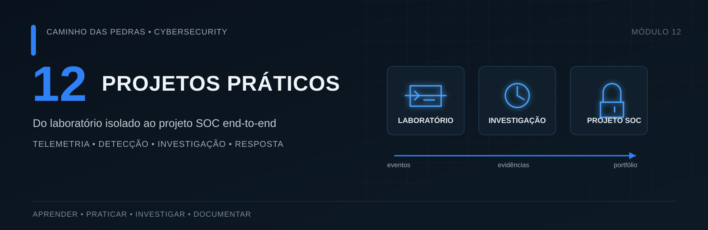
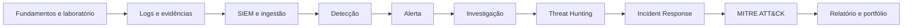
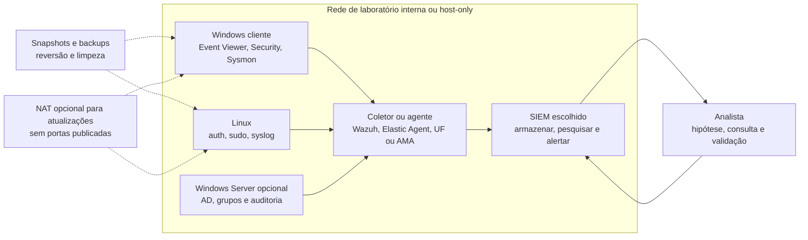
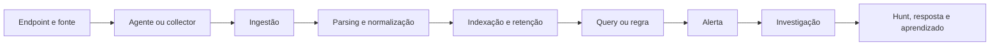

# 12: Projetos Práticos de Cybersecurity

[← Página principal](../README.md) · [Módulo 08: Detection Engineering](../08-Detection-Engineering/README.md) · [Módulo 09: Threat Hunting](../09-Threat-Hunting/README.md) · [Módulo 10: Incident Response](../10-Incident-Response/README.md) · [Módulo 11: MITRE ATT&CK](../11-MITRE-ATTACK/README.md)



Cybersecurity não se aprende apenas lendo. Este módulo transforma conceitos em laboratório isolado, eventos observáveis, consultas, detecções, investigações e projetos que você pode apresentar no portfólio. Cada etapa deixa uma entrega que prepara a próxima. O percurso termina num projeto Blue Team/SOC de ponta a ponta.

> **Princípio de trabalho:** primeiro formule a pergunta, depois identifique os dados e só então escolha uma ferramenta. Uma query que retorna resultados não prova, sozinha, que a hipótese está certa.

## O que você vai construir

| Projeto | Objetivo | Tecnologias | Dificuldade |
| --- | --- | --- | --- |
| Laboratório isolado | Montar VMs, rede controlada, snapshots e inventário. | VirtualBox ou VMware, Windows, Linux | Inicial |
| Pipeline de telemetria | Gerar, conferir, coletar, normalizar e consultar logs. | Windows Event Log, Sysmon, WEF, SIEM escolhido | Inicial a intermediária |
| Detecções testáveis | Escrever lógica para contas e autenticação, avaliar limites e falsos positivos. | KQL, SPL, AQL, Elastic Query DSL, Wazuh Rules | Intermediária |
| Investigação e hunting | Investigar alerta, criar hipótese, pivotar e documentar conclusão. | Logs sintéticos e locais, ferramentas escolhidas | Intermediária |
| Projeto final SOC | Integrar arquitetura, regra, alerta, hunting, resposta e relatório. | Um ou mais componentes já estudados | Intermediária a avançada |

## Como seguir a trilha

Faça os Labs 01 a 03 antes de instalar um SIEM. No Lab 04, escolha **uma** plataforma principal. As etapas seguintes ensinam conceitos e oferecem exemplos de consulta para outras plataformas quando o modelo de dados permite. Não é necessário instalar todos os produtos.



## Arquitetura do laboratório

Comece com uma VM Windows e uma VM Linux numa rede interna ou host-only. Acrescente um servidor Windows com Active Directory apenas quando os exercícios precisarem de domínio e houver recursos suficientes. Coloque o SIEM numa VM própria ou use um workspace remoto com limite de custo. A saída NAT é opcional para obter atualizações. Não faça bridge para redes domésticas ou corporativas e não encaminhe portas do laboratório à Internet.



> **Atenção:** não use uma rede bridged para VMs vulneráveis, não publique RDP, SSH, painel do SIEM ou Active Directory e não coloque credenciais reais no lab. Prefira contas descartáveis, snapshots e um segmento interno sem rota externa.

## Pré-requisitos

- Computador com virtualização habilitada e espaço para snapshots e logs.
- Para duas VMs pequenas, planeje aproximadamente 16 GB de RAM no host. Produtos de SIEM podem exigir mais. Confira requisitos oficiais antes de instalar.
- VirtualBox ou VMware Workstation, imagens de sistema obtidas de fontes oficiais e licenças válidas para o seu uso.
- Conta Microsoft ou de fornecedor somente se escolher um serviço cloud ou trial.
- Familiaridade básica com terminal, endereços IP e leitura de logs. Consulte [fundamentos](../01-Fundamentos/README.md), [redes](../02-Redes/README.md) e [Windows/Linux](../03-Linux-e-Windows/README.md).
- Orçamento definido para qualquer serviço com cobrança por ingestão, armazenamento, VM ou retenção.

## Ambiente recomendado

| Caminho | Bom para | Observações práticas |
| --- | --- | --- |
| Wazuh | Primeira instalação local e pipeline de endpoint. | Gratuito e open source. O quickstart oficial recomenda 4 vCPU, 8 GiB RAM e 50 GB para uma instalação pequena de 1 a 25 agentes. O servidor central roda em Linux. |
| Elastic Stack | Aprender indexação, parsing, ECS, busca e dashboards. | Use instalação local de nó único com recursos Basic gratuitos. Algumas capacidades avançadas podem exigir licença ou trial. Consulte a matriz atual antes de depender de um recurso. |
| Microsoft Sentinel | Praticar KQL e o caminho Azure Monitor/Log Analytics. | O trial atual cobre até 10 GB/dia por 31 dias em até 20 workspaces por tenant. Recursos de Azure e outros serviços podem gerar cobrança. Defina alertas de custo e remova recursos ao terminar. |
| Splunk Enterprise | Praticar SPL, ingestão e investigação. | Instalação local começa com trial Enterprise de 60 dias, limitado a 500 MB/dia; depois há licença Free perpétua com restrições e uso standalone. Splunk Cloud oferece trial curto. |
| IBM QRadar Community Edition | Conhecer QRadar e AQL em hardware de laboratório. | Gratuita e limitada, sem suporte. A oferta atual requer no mínimo 24 GB de RAM e 250 GB de disco, e a licença de 3 meses é renovável. Se o computador não comportar a VM, use os exemplos AQL e os dados sintéticos deste repositório. |
| Sem SIEM instalado | Treinar raciocínio, estrutura de dados e lógica. | Use EVTX/JSON de laboratório autorizado, o conjunto sintético deste módulo e consultas explicadas. Não declare que testou numa plataforma que não executou. |

As condições comerciais e técnicas mudam. Antes de criar uma conta, baixar software ou ingerir dados, confira as páginas oficiais: [Wazuh quickstart](https://documentation.wazuh.com/current/quickstart.html) documenta licença e requisitos; [Elastic subscriptions](https://www.elastic.co/subscriptions) compara recursos Basic e pagos; [preços e trial do Sentinel](https://learn.microsoft.com/azure/sentinel/billing) explica a janela gratuita e cobranças; [downloads e licenças Splunk](https://www.splunk.com/en_us/download.html) informa os limites atuais; [QRadar Community Edition](https://www.ibm.com/community/101/qradar/ce/) descreve licença e hardware. Use [VirtualBox](https://www.virtualbox.org/wiki/Downloads) ou [VMware Workstation](https://www.vmware.com/products/desktop-hypervisor/workstation-and-fusion) conforme seu sistema e termos vigentes.

## Labs disponíveis

| Etapa | Projeto | Entrega principal |
| --- | --- | --- |
| 01 | [Preparando o laboratório](lab-01-preparacao/README.md) | Diagrama, inventário, rede e checklist de isolamento |
| 02 | [Entendendo e gerando logs](lab-02-logs/README.md) | Tabela de eventos e notas de observação |
| 03 | [Sysmon e telemetria de endpoint](lab-03-sysmon/README.md) | Configuração, eventos verificados e limites de coleta |
| 04 | [Escolhendo e montando um SIEM](lab-04-siem/README.md) | Plataforma escolhida, fluxo de dados e teste ponta a ponta |
| 05 | [Detecção de criação de conta](lab-05-detection/README.md) | Regra e mapping delimitados para Event ID 4720 |
| 06 | [Falhas seguidas por login bem-sucedido](lab-06-brute-force/README.md) | Consulta correlacionada, limiar e análise de falsos positivos |
| 07 | [Simulando e validando telemetria](lab-07-telemetria/README.md) | Matriz de comportamento, evento e campo |
| 08 | [Investigação de alerta](lab-08-investigacao/README.md) | Caderno de investigação e timeline com fontes |
| 09 | [Threat Hunting](lab-09-threat-hunting/README.md) | Hipótese, query, pivots e conclusão |
| 10 | [Detection Engineering](lab-10-detection-engineering/README.md) | Ficha de detecção testável e versionada |
| 11 | [Incident Response](lab-11-incident-response/README.md) | Registro de resposta, evidência e recuperação |
| 12 | [MITRE ATT&CK na prática](lab-12-mitre/README.md) | Mapping justificado por comportamento e evidência |
| 13 | [Dashboards úteis para SOC](lab-13-dashboards/README.md) | Painel com indicadores acionáveis e limites |
| 14 | [Projeto Final SOC End-to-End](projeto-final-soc/README.md) | Repositório-portfólio reproduzível e relatório final |

Os seis roteiros detalhados anteriores foram preservados e conectados às etapas: [4625](01-EventID-4625/README.md), [4720](02-EventID-4720/README.md), [Sysmon Event ID 1](03-Sysmon-EventID-1/README.md), [correlação de logins](04-BruteForce-Login-Sucesso/README.md), [coleta Sentinel](05-Microsoft-Sentinel/README.md) e [hunting de PowerShell](06-Threat-Hunting/README.md). São referências de aprofundamento e variações opcionais, não uma trilha paralela obrigatória.

## Fluxo de eventos



Em cada transição, confira o dado real. Um agente ativo não prova ingestão; ingestão não garante parsing correto; parsing não prova que todos os ativos enviaram dados; uma query sem resultados não prova que o comportamento não ocorreu.

## Projeto Final

O [Projeto Final SOC End-to-End](projeto-final-soc/README.md) integra uma sequência fictícia de atividade autorizada, coleta, regra, alerta, investigação, hunting, ATT&CK, contenção proposta e relatório. O estudante precisa produzir:

- diagrama e inventário do laboratório;
- queries e uma detecção com teste positivo e negativo;
- evidências anonimizadas e uma timeline com proveniência;
- mapping ATT&CK com versão, evidência e limites;
- assessment de telemetria, falsos positivos e gaps;
- recomendações priorizadas e relatório reproduzível.

Não é necessário publicar endereço IP pessoal, domínio, hostname real, usuário, token, chave, log bruto ou print com informação sensível. O modelo do projeto inclui pastas e exemplos fictícios para separar material seguro do que deve permanecer privado.

## Como documentar seus projetos no GitHub

Use um repositório por projeto ou um diretório com esta estrutura simples:

```text
projeto-soc/
├── README.md
├── diagrams/
│   └── architecture.mmd
├── detections/
│   └── conta-criada.md
├── queries/
│   ├── kql/
│   ├── spl/
│   ├── aql/
│   ├── elastic/
│   └── wazuh/
├── evidence/
│   └── README.md
├── reports/
│   └── incident-report.md
└── data/
    └── README.md
```

No README explique objetivo, arquitetura, versões, pré-requisitos, passos reproduzíveis, resultado esperado, resultado observado, limitações e limpeza. Guarde diagramas editáveis em `diagrams/`, queries por linguagem em `queries/`, regra e testes em `detections/`, capturas já redigidas em `evidence/` e relatórios sem dados pessoais em `reports/`. Em `data/`, publique apenas dados sintéticos ou conjuntos redistribuíveis com licença conferida.

> **Portfólio:** escreva o que você testou de fato e quais dados usou. Se um trecho é exemplo e não foi executado, chame-o de exemplo. Se o resultado não bateu com a expectativa, registre a diferença e a próxima investigação.

Use o [template de laboratório](TEMPLATE-LAB.md) para registrar o percurso. A ficha final de detecção e o relatório estão na pasta do [projeto SOC](projeto-final-soc/README.md).

## Próximos passos

O percurso reaproveita [SIEM](../06-SIEM-na-Pratica/README.md), [queries](../07-Buscas-e-Queries-em-SIEM/README.md), [Detection Engineering](../08-Detection-Engineering/README.md), [Threat Hunting](../09-Threat-Hunting/README.md), [Incident Response](../10-Incident-Response/README.md) e [MITRE ATT&CK](../11-MITRE-ATTACK/README.md). Consulte os módulos relacionados quando precisar aprofundar uma ferramenta ou conceito. O objetivo aqui é juntar as peças numa prática reproduzível.

## Checklist de conclusão

- [ ] Consigo montar um laboratório isolado e reverter mudanças.
- [ ] Consigo reconhecer logs importantes e explicar o contexto do evento.
- [ ] Consigo consultar eventos num SIEM ou num dataset local.
- [ ] Consigo criar e testar uma detecção delimitada.
- [ ] Consigo investigar um alerta e montar uma timeline com evidências.
- [ ] Consigo propor e documentar Threat Hunting baseado em hipótese.
- [ ] Consigo mapear comportamento para MITRE ATT&CK com justificativa.
- [ ] Consigo documentar resposta a incidente sem expor dados sensíveis.
- [ ] Consigo apresentar arquitetura, queries, limites e resultados num portfólio.

---

[← Página principal](../README.md) · [Projeto Final SOC →](projeto-final-soc/README.md)
