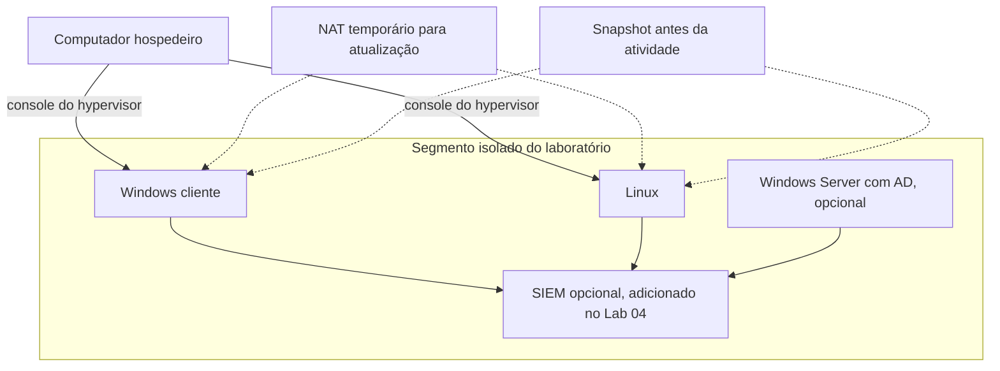

# Lab 01: Preparando o laboratório

[← Índice da trilha](../README.md) · [Página principal](../../README.md) · [Lab 02: Logs](../lab-02-logs/README.md) · [Template](../TEMPLATE-LAB.md)

**Status: roteiro. Ambiente não foi provisionado por este repositório.**

## Objetivo

Montar um espaço isolado e reversível para gerar e investigar eventos sem expor máquinas vulneráveis ou credenciais reais.

## Arquitetura mínima

Comece com uma VM Windows e uma Linux. Use uma rede interna ou host-only, snapshots antes de mudanças e NAT temporário somente para atualizar o sistema. A diferença importa: NAT pode dar saída à Internet, enquanto uma rede interna pode manter as VMs isoladas do host e da rede externa, conforme o hypervisor.

## Escolha de rede

| Modo | Uso didático | Cuidado |
| --- | --- | --- |
| Internal Network | VM conversa com outras VMs no mesmo segmento. | O host normalmente não acessa a rede sem uma interface adicional. |
| Host-only | Host administra e coleta dados das VMs numa rede privada. | Verifique DHCP, rotas e firewall do host. Não crie encaminhamento para fora. |
| NAT | Download de atualização controlado, se necessário. | Pode permitir saída para Internet. Desligue após atualizar e nunca configure port forwarding. |
| Bridged | Não usar neste percurso com máquinas de teste. | Coloca a VM diretamente na rede conectada do host. |

## Passos

1. Ative virtualização no firmware apenas se souber reverter essa configuração e se o hardware exigir.
2. Instale VirtualBox ou VMware a partir do site oficial e registre a versão.
3. Baixe imagem de avaliação ou sistema Linux de fonte oficial e leia os termos de licença.
4. Crie uma rede `lab-interno` e conecte as VMs a ela. Não use bridge.
5. Instale atualizações usando NAT temporário, se necessário, e remova a interface NAT depois.
6. Instale Windows e Linux com nomes fictícios, senha única de laboratório e sem dados pessoais.
7. Desative compartilhamento de pastas e clipboard se não forem necessários. Não compartilhe o diretório de documentos ou credenciais do host.
8. Faça snapshot `base-limpa` e teste que consegue restaurá-lo.
9. Registre host, SO, vCPU, RAM, disco, rede, snapshot e data num inventário.

## Extensão opcional: domínio Active Directory

Faça esta extensão somente se tiver RAM e armazenamento suficientes. Use uma VM Windows Server dedicada, obtida do [Evaluation Center oficial](https://www.microsoft.com/evalcenter/evaluate-windows-server-2025), e uma rede interna sem rota para sua rede doméstica ou corporativa. A avaliação publicada pela Microsoft tem prazo e condições de ativação; confirme os termos vigentes antes de instalar.

1. Crie o servidor na rede `lab-interno`, sem interface bridged. Use uma sub-rede privada reservada ao seu laboratório, por exemplo `10.20.0.0/24`, e documente o plano de endereçamento.
2. Instale Windows Server e aplique atualizações por NAT temporário. Desconecte NAT ao concluir e crie snapshot `server-base`.
3. No Server Manager, instale as funções **Active Directory Domain Services** e **DNS**. Promova o servidor como primeiro controlador de um novo domínio de laboratório, por exemplo `lab.test`. Use senha de recuperação única, não reutilizada, e guarde-a fora do GitHub.
4. Configure o cliente Windows da VM para usar o DNS do controlador de domínio. Associe somente esta VM ao domínio de teste e confirme o logon com uma conta descartável.
5. Verifique que o controlador e o cliente continuam na rede interna e sem rota para o host ou para fora. Tire snapshots de ambas as VMs antes das alterações de grupo.

> **Atenção:** não conecte um controlador de domínio de laboratório a uma rede de produção, não reutilize credenciais e não publique nomes, endereços, senhas ou capturas com dados pessoais. O domínio `lab.test` é apenas um nome de exemplo para ambiente isolado, não uma recomendação para produção.

## O que observar

O host não deve anunciar serviços da VM à rede local. Confirme a interface e o endereço dentro de cada convidado e revise rotas. Teste a comunicação somente entre VMs planejadas. Se habilitar RDP ou SSH, restrinja ao segmento privado e desligue quando terminar.

> **Atenção:** licenças de Windows cliente e Windows Server dependem da imagem, edição, prazo de avaliação e uso. Consulte a [avaliação oficial do Windows Server](https://www.microsoft.com/evalcenter/evaluate-windows-server-2025) e os [termos de licenciamento Windows](https://www.microsoft.com/licensing/terms/productoffering/WindowsDesktopOperatingSystem/all). Não contorne ativação ou limites da imagem.

## Entrega para o portfólio

Publique um diagrama, um inventário sanitizado e o checklist de isolamento. Não publique endereço de rede doméstica, nome real do host, serial, chave de produto ou print com conta pessoal.

## Limpeza

Desligue VMs, desconecte NAT, confirme que não há port-forwarding e mantenha o snapshot. Apague discos da VM apenas se tiver certeza de que não precisa deles e que não guardam evidência ainda necessária.

**Próximo:** [Lab 02, entendendo e gerando logs](../lab-02-logs/README.md).
