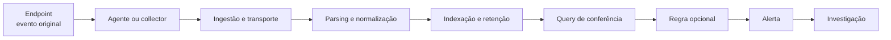

# Lab 04: Escolhendo e montando um SIEM

[← Índice da trilha](../README.md) · [Página principal](../../README.md) · [Lab 03: Sysmon](../lab-03-sysmon/README.md) · [Lab 05: Detecção](../lab-05-detection/README.md)

**Escolha uma opção principal.** O objetivo é compreender o pipeline e verificar o evento original, não instalar todos os produtos.

## Opções de laboratório

| Caminho | Coleta local | Alternativa de baixo custo ou sem instalação | Pré-requisito especial |
| --- | --- | --- | --- |
| **A. Wazuh** | Servidor Wazuh em VM Linux, agents Windows/Linux e dashboard. | É a opção local mais acessível sem licença comercial. Para capacidade pequena, a documentação recomenda 4 vCPU, 8 GiB e 50 GB. | RAM e disco disponíveis no host. |
| **B. Elastic Stack** | Elasticsearch e Kibana nó único, Elastic Agent ou integração Windows. | Licença Basic possui recursos gratuitos, com diferenças em relação aos recursos pagos. Alternativa: praticar Query DSL com JSON de exemplo. | Confira a matriz de assinatura e os recursos que pretende usar. |
| **C. Microsoft Sentinel** | Azure Monitor Agent, Data Collection Rule, Log Analytics e Sentinel. | Trial atual 31 dias, até 10 GB/dia para ingestão Analytics. Também pratique KQL com dataset sintético offline. | Tenant Azure, permissões, custos residuais e revisão após o trial. |
| **D. Splunk** | Splunk Enterprise local, Universal Forwarder e inputs Windows. | Trial 60 dias, 500 MB/dia; Free perpétuo tem limite de volume e de funcionalidades. SPL offline também pode ser estudada sem declarar execução. | Conta para download, recursos da VM e limite de ingestão. |
| **E. QRadar Community Edition** | VM QRadar CE com DSMs e AQL. | Dados sintéticos e snippets AQL deste módulo se a VM não couber no host. | Mínimo atual de 24 GB RAM, 250 GB disco e requisitos de rede. Licença limitada e sem suporte. |

As condições podem mudar. Confirme [Wazuh](https://documentation.wazuh.com/current/quickstart.html), [Elastic](https://www.elastic.co/subscriptions), [Sentinel](https://learn.microsoft.com/azure/sentinel/billing), [Splunk](https://www.splunk.com/en_us/download.html) e [QRadar CE](https://www.ibm.com/community/101/qradar/ce/) antes da instalação. O projeto não é endossado por nenhum desses fornecedores.

## Pipeline que você vai verificar

## Roteiro comum

1. Escolha Wazuh, Elastic, Sentinel, Splunk ou QRadar e registre edição, versão, requisitos e origem do download.
2. Defina orçamento, retenção e limite de ingestão. Para cloud, configure alertas e entenda que alerta de orçamento não bloqueia consumo.
3. Desenhe endpoints, collectors, portas necessárias, destino e trust boundary. Abra somente portas descritas pelo fabricante e apenas na rede de laboratório.
4. Conecte um endpoint Windows e um Linux, se o produto escolhido suportar o agente e o host tiver recursos.
5. Faça o Lab 02 gerar uma observação conhecida. Para Sysmon, use o canal `Microsoft-Windows-Sysmon/Operational` e configure sua coleta explicitamente.
6. Compare o XML/log original com o registro no SIEM. Registre tabela, índice, sourcetype ou decoder real, campos, parser, timezone, atraso e retenção.
7. Procure um 4625 benigno ou um processo `Get-Date`. Não avance para alertas se o evento não estiver visível com contexto correto.
8. Exporte uma query de saúde e anote como limpar agent, DCR, workspace ou VM.

## Conceitos a demonstrar

| Fase | Pergunta de validação |
| --- | --- |
| Coleta | O host e a política permitem que a fonte gere o evento? |
| Ingestão | O evento chega no destino e dentro de quanto tempo? |
| Parsing | Campos extraídos correspondem ao XML ou mensagem original? |
| Normalização | Nome, tipo, timezone e identidade são coerentes entre fontes? |
| Indexação | Qual tabela, índice ou stream recebeu o registro? |
| Retenção | Por quanto tempo fica disponível e que custo ou limite existe? |
| Consulta | A query encontra evento conhecido e também testa casos negativos? |

## Rota seguinte

Use os exemplos multi-SIEM no [Lab 05](../lab-05-detection/README.md) para criar a primeira lógica de detecção. Para o passo a passo detalhado do Azure, veja [coleta no Sentinel](../05-Microsoft-Sentinel/README.md).
