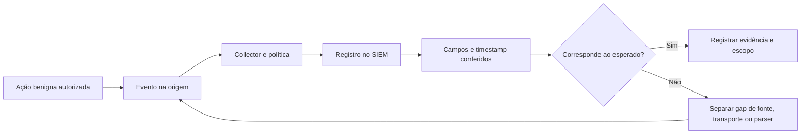

# Lab 07: Simulando e validando telemetria

[← Índice da trilha](../README.md) · [Página principal](../../README.md) · [Lab 03: Sysmon](../lab-03-sysmon/README.md) · [Lab 08: Investigação](../lab-08-investigacao/README.md)

**Objetivo:** exercitar observabilidade de comportamentos benignos, não reproduzir malware nem técnica ofensiva destrutiva.

## Atividades controladas

| Atividade de laboratório | Ação benigna | Fonte possível | Limite |
| --- | --- | --- | --- |
| Autenticação | Uma falha manual e um login permitido com conta descartável. | Windows 4625/4624, Linux `auth.log`/journal | Não aumente tentativas até bloqueio. |
| Usuário local | Conta de teste opcional em VM com snapshot. | Windows 4720/4726, Linux auth/audit conforme configuração | Remova apenas a conta criada pelo lab. |
| Grupo | Grupo local descartável sem privilégio e uma associação. | Windows 4732, Linux audit conforme configuração | Não use Administrators/sudo nem AD de trabalho. |
| Processo | `Get-Date`, `whoami` ou `id` no próprio sistema. | Sysmon 1, Security 4688, Linux audit/process telemetry | Eventos dependem de auditoria e agente. |
| PowerShell | Comando de leitura benigno no terminal da VM. | Sysmon 1, PowerShell Operational 4103/4104 se configuração apropriada | Logging de script pode coletar conteúdo sensível. |
| Arquivo | Criar e editar `lab-nota.txt` numa pasta de teste. | Sysmon 11, auditoria de objetos, Linux audit | Sysmon pode exigir filtro; Object Access precisa de SACL. |
| Rede e DNS | A VM consulta site oficial de documentação durante uma janela curta com NAT. | Sysmon 3/22, firewall, DNS resolver | Não faça scan ou varredura de rede. |
| Firewall | Inspecionar log de bloqueio já ativo ou usar dataset sintético. | Log local do firewall escolhido | Não mude regra do roteador doméstico. |
| M365/Azure opcional | Examine audit logs do próprio tenant de teste, se autorizado. | Microsoft 365 Unified Audit Log, Azure Activity | Ingestão, retenção e licenças variam. Prefira sample data/offline. |

## Sequência de validação

1. Escreva o evento que espera observar e onde ele é produzido.
2. Confirme a política, configuração de agente e filtros antes da atividade.
3. Registre o horário UTC e um identificador fictício do teste.
4. Execute uma ação benigna e única na VM isolada.
5. Confira evento bruto no Event Viewer ou log local.
6. Confira se o collector encaminhou e se os campos preservam valores e tipos.
7. Registre latência, duplicatas, timezone e ausência de campos.
8. Se nada aparecer, diagnostique geração, auditoria, origem, transporte, parser e retenção, uma etapa por vez.

## Conteúdo que não deve entrar no GitHub

Logs brutos podem conter nomes, emails, IPs, command lines e credenciais inseridas por engano. Mantenha-os fora do Git. Publique fixtures artificiais, amostras redigidas e diagrama sem endereço real. Verifique licenças de datasets públicos e condições de redistribuição.

## Entrega

Monte uma matriz evento esperado, fonte habilitada, evidência de origem, destino, schema, atraso, gap e ação. Não chame conectividade do agente de cobertura comprovada.
