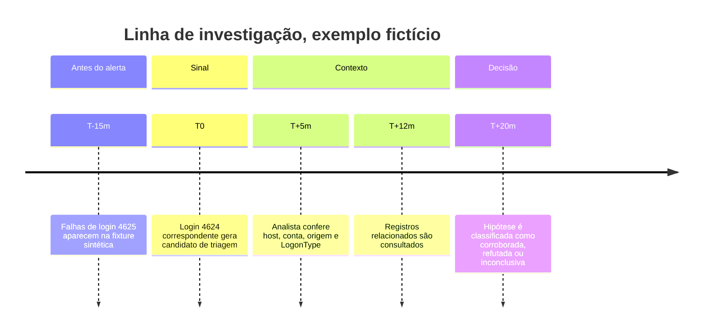

# Lab 08: Investigação de alerta

[← Índice da trilha](../README.md) · [Página principal](../../README.md) · [Lab 06: Correlação](../lab-06-brute-force/README.md) · [Lab 09: Hunting](../lab-09-threat-hunting/README.md) · [Projeto Final](../projeto-final-soc/README.md)

**Cenário inteiramente fictício.** Use o alerta de correlação sintético do Lab 06 ou uma detecção local criada nos Labs 05 a 07.

## Objetivo

Responder perguntas de triagem com dados, fontes e incertezas explícitos. Não transforme um único alerta em conclusão de comprometimento.

## Caderno do analista

| Pergunta | Evidência que deve ser examinada |
| --- | --- |
| O que aconteceu? | Evento original, título do alerta, regra e lógica de disparo. |
| Quando aconteceu? | Timestamp UTC, hora de ingestão e diferença entre fontes. |
| Qual conta foi autora e qual foi alvo? | Subject/Target, identidade, SID e fonte autoritativa. |
| Qual máquina? | Host gerador versus host observado no evento e inventário. |
| Qual processo? | Sysmon/4688 com ProcessGuid/PID, imagem, pai e campos disponíveis. |
| Qual IP? | Endereço de origem no protocolo e evento. IP ausente não é zero. |
| Há eventos relacionados? | Chave válida, janela, mesmo usuário/host/processo e deduplicação. |
| Persistência ou movimento lateral? | Evidência adicional. Não inferir só pela técnica que “poderia” acontecer. |
| Qual a severidade? | Impacto plausível, escopo, privilégio, confiança e urgência segundo critérios locais. |

## Timeline com proveniência

A timeline usa tempos relativos fictícios, não evidência real. Num caso real, use timestamps e fonte de cada registro. Não reordene por colunas ATT&CK.

## Passos de triagem

1. Preserve identificador do alerta, regra, versão, hora e intervalo consultado.
2. Abra o evento bruto e confirme a condição que disparou a regra.
3. Valide timezone, esquema e campos. Observe conta-alvo versus identidade autora.
4. Busque eventos antes e depois com chaves que realmente se correlacionam.
5. Consulte baseline, mudança aprovada, inventário e atividade de suporte.
6. Declare hipótese, evidência favorável, evidência contrária e dado ausente.
7. Escalone conforme runbook local. Não contenha host nem desative conta sem autoridade e decisão apropriadas.

## Entrega

Preencha a ficha de investigação do [Projeto Final](../projeto-final-soc/README.md). Inclua veredito limitado e próxima ação. Não atribua threat actor por ferramenta, IP público isolado ou técnica compartilhada.
