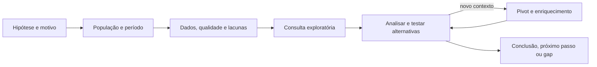

# Lab 09: Threat Hunting por hipótese

[← Índice da trilha](../README.md) · [Página principal](../../README.md) · [Investigação](../lab-08-investigacao/README.md) · [Detection Engineering](../lab-10-detection-engineering/README.md) · [Módulo 09 completo](../../09-Threat-Hunting/README.md)

## Objetivo

Construir uma pergunta testável, consultar dados, analisar resultados, pivotar e documentar uma conclusão com os limites da coleta.

## Hipóteses para este laboratório

- Existe usuário com autenticações falhas fora do padrão esperado?
- Há relação pai/filho de PowerShell incomum para uma população definida?
- Contas são criadas fora da janela e do fluxo habitual de provisionamento?

Escolha uma hipótese e adapte ativos, período e comportamento ao seu ambiente. Os exemplos não presumem ameaça.

## Ciclo de trabalho



## Exemplos iniciais

### KQL, falhas por usuário e host

Assume tabela SecurityEvent e TargetAccount/Computer. Conta é chave; falta de IP não exclui linha nesta busca exploratória.

```kql
SecurityEvent
| where TimeGenerated >= ago(7d) and EventID == 4625
| summarize Failures=count(), FirstSeen=min(TimeGenerated), LastSeen=max(TimeGenerated),
            SourceCount=dcount(IpAddress) by Account=TargetAccount, Host=Computer
| order by Failures desc
```

A consulta mostra volume para investigação, não uma escala de malícia. Compare janela equivalente, população, serviços e contas de teste.

### SPL, relações de processo

Assume campos de evento Sysmon extraídos e indexação correta.

```spl
index=endpoint sourcetype=XmlWinEventLog:Microsoft-Windows-Sysmon/Operational EventCode=1 earliest=-7d
| stats count values(CommandLine) as examples by host User ParentImage Image
| sort - count
```

Escolha uma relação para revisar. Contagens sem denominador e baseline não mostram anomalia por si só.

### Elastic Query DSL, contas criadas

Assume índice Windows ECS e `winlog.event_id` keyword.

```json
GET logs-windows.security-*/_search
{
  "query": {
    "bool": {
      "filter": [
        { "term": { "winlog.event_id": "4720" } },
        { "range": { "@timestamp": { "gte": "now-7d" } } }
      ]
    }
  },
  "aggs": { "actors": { "terms": { "field": "winlog.event_data.SubjectUserName", "size": 20 } } }
}
```

Field mappings variam por integração. Confira se o alvo, autor e computador estão nos documentos antes de agregar.

## Pivot e enriquecimento

Use event original, conta e SID, inventário de ativo, relação de processo, ticket de mudança, DNS ou auditoria do provedor quando disponíveis. Preserve fonte e tempo. Enriquecimento de reputação não substitui contexto interno. Não envie logs da organização a serviços públicos sem autorização.

## Conclusão

Declare hipótese corroborada, refutada ou inconclusiva. Registre dados verificados, amostra, consulta, lacunas, alternativas e próxima ação. Se resultado foi vazio mas a fonte não cobre a população, conclua que a observabilidade é insuficiente.

## Entrega

Use o modelo de [hunt report](../projeto-final-soc/reports/hunt-report-template.md) e relacione melhoria para [Detection Engineering](../lab-10-detection-engineering/README.md).
