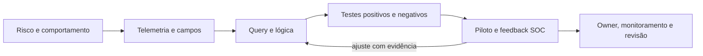

# Lab 10: Detection Engineering

[← Índice da trilha](../README.md) · [Página principal](../../README.md) · [Lab 05: Detecção inicial](../lab-05-detection/README.md) · [Lab 09: Hunting](../lab-09-threat-hunting/README.md) · [Módulo 08 completo](../../08-Detection-Engineering/README.md)

## Objetivo

Converter comportamento relevante em uma detecção documentada, versionada e testável. Use criação de conta ou correlação de logins. A pergunta é o que a lógica observa, não quantas tags ela tem.

## Contrato da detecção

| Elemento | Registro necessário |
| --- | --- |
| Nome e versão | Identificador estável, autor, owner e estado real. |
| Hipótese | Comportamento, risco e população em escopo. |
| Fonte e evento | Auditoria, provedor, canal, query table/index e versão do parser. |
| Campos | Campo original, mapeado, tipo, entidade e null handling. |
| Query | Filtros, agregação, tempo, limiar, chave e deduplicação. |
| ATT&CK | Domínio, versão, ID, justificativa e manifestação limitada. |
| Severidade | Impacto e confiança separados, critérios locais. |
| Falsos positivos | Provisionamento normal, manutenção e atividade legítima semelhante. |
| Tuning | Allowlist estreita, owner, prazo de validade e evidência. |
| Validação | Teste positivo, negativos, campos ausentes, atraso e duplicação. |
| Resposta | Contexto no alerta, triagem, owner e ação permitida. |

Use o [modelo profissional](../projeto-final-soc/detections/account-creation.md) como exemplo inicial. Consulte também [TEMPLATE-DETECCAO do módulo 08](../../08-Detection-Engineering/TEMPLATE-DETECCAO.md).

## Ciclo

## Exemplo de eventos e dados

O 4720 pode alimentar uma detecção de criação de conta. Campos úteis incluem host, autor, alvo, SID e horário. Identifique se a conta é local, domínio ou cloud antes de escolher uma subtécnica ATT&CK. A regra não prova intenção. Uma detecção de conta local pode exigir contexto de inventário do host, política de provisionamento e baseline.

Para brute force, documente limiar e janela como parte da lógica: cinco falhas para mesma identidade/host/origem, em dez minutos, seguidas por sucesso. O projeto KQL correlaciona eventos e inclui fixtures; veja [código e validação sintética](../../queries/kql/04-falhas-seguidas-sucesso.kql).

## Testes e tuning

Antes do piloto, valide evento que deve disparar, evento que não deve disparar, chave ausente, atraso, timezone, duplicação, volume benigno e alteração de schema. Guarde a query exatamente como testada. Tuning deve ser justificado, delimitado, aprovado e revisado. Exceção permanente sem owner vira ponto cego.

## Resultado esperado

Uma ficha que outra pessoa possa reproduzir: fonte, query, comportamento, condição, versão, teste e limites. Se o teste real não foi realizado, marque validação pendente. Não promova para produção pelo resultado de fixture apenas.

**Próximo:** [Lab 11, resposta a incidente](../lab-11-incident-response/README.md).
