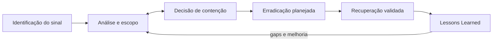

# Lab 11: Incident Response

[← Índice da trilha](../README.md) · [Página principal](../../README.md) · [Investigação](../lab-08-investigacao/README.md) · [MITRE na prática](../lab-12-mitre/README.md) · [Módulo 10](../../10-Incident-Response/README.md)

**Exercício de mesa fictício.** Não crie persistência, não altere grupo privilegiado, não conecte à infraestrutura real e não isole ativos corporativos.

## Cenário

Fixture anonimizada mostra várias falhas de autenticação, um login bem-sucedido no mesmo contexto, processo PowerShell benigno da VM e criação de conta de laboratório. O vínculo entre essas observações não está garantido. Parte do exemplo é atividade autorizada.

## Fluxo de resposta

As decisões podem voltar à análise quando surgem fatos novos. A ordem é uma estrutura de exercício, não cronologia de ataque. Consulte o módulo 10 para preparar playbooks e governança.

## Exercício de mesa

1. **Identification:** descreva alerta, fonte, conta, ativo e limitação sem classificar imediatamente como incidente confirmado.
2. **Containment:** proponha opções reversíveis e seus impactos. Indique quem teria autoridade, quando seria urgente e quais evidências precisam ser preservadas primeiro.
3. **Eradication:** descreva processo seguro para validar/remover somente a conta de teste criada no Lab 02. No cenário fictício, não faça mudanças em sistema real.
4. **Recovery:** defina verificação de identidade, acesso, serviço, monitoramento e critério de retorno.
5. **Lessons Learned:** relacione falha de coleta, regra, handoff ou documentação e owner de melhoria.

## Preservar evidência

Registre horário UTC, timezone, origem, operador, finalidade, integridade e transferência. Exporte apenas logs do sistema de laboratório em armazenamento privado com controle de acesso. Calcule hash local se fizer parte do exercício e não altere o original. Não suba EVTX, PCAP ou logs brutos ao GitHub. Publique somente fixture fictícia ou captura redigida. A cadeia de custódia oficial depende de política e legislação da organização.

## Entrega

Preencha a ficha do [incidente fictício](../projeto-final-soc/reports/incident-report-template.md). Separe decisão proposta de ação executada. Registre evidência a coletar, autoridade de aprovação, reversibilidade, risco, resultado e gap.
