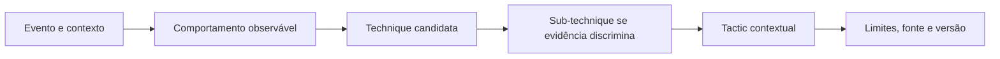

# Lab 12: MITRE ATT&CK na prática

[← Índice da trilha](../README.md) · [Página principal](../../README.md) · [Lab 11: Incident Response](../lab-11-incident-response/README.md) · [Lab 13: Dashboards](../lab-13-dashboards/README.md) · [Módulo 11 completo](../../11-MITRE-ATTACK/README.md)

## Objetivo

Mapear a sequência sintética do laboratório ao comportamento Enterprise atual e justificar cada associação por evidência, não por nome de evento.

## Tabela de mapping

| Evento | Observação | Técnica candidata | Tática plausível | Evidência e limite |
| --- | --- | --- | --- | --- |
| 4625 repetido | Falha de autenticação | T1110.001 pode ser hipótese se padrão e contexto sustentarem tentativa de senha | Credential Access | Uma falha isolada não prova password guessing. |
| 4624 depois das falhas | Logon concluído | Não mapeie automaticamente para Valid Accounts | depende da investigação | Verifique identidade, origem, LogonType, sessão e evidência independente. |
| Sysmon 1 com PowerShell | Processo observado | T1059.001 se a evidência realmente sustenta PowerShell | Execution | Sysmon 1 não prova intenção maliciosa. |
| 4720 em VM independente | Objeto de usuário foi criado | T1136.001 após confirmar conta local | Persistence é possível, não conclusão automática | Autor, alvo, host, escopo e finalidade autorizada são necessários. |
| 4728 ou 4732 | Membro foi adicionado a grupo | Mapear somente se ação e alvo forem entendidos | pode envolver Privilege Escalation ou Persistence conforme comportamento | Confirme tipo do grupo, privilégio e contexto. |

IDs e táticas foram validados no conteúdo Enterprise 19.2 do módulo 11. Sempre confira descrição, domínio, relações e versão no uso futuro. A técnica candidata descreve comportamento possível, não atribuição.

## Método

1. Copie do log uma descrição literal da observação e preserve o evento original em local privado.
2. Procure o objeto vigente que corresponde à ação, não apenas o Event ID.
3. Justifique técnica e subtécnica com campos e contexto.
4. Separe objetivo tático de intenção comprovada.
5. Registre explicação legítima, observação contraditória e dado que falta.
6. Inclua versão, data, URL oficial e grau de confiança local.

## Entrega

Preencha mapping no [relatório final](../projeto-final-soc/reports/incident-report-template.md). Marque cada linha como fato, inferência ou hipótese. Não conclua actor/group e não declare cobertura a partir da tabela.
