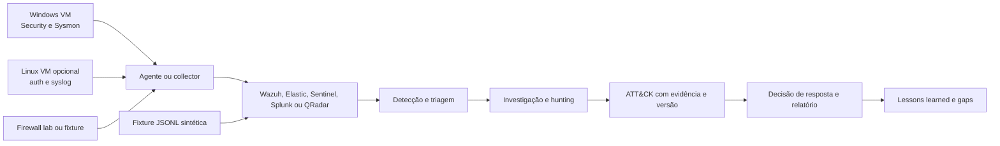

# Projeto Final: SOC End-to-End

[← Índice dos projetos](../README.md) · [Página principal](../../README.md) · [Lab 13: Dashboards](../lab-13-dashboards/README.md) · [Template de laboratório](../TEMPLATE-LAB.md)

**Cenário e eventos sintéticos. Nada neste material representa um incidente executado.**

## Objetivo

Montar um pequeno projeto de portfólio Blue Team que mostre arquitetura, telemetria, detecção, triagem, hunting, mapping ATT&CK, decisões de resposta e limites da análise. Escolha o SIEM já instalado no Lab 04. Sentinel não é obrigatório.

## História de exercício

Uma fixture sintética contém falhas de autenticação e um login de sucesso. Em seguida, há uma observação de processo PowerShell benigno e eventos fictícios de criação de conta e mudança de grupo numa VM de laboratório. A ordem temporal é para praticar pivots. Ela **não prova que os eventos têm o mesmo autor, que um causou outro ou que representam atividade adversária**.

## Arquitetura



Fonte editável: [architecture.mmd](diagrams/architecture.mmd). Adapte a ferramenta, o esquema e o fluxo que você usou. Não deixe uma VM Vulnerável voltada à rede pública.

## Escopo reproduzível

1. Escolha uma fonte de dados local ou use [events.jsonl sintético](data/events.jsonl).
2. Declare a versão, sistema e schema do SIEM. Diferencie importação de fixture da coleta em tempo real.
3. Implemente uma busca por 4720 e uma correlação 4625/4624. Reuse ou adapte os [exemplos multi-SIEM](../lab-05-detection/README.md) e [correlação](../lab-06-brute-force/README.md).
4. Escreva testes positivos e negativos e registre os resultados obtidos de verdade.
5. Investigue o alerta como caso de exercício. Separe eventos independentes, alternativas legítimas e dados insuficientes.
6. Crie hipótese de hunting e registre consulta, resultado, pivot e limitação.
7. Proponha opções de contenção com autoridade, impacto, reversibilidade e condição de decisão. Não execute ação em ambiente real.
8. Escreva relatório e recomendações priorizadas.

## Estrutura do portfólio

```text
projeto-final-soc/
├── README.md
├── data/events.jsonl
├── diagrams/architecture.mmd
├── detections/account-creation.md
├── evidence/README.md
├── queries/README.md
└── reports/
    ├── incident-report-template.md
    ├── hunt-report-template.md
    └── sample-analysis.md
```

O diretório aqui é exemplo didático dentro do curso. Para portfólio, copie a estrutura para seu próprio repositório. Inclua apenas dados sintéticos ou redistribuíveis. Evidência bruta e segredos ficam fora do Git.

## Entregas obrigatórias

- Diagrama e inventário sanitizados.
- Queries, detecção e pressupostos de schema.
- Evidência anonimizada com horário e fonte.
- Timeline e registro de investigação.
- Mapping ATT&CK, versão, justificativa e limites.
- Testes, resultados reais ou status pendente.
- Gaps de fonte, parsing, lógica e resposta.
- Recomendações com responsável e critério de validação.
- Relatório final adequado a leitor técnico.

## Rubrica do projeto

| Critério | Evidência esperada |
| --- | --- |
| Reprodutibilidade | Pré-requisitos, passos, versões, dataset e limpeza. |
| Raciocínio | Hipótese, perguntas, chaves, alternativas e conclusão. |
| Qualidade de dados | Fonte, parsing, horário, cobertura de ativos e lacunas. |
| Detecção | Lógica delimitada, threshold, falsos positivos e testes. |
| Resposta | Evidência, escopo, autoridade e impacto documentados. |
| ATT&CK | Mapping sustentado, versão e ausência de atribuição indevida. |
| Segurança | Ambiente isolado e publicação sanitizada. |
| Comunicação | README claro, diagramas, capturas úteis e limitações honestas. |

## Segurança e custo

Nunca colete logs de produção sem autorização. Não adicione malware nem publique endereços, emails, nomes de host, command lines sensíveis, tokens, chaves ou conteúdo de evento pessoal. Em cloud, limite dados, retenção e tempo de uso; confira fatura e remova recursos de laboratório.

## Conclusão

O trabalho está concluído para portfólio quando outra pessoa entende o que você queria testar, quais dados usou, como reproduzir a análise, o que de fato aconteceu, quais conclusões não foram possíveis e que melhoria você recomenda. Preencha os [templates de incidente](reports/incident-report-template.md) e [hunt](reports/hunt-report-template.md). Compare com a [análise fictícia](reports/sample-analysis.md), que é exemplo, não resultado executado.
