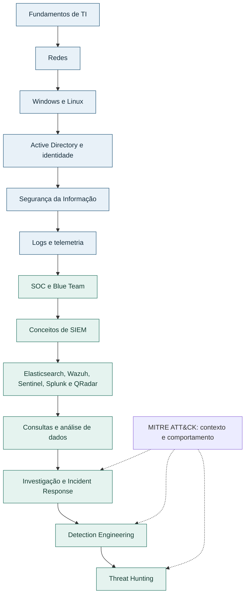

# Caminho das Pedras CyberSecurity

<!-- markdownlint-configure-file {"MD033": {"allowed_elements": ["a"]}} -->

Aprender → Praticar → Documentar → Evoluir.

Um caminho possível para quem quer entrar em Cybersecurity, fortalecer a base técnica e aprender a investigar com método. Estudos, laboratórios defensivos e documentação para conectar infraestrutura, dados e comportamento.


> Antes de reconhecer um comportamento estranho, precisamos entender o que é esperado naquele ambiente. As ferramentas ajudam a enxergar os dados; os fundamentos ajudam a interpretá-los.

**Primeira visita?** Vá para [Comece aqui](#comece-aqui). **Já trabalha com suporte?** Veja como essa base se conecta à [transição para Cybersecurity](#do-suporte-para-cybersecurity). **Quer praticar?** Consulte os [seis roteiros de laboratório](#labs-praticos).

## Índice

- [De onde surgiu o projeto](#origem)
- [Propósito: estudar, praticar e documentar](#proposito)
- [Para quem é este repositório](#para-quem)
- [Trabalho com suporte. Posso ir para Cybersecurity?](#do-suporte-para-cybersecurity)
- [Fundamentos antes das ferramentas](#fundamentos)
- [SIEM é conceito antes de ser produto](#siem)
- [Elasticsearch e análise de logs](#elasticsearch)
- [Wazuh, Splunk, QRadar e Sentinel](#plataformas)
- [Caminho das pedras](#caminho)
- [Comece aqui](#comece-aqui)
- [Como estudar por este repositório](#como-estudar)
- [Os 14 módulos](#modulos)
- [Labs práticos e ideias futuras](#labs-praticos)
- [Consultas e raciocínio sobre dados](#consultas)
- [SOC, identidade e resposta a incidentes](#soc-identidade)
- [Detection Engineering, Threat Hunting e MITRE ATT&CK](#deteccao-hunting)
- [Certificações](#certificacoes)
- [Portfólio, erros e aprendizado](#portfolio)
- [Tecnologias e estrutura](#estrutura)
- [Status e próximos passos](#status)
- [Contribuições e referências](#contribuicoes)
- [Uso ético e licença](#uso-etico)

<a id="origem"></a>

## De onde surgiu o projeto

Minha entrada profissional em tecnologia começou pelo suporte. Esse contato com problemas do dia a dia ajudou a construir uma base que depois passou a fazer cada vez mais sentido em Segurança da Informação: entender sistemas, acessos, serviços, redes e o motivo de uma falha.

O projeto nasceu da vontade de organizar esse caminho. Quem está começando costuma encontrar muitos nomes de ferramentas, certificações e especialidades, mas nem sempre consegue enxergar a ligação entre eles. Quero registrar o que considero importante nessa construção e transformar os estudos em material que outras pessoas também consigam acompanhar.

Ao longo dessa evolução, passei a trabalhar e estudar temas ligados a monitoramento, SOC, análise de alertas, investigação, correlação de logs e resposta a incidentes. Casos de uso, regras, tuning, falsos positivos e análise de evidências passaram a se conectar com assuntos de infraestrutura que eu já vinha aprendendo.

**Elasticsearch teve importância no meu contato prático com pesquisa e análise de logs no contexto de SIEM.** Trabalhar com dados, campos, filtros e agregações ajudou a desenvolver um raciocínio que continuo aprofundando em investigação e detecção.

Essa trajetória reúne experiência prática, contato profissional e estudo. São níveis diferentes de familiaridade, que não devem ser confundidos com domínio de todas as tecnologias citadas aqui. Windows, Active Directory, Microsoft 365, ambientes cloud, firewalls e endpoints compõem o contexto técnico dessa evolução. Vulnerabilidades, mitigação, patches e Threat Intelligence ampliam as perguntas sobre prevenção, exposição e resposta.

Sentinel e KQL fazem parte da trilha atual do repositório. Splunk e QRadar entram como plataformas que quero conhecer e aprofundar; Wazuh, como possibilidade de laboratório próprio. Detection Engineering e Threat Hunting são frentes de aprendizado contínuo. Há sempre uma fonte diferente, uma hipótese a revisar ou uma forma melhor de investigar.

Este é um caminho possível, construído a partir dessa trajetória. O ponto de partida e a ordem de aprofundamento podem ser diferentes para cada pessoa.

<a id="proposito"></a>

## Propósito: estudar, praticar e documentar

| Objetivo | Como aparece no projeto |
| --- | --- |
| **Estudar** | Organizar conceitos importantes e entender por que eles fazem parte do trabalho defensivo. |
| **Praticar** | Transformar o conteúdo em laboratórios, investigações, consultas e exercícios. |
| **Documentar** | Registrar raciocínio, dificuldades, evidências, decisões e aprendizados. |

Cursos e leituras ajudam a começar. Para desenvolver autonomia, também preciso testar o que entendi e explicar o que aconteceu. É nessa passagem do conteúdo para a prática que aparecem dúvidas que uma aula pronta nem sempre resolve.

Estudar o Event ID 4625, por exemplo, apresenta um evento de falha de autenticação. Gerar uma tentativa controlada, encontrar o evento, conferir seus campos, verificar a coleta, pesquisá-lo no SIEM e investigar o contexto exige conectar várias peças. Uma relação com MITRE ATT&CK só entra quando o comportamento e as evidências sustentam esse mapeamento.

A proposta é fazer esse percurso com calma, registrar as limitações e voltar ao conceito quando o resultado não fizer sentido. O portfólio nasce desse processo de aprendizado e desenvolvimento profissional.

<a id="para-quem"></a>

## Para quem é este repositório

- **Quem está começando em TI ou estudando tecnologia:** uma sequência para construir base antes de avançar para ferramentas de segurança.
- **Quem trabalha com suporte, infraestrutura ou operações:** conexões entre conhecimentos já usados no trabalho e sua aplicação em investigação defensiva.
- **Quem busca a primeira oportunidade em SOC ou começa em Blue Team:** estudos de logs, triagem, contexto, incidentes e documentação.
- **Quem está começando com SIEM:** uma visão do caminho do evento, desde a origem até a análise e a decisão.
- **Quem estuda Sentinel ou KQL:** módulos e consultas já disponíveis, com pressupostos e limitações explícitos.
- **Quem explora Elasticsearch, conhece Splunk ou QRadar, ou quer usar Wazuh no laboratório:** conceitos transferíveis e propostas de expansão, ainda sem trilhas próprias para essas plataformas.
- **Quem se interessa por Detection Engineering, Threat Hunting ou portfólio técnico:** exercícios para justificar hipóteses, testar lógica e comunicar conclusões.

Não é preciso conhecer todas as ferramentas para aproveitar o projeto. Identifique o que já consegue explicar e praticar, depois escolha a próxima lacuna a trabalhar.

<a id="do-suporte-para-cybersecurity"></a>

## Trabalho com suporte. Posso ir para Cybersecurity?

Sim. Suporte, infraestrutura e operações de TI podem oferecer uma base valiosa para essa transição. Resolver falhas, conferir acessos, entender serviços e acompanhar o comportamento de uma máquina são atividades que desenvolvem observação e raciocínio técnico.

Isso não significa estar automaticamente preparado para uma vaga de segurança. Ainda será necessário estudar ameaças, telemetria, análise de alertas, resposta e outras competências da função desejada. A vantagem é perceber que parte dos fundamentos talvez já esteja presente no seu dia a dia.

| Conhecimento de suporte ou infraestrutura | Aplicação em Cybersecurity |
| --- | --- |
| Windows | Examinar eventos, processos, serviços e comportamento do endpoint. |
| Active Directory | Investigar identidades, autenticação, grupos, privilégios e mudanças administrativas. |
| Redes, TCP/IP, portas e protocolos | Interpretar conexões, tráfego e comunicação fora do padrão esperado. |
| DNS | Analisar resolução de nomes e relacionar domínios à atividade observada. |
| Troubleshooting e análise de causa | Formular hipóteses, testar explicações e buscar dados que confirmem ou contrariem uma conclusão. |
| Logs | Entender o registro original antes de pesquisar, correlacionar ou criar uma detecção. |
| PowerShell | Fazer consultas administrativas e reconhecer o contexto de execução de comandos. |
| Usuários, acessos e permissões | Avaliar autenticação, autorização, menor privilégio e impacto de uma mudança. |
| Sistemas operacionais e endpoints | Entender o que sensores, EDR e Sysmon observam e quais lacunas permanecem. |
| Atendimento de incidentes | Coletar contexto, priorizar, registrar ações e comunicar uma decisão. |

Antes de investigar uma conexão suspeita, ajuda entender como a comunicação deveria acontecer. Antes de analisar um login, é preciso distinguir usuário, origem, destino, autenticação e permissão. Antes de consultar um log, vale saber qual sistema o produziu, em que condição e com qual configuração de auditoria.

Uma forma de começar a transição é escolher um problema conhecido de suporte e estudá-lo pelo olhar da segurança. Uma falha de login pode virar um exercício de auditoria e investigação. A criação de um usuário pode virar um estudo sobre ator, conta alvo, autorização e rastreabilidade.

<a id="fundamentos"></a>

## Fundamentos antes das ferramentas

Aprender a navegar em um SIEM é útil, mas os cliques não explicam sozinhos o que um resultado significa. Redes, sistemas operacionais, identidade, autenticação, processos, protocolos e endpoints ajudam a formular a pergunta certa.

Também é preciso entender a origem e a qualidade do dado. Um campo vazio pode ser uma característica daquele evento, um problema de parsing ou uma coleta incompleta. Uma consulta sem resultados pode indicar ausência de atividade, mas também uma tabela errada, um intervalo inadequado ou um sensor que parou de enviar dados.

> Ferramentas mudam. Os fundamentos que sustentam uma boa investigação continuam sendo essenciais.

Em um ambiente, a análise pode acontecer no Sentinel; em outro, no Splunk, no QRadar ou em uma stack baseada em Elasticsearch. Em um laboratório, Wazuh pode ajudar a visualizar a coleta e os alertas. Em todos esses cenários, permanece a necessidade de coletar, armazenar, pesquisar, filtrar, correlacionar, contextualizar, detectar, investigar e responder.

<a id="siem"></a>

## SIEM é conceito antes de ser produto

Ao estudar SIEM, quero entender como diferentes fontes se tornam dados úteis para uma operação de segurança. Centralizar eventos é uma parte desse trabalho. O valor depende também de interpretar os campos, conhecer a cobertura, relacionar atividades e produzir contexto para uma decisão.

```text
Fontes de dados
      ↓
Coleta e ingestão
      ↓
Parsing e normalização
      ↓
Armazenamento e pesquisa
      ↓
Correlação e detecção
      ↓
Alerta e investigação
      ↓
Resposta e melhoria
```

Coleta obtém os registros da origem; ingestão os recebe na plataforma. Parsing identifica sua estrutura, e normalização pode alinhar campos de fontes distintas. Depois, pesquisa e correlação permitem analisar atividades por tempo, conta, host ou outra entidade relevante.

Esse fluxo é didático. As plataformas podem distribuir essas etapas de maneiras diferentes, e nem toda consulta precisa gerar um alerta. Durante uma investigação, também é comum voltar ao evento original, descobrir uma lacuna e revisar a coleta.

O [módulo de SOC e Blue Team](05-SOC-Blue-Team/README.md) apresenta essa relação entre dados e operação. As plataformas abaixo ajudam a explorar implementações diferentes dos mesmos problemas.

<a id="elasticsearch"></a>

## Elasticsearch e análise de logs

Meu contato prático com Elasticsearch no contexto de SIEM e análise de logs foi importante para desenvolver o raciocínio sobre dados. Antes de procurar um comportamento, é preciso entender como a informação está organizada e quais campos permitem responder à pergunta.

Nesse estudo, índices organizam documentos; documentos contêm campos; pesquisas e filtros delimitam o que será analisado. Agregações ajudam a resumir conjuntos de dados. No ecossistema Elastic Stack, Elasticsearch participa do armazenamento e da pesquisa, enquanto Kibana oferece interfaces para exploração e visualização. A [documentação da Elastic](https://www.elastic.co/docs) permite aprofundar esses componentes.

Esse contato reforçou algumas perguntas que levo para outras ferramentas:

- Em quais dados a investigação está se apoiando?
- O campo representa o ator, o alvo ou outra entidade?
- Como reduzir um grande volume de eventos sem perder o contexto?
- O que muda quando agrupo por conta, origem, host ou intervalo de tempo?
- A sequência observada sustenta a hipótese ou apenas coincide no horário?

Busca, filtros, agregações, volume de eventos e análise temporal se conectam tanto à engenharia de detecção quanto ao hunting. Uma detecção precisa de campos confiáveis; uma hipótese precisa de dados capazes de testá-la. Correlacionar informações exige conhecer essas condições, independentemente da plataforma.

**No repositório:** a trilha específica de Elasticsearch está planejada. O objetivo será trabalhar estrutura de dados, pesquisa e investigação, sem reproduzir arquiteturas ou informações de ambientes profissionais.

<a id="plataformas"></a>

## Diferentes plataformas, perguntas em comum

### Wazuh como possibilidade de laboratório

Wazuh pode ajudar quem está começando a visualizar monitoramento de endpoints, agentes, coleta, regras e alertas em um ambiente próprio. Sua arquitetura inclui agentes e componentes centrais de análise, indexação e visualização, descritos na [documentação oficial](https://documentation.wazuh.com/current/getting-started/architecture.html).

> Um laboratório com Wazuh pode tornar visível o caminho entre uma atividade no endpoint, o evento coletado, a regra aplicada e o alerta que inicia uma investigação.

A proposta é usar esse ambiente para formular perguntas: o evento chegou? Quais campos foram interpretados? Por que a regra correspondeu à atividade? O alerta faz sentido no contexto? Ele é uma possibilidade de aprendizado, com requisitos de recursos e configuração que precisam ser avaliados. Não há um lab Wazuh implementado neste repositório ainda.

### Splunk e pesquisa com SPL

Splunk oferece outra abordagem para busca, análise, dashboards, correlação, alertas e investigação. SPL, Search Processing Language, faz parte desse ecossistema de pesquisa. A [referência oficial de SPL](https://help.splunk.com/en/splunk-enterprise/spl-search-reference/9.4/introduction/welcome-to-the-search-reference) é um ponto de consulta para seus comandos e funções.

Splunk aparece aqui como uma plataforma relevante para estudo. Uma introdução a ingestão, pesquisa com SPL e análise de eventos está entre as expansões planejadas, sem pressupor experiência avançada ou conteúdo já disponível.

### IBM QRadar e outra arquitetura de SIEM

QRadar permite estudar a relação entre eventos, flows, regras, correlação e offenses. Eventos registram atividades; flows descrevem comunicação de rede. Uma offense reúne contexto de atividades correlacionadas para investigação, conforme a lógica configurada. Consulte a [documentação de eventos e flows](https://www.ibm.com/support/pages/what-are-qradar-events-and-how-do-they-differ-flows).

O interesse é conhecer essa organização e, futuramente, explorar conceitos de pesquisa com AQL. A trilha é planejada e não representa domínio declarado da ferramenta. Conhecer outras arquiteturas ajuda a distinguir conceitos gerais de decisões específicas de cada plataforma.

### Microsoft Sentinel dentro do ciclo de investigação


Sentinel faz parte da trilha para estudar SIEM em ecossistemas Microsoft. O objetivo é percorrer o ciclo completo: fonte de dados → ingestão → entendimento dos dados → consulta → detecção → incidente → investigação → resposta.

Log Analytics e suas tabelas dão contexto ao armazenamento e à consulta dos logs; KQL permite explorar esses dados. Analytics Rules, incidentes e automação entram depois que a fonte e a lógica estão compreendidas. Automatizar uma decisão também exige tratar erros, permissões e impacto.

O [módulo Sentinel](06-Microsoft-Sentinel/README.md) e o [Lab 05](12-Labs-Praticos/05-Microsoft-Sentinel/README.md) já possuem roteiros. Eles representam uma implementação desses conceitos. O raciocínio sobre coleta, qualidade, contexto e resposta também será útil em outras plataformas.

<a id="caminho"></a>

## Caminho das pedras

O percurso abaixo é uma orientação de estudo. Você pode voltar aos fundamentos quando encontrar uma lacuna, praticar uma etapa enquanto estuda outra e aprofundar uma ferramenta conforme sua necessidade. Não existe obrigação de dominar todos os SIEMs para começar em segurança.



MITRE ATT&CK acompanha a investigação, a detecção e o hunting como uma linguagem para descrever comportamentos. O [roadmap com entregas por nível](14-Roadmap/README.md) ajuda a transformar essa visão em objetivos menores.

<a id="comece-aqui"></a>

## Comece aqui

1. **Identifique seu ponto de partida.** Abra o [roadmap](14-Roadmap/README.md) e a [trilha iniciante](14-Roadmap/iniciante.md). Escolha fundamentos que ainda não consegue explicar ou demonstrar.
2. **Entenda o sistema que gera o dado.** Estude [Windows, Linux e auditoria](03-Linux-e-Windows/README.md), usuários, serviços e autenticação.
3. **Prepare um laboratório simples.** Use uma VM própria, rede controlada e snapshot. Comece pelos eventos locais, sem depender de assinatura Azure.
4. **Execute uma atividade pequena.** Siga os Labs 01 e 02 para observar falha de autenticação e criação de conta. Verifique o evento original antes de pensar em alerta.
5. **Aprenda a pesquisar.** Use [KQL com dados sintéticos](07-KQL/fundamentos.md). Para as queries com telemetria do Sentinel, faça o Lab 05 antes dessa etapa.
6. **Explore a coleta em outra plataforma quando fizer sentido.** Wazuh é uma opção para estudo próprio com a documentação oficial; o roteiro específico daqui ainda está planejado.
7. **Documente o que realmente aconteceu.** Copie o [template de lab](12-Labs-Praticos/TEMPLATE-LAB.md), registre erros e publique apenas evidências anonimizadas.
8. **Aumente a complexidade aos poucos.** Modifique filtros, compare contextos, teste correlações e avance para Detection Engineering e Threat Hunting. Conhecer outra plataforma será mais útil quando você souber qual pergunta deseja responder.

<a id="como-estudar"></a>

## Como estudar por este repositório

| Etapa | Pergunta que orienta a prática |
| --- | --- |
| 1. Entenda o conceito | O que estou estudando e por que isso importa? |
| 2. Veja como funciona | Quais componentes, identidades e processos participam? |
| 3. Crie um laboratório | Como reproduzir o comportamento em um ambiente controlado? |
| 4. Gere telemetria | Qual atividade produzirá os eventos necessários? |
| 5. Colete os dados | Como confirmar o caminho da origem até a plataforma? |
| 6. Pesquise | Quais campos, filtros e linguagem estão disponíveis? |
| 7. Investigue | Quem fez o quê, em qual ativo, quando e em qual sequência? |
| 8. Detecte | Esse comportamento justifica uma regra acionável? |
| 9. Mapeie | Existe correspondência válida com uma técnica ATT&CK? |
| 10. Documente | Quais evidências, erros, hipóteses e conclusões sustentam o relato? |
| 11. Evolua | O que muda com outra condição, exceção, fonte ou plataforma? |

O ciclo pode exigir voltar algumas etapas. Se o campo necessário não foi coletado, a solução talvez esteja na auditoria ou no parser, antes da consulta. Se a hipótese não se sustentar, registre o que a análise permitiu aprender.

<a id="modulos"></a>

## Os 14 módulos

Estes são os módulos existentes. Elasticsearch, Wazuh, Splunk e QRadar aparecem como direções de expansão, sem pastas ou cursos próprios nesta versão.

| Módulo | O que você vai aprender | Acesso |
| --- | --- | --- |
| 01: Fundamentos de TI | Recursos de uma máquina, sistemas, virtualização, terminal e Git. | [Abrir módulo](01-Fundamentos/README.md) |
| 02: Redes | TCP/IP, OSI, DNS, DHCP, protocolos e análise de tráfego. | [Abrir módulo](02-Redes/README.md) |
| 03: Linux e Windows | Administração, PowerShell, eventos, Active Directory e Sysmon. | [Abrir módulo](03-Linux-e-Windows/README.md) |
| 04: Segurança da Informação | Risco, identidade, criptografia, hardening e segurança em nuvem. | [Abrir módulo](04-Seguranca-da-Informacao/README.md) |
| 05: SOC e Blue Team | Telemetria, alertas, triagem, contexto e investigação. | [Abrir módulo](05-SOC-Blue-Team/README.md) |
| 06: Microsoft Sentinel | Coleta, Log Analytics, regras, incidentes e automação. | [Abrir módulo](06-Microsoft-Sentinel/README.md) |
| 07: KQL | Filtros, campos, agregações, joins e consultas defensivas. | [Abrir módulo](07-KQL/README.md) |
| 08: Detection Engineering | Casos de uso, qualidade dos dados, testes, tuning e Sigma. | [Abrir módulo](08-Detection-Engineering/README.md) |
| 09: Threat Hunting | Hipóteses, IoCs, TTPs, pesquisa e interpretação de evidências. | [Abrir módulo](09-Threat-Hunting/README.md) |
| 10: Incident Response | Preparação, identificação, contenção, recuperação e melhoria. | [Abrir módulo](10-Incident-Response/README.md) |
| 11: MITRE ATT&CK | Táticas, técnicas e mapeamento justificado por comportamento. | [Abrir módulo](11-MITRE-ATTACK/README.md) |
| 12: Labs práticos | Roteiros reproduzíveis, evidências e resultados documentados. | [Abrir módulo](12-Labs-Praticos/README.md) |
| 13: Certificações | Objetivos de estudo, guias oficiais e conexão com a prática. | [Abrir módulo](13-Certificacoes/README.md) |
| 14: Roadmap | Prioridades e entregas para cada etapa do aprendizado. | [Abrir módulo](14-Roadmap/README.md) |

<a id="labs-praticos"></a>

## Labs práticos

Os seis labs possuem **roteiros iniciais em desenvolvimento**. A existência de um roteiro não comprova execução. Resultados, capturas e aprendizados observados precisam ser registrados depois de realizar o exercício.

| Laboratório | Prática | Situação |
| --- | --- | --- |
| [Lab 01: Falhas de autenticação (4625)](12-Labs-Praticos/01-EventID-4625/README.md) | Investigar uma falha de autenticação Windows sem assumir que ela é maliciosa. | Em desenvolvimento: roteiro inicial |
| [Lab 02: Criação de usuário (4720)](12-Labs-Praticos/02-EventID-4720/README.md) | Identificar criação de conta e distinguir ator, alvo e escopo local. | Em desenvolvimento: roteiro inicial |
| [Lab 03: Sysmon Process Creation](12-Labs-Praticos/03-Sysmon-EventID-1/README.md) | Relacionar processo, pai e linha de comando usando Event ID 1 do Sysmon. | Em desenvolvimento: roteiro inicial |
| [Lab 04: Falhas seguidas de login com sucesso](12-Labs-Praticos/04-BruteForce-Login-Sucesso/README.md) | Correlacionar falhas anteriores a um sucesso sem confundir ordem, conta ou origem. | Em desenvolvimento: roteiro inicial |
| [Lab 05: Coleta e investigação no Sentinel](12-Labs-Praticos/05-Microsoft-Sentinel/README.md) | Montar e verificar o caminho entre evento Windows e consulta no workspace. | Em desenvolvimento: roteiro inicial |
| [Lab 06: Hunt baseado em hipótese](12-Labs-Praticos/06-Threat-Hunting/README.md) | Testar se relações pouco frequentes de PowerShell precisam de investigação adicional. | Em desenvolvimento: roteiro inicial |

**Legenda de status:** planejado significa ideia ainda sem roteiro; em desenvolvimento indica preparação ou revisão do material; executado exige registro da realização; documentado exige relato dos resultados, evidências revisadas e limitações. Um lab documentado ainda pode receber melhorias.

Nenhum dos seis labs está declarado como executado. Prints, dados e resultados reais continuam marcados como TODO. O [índice de labs](12-Labs-Praticos/README.md) reúne pré-requisitos e ordem de execução. Os Labs 01 a 03 podem começar pelo Event Viewer; a etapa KQL com dados coletados depende do ambiente descrito no Lab 05.

### Ideias de laboratórios futuros

| Ideia | Fluxo proposto | Objetivo | Status |
| --- | --- | --- | --- |
| Wazuh | Windows ou Linux → agente → coleta → alerta → investigação | Visualizar monitoramento de endpoints e o caminho dos eventos. | Planejado |
| Elastic | Logs → Elasticsearch → pesquisa → filtros → agregações | Explorar dados de segurança e construir contexto para investigar. | Planejado |
| Splunk | Ingestão → pesquisa com SPL → investigação → alerta | Conhecer outra abordagem de busca e análise de logs. | Planejado |
| QRadar | Eventos e flows → correlação → offense → investigação | Entender conceitos de outra arquitetura de SIEM e pesquisa com AQL. | Planejado |

Essas ideias ainda não têm roteiros ou resultados no repositório. Uma expansão posterior poderá comparar o raciocínio aplicado ao mesmo comportamento em plataformas diferentes, respeitando seus esquemas e capacidades.

<a id="consultas"></a>

## Consultas e raciocínio sobre dados

Uma boa pesquisa começa com uma pergunta. Depois vêm os dados disponíveis, os campos relevantes, os filtros, a correlação e a interpretação. Esse raciocínio pode ser praticado em várias ferramentas.

> Pergunta → Dados disponíveis → Campos relevantes → Filtro → Correlação → Contexto → Conclusão

### KQL como parte da trilha


Quero usar o [módulo KQL](07-KQL/README.md) para evoluir de consultas simples até investigações e detecções que exijam mais contexto:

> Filtrar dados → Selecionar campos → Agrupar eventos → Correlacionar informações → Criar contexto → Identificar comportamento → Investigar → Detectar

O [catálogo KQL](queries/kql/README.md) contém seis exemplos com intenção, funcionamento, falsos positivos e possibilidades de melhoria. As consultas distinguem `SecurityEvent` de `WindowsEvent`; a tabela e os campos reais precisam ser conferidos antes da execução.

### Levando o raciocínio para outras ferramentas

SPL no Splunk, AQL no contexto do QRadar, consultas no Elasticsearch e mecanismos de pesquisa e regras do Wazuh oferecem outras formas de trabalhar com dados. As sintaxes, os tipos, a normalização e os recursos de correlação variam. As linguagens não são equivalentes e uma query não deve ser transportada apenas trocando palavras.

O que pode ser levado de um ambiente para outro é o método: definir o comportamento, identificar a telemetria necessária, escolher chaves e janelas, conferir resultados e procurar explicações alternativas.

<a id="soc-identidade"></a>

## SOC, identidade e resposta a incidentes

### O ciclo de trabalho defensivo

> Telemetria → Alerta → Triagem → Investigação → Contexto → Decisão → Resposta → Melhoria da detecção

Esse ciclo influencia a organização dos módulos. Um alerta precisa de contexto para ser priorizado; uma investigação precisa produzir informação útil para decidir; o resultado pode mostrar uma falha de coleta ou uma oportunidade de melhorar a regra. A ferramenta disponível muda entre ambientes, e o raciocínio do analista precisa se adaptar a essas condições.

Os [playbooks manuais](playbooks/README.md) apoiam a triagem de autenticações e criação de contas. O [módulo de Incident Response](10-Incident-Response/README.md) trata preparação, identificação, contenção, erradicação, recuperação e lições aprendidas. Uma resposta exige avaliar escopo, autoridade e impacto operacional.

### Active Directory e identidade

Identidade conecta pessoas, serviços e recursos. Em ambientes Windows, entender [Active Directory](03-Linux-e-Windows/active-directory.md) ajuda a interpretar usuários, grupos, autenticação, permissões, privilégios e mudanças administrativas.

Na investigação, importa distinguir quem realizou a ação de qual conta foi afetada, confirmar se o escopo é local ou de domínio e acompanhar atividades relacionadas. Criação de contas, alteração de grupos e uso de identidades em diferentes hosts precisam de contexto antes de sugerir abuso ou movimentação indevida.

Esse conhecimento também ajuda a formular perguntas sobre logs de identidade em Microsoft 365 e Entra ID, respeitando as diferenças entre esses serviços e AD DS. O foco aqui é defensivo: visibilidade, menor privilégio, rastreabilidade e investigação.

<a id="deteccao-hunting"></a>

## Detection Engineering, Threat Hunting e MITRE ATT&CK

### Detection Engineering

Escrever uma query é uma parte da detecção. Para que o resultado ajude alguém a agir, é necessário definir o objetivo, a hipótese e o comportamento de interesse, além de verificar se a fonte realmente fornece a telemetria necessária.

| Parte da detecção | O que precisa ficar claro |
| --- | --- |
| Objetivo e comportamento | Qual situação quero identificar e por que ela importa? |
| Fonte e qualidade | Quais eventos e campos existem? Há atraso, perda ou duplicação? |
| Lógica e contexto | Quais condições, entidades e janelas relacionam os dados? |
| Severidade e resposta | Qual é o impacto possível e o que o analista deve verificar? |
| Falsos positivos e tuning | Quais atividades legítimas correspondem à lógica? Como ajustar sem perder cobertura? |
| Validação | Quais testes positivos, negativos e de limite foram executados? |
| Mapeamento e manutenção | Qual comportamento ATT&CK é sustentado? Quem revisa a regra e suas exceções? |

O [template de detecção](08-Detection-Engineering/TEMPLATE-DETECCAO.md) organiza essas decisões. A [regra Sigma inicial](queries/sigma/README.md) permanece experimental e precisa de conversão e teste no backend escolhido.

Uma pessoa deve conseguir entender o comportamento procurado antes de ler a sintaxe da implementação. A lógica poderá exigir adaptações entre Sentinel, Elastic, Splunk, QRadar ou outro ambiente, mas objetivo, dados necessários e limitações precisam continuar claros.

### Threat Hunting

Hunting começa com uma hipótese que possa ser investigada, com escopo e dados definidos. Procurar aleatoriamente por algo que pareça estranho dificulta saber o que foi testado e quando a pesquisa terminou.

> Hipótese → Dados → Pesquisa → Investigação → Evidência → Conclusão

Uma hipótese pode ser confirmada, refutada ou permanecer inconclusiva por falta de dados. Todos esses resultados podem trazer aprendizado quando o raciocínio e a cobertura ficam documentados. Uma atividade rara também pode ser legítima; ausência de resultados não prova ausência de ameaça.

O [módulo de Threat Hunting](09-Threat-Hunting/README.md) e o Lab 06 trabalham essa abordagem. A pesquisa pode acontecer em plataformas diferentes; formular a hipótese e interpretar evidências continuam sendo tarefas centrais.

### MITRE ATT&CK aplicado aos estudos

O [módulo MITRE ATT&CK](11-MITRE-ATTACK/README.md) apresenta táticas, técnicas e subtécnicas como uma linguagem para contextualizar comportamentos. No projeto, ele ajuda a mapear os labs, organizar a cobertura de detecção e enriquecer investigações.

Um Event ID isolado não prova que uma técnica adversária ocorreu. O 4720 registra criação de conta, inclusive em atividade administrativa autorizada. Associá-lo à criação de conta local exige confirmar o escopo; interpretar a intenção exige mais contexto. O mapeamento deve explicar essa relação e suas limitações.

<a id="certificacoes"></a>

## Certificações

| Trilha | Como se conecta aos estudos |
| --- | --- |
| [SC-900](13-Certificacoes/SC-900.md) | Fundamentos de segurança, conformidade e identidade no ecossistema Microsoft. |
| [AZ-900](13-Certificacoes/AZ-900.md) | Conceitos de nuvem, serviços Azure e governança. |
| [SC-200](13-Certificacoes/SC-200.md) | Operações de segurança, investigação e hunting. |
| [Security+](13-Certificacoes/Security-Plus.md) | Fundamentos de segurança em uma abordagem independente de fabricante. |

Uma certificação pode validar conhecimentos e organizar objetivos. O laboratório ajuda a desenvolver prática, testar entendimento e lidar com resultados inesperados. As duas formas de estudo podem se complementar.

As páginas incluem objetivos, temas, links oficiais, labs relacionados e checklists. Consulte a versão dos objetivos aplicável à sua prova. O repositório não cobre sozinho todos os conteúdos e não declara certificações obtidas.

<a id="portfolio"></a>

## Portfólio, erros e aprendizado

### Um portfólio que mostra raciocínio

Este repositório também funciona como portfólio técnico. A quantidade de arquivos importa menos que a capacidade de explicar uma escolha, reproduzir um procedimento e reconhecer o limite de uma conclusão.

Ao documentar uma regra ou investigação, quero conseguir responder:

- Qual comportamento eu queria identificar?
- Qual telemetria estava disponível e em qual plataforma foi analisada?
- Por que escolhi essa lógica, esses campos e essa janela?
- Quais falsos positivos ou explicações legítimas apareceram?
- Como validei o resultado e o que ainda não foi testado?
- O que eu mudaria e como adaptaria a abordagem para outra plataforma?

O relato deve permitir acompanhar o raciocínio, inclusive quando o resultado não confirma a hipótese inicial. Evidências reais, anonimizadas e contextualizadas ajudam a demonstrar evolução técnica sem expor ambientes profissionais.

### Erros também fazem parte

Um evento pode não chegar. Uma query pode usar um campo inexistente. O parser pode produzir uma estrutura diferente da esperada, e uma regra aparentemente boa pode gerar muitos falsos positivos.

Esses problemas merecem registro: o que era esperado, o que foi observado, quais verificações foram feitas, qual causa foi identificada e como a correção foi conferida. Quando a causa continuar desconhecida, isso também deve ficar explícito. Documentar a dificuldade torna o exercício mais útil para quem tentar reproduzi-lo.

<a id="estrutura"></a>

## Tecnologias e estrutura

### Mapa de conceitos e tecnologias

| Grupo | Conteúdo e papel na trilha |
| --- | --- |
| Sistemas e infraestrutura | Windows, Linux, Active Directory, PowerShell, redes e Git/GitHub. |
| Telemetria | Windows Event Logs, Sysmon, identidade, endpoints, firewalls e análise de tráfego com Wireshark. |
| SIEM e análise | Sentinel nos roteiros atuais; Elasticsearch no contexto da experiência e expansão; Wazuh, Splunk e QRadar em estudos planejados. |
| Consultas e pesquisa | KQL disponível; conceitos de busca e agregação no Elastic, SPL e AQL como aprofundamentos futuros. |
| Operação de segurança | SOC, Blue Team, Incident Response, Detection Engineering, Threat Hunting e Threat Intelligence. |
| Ecossistema Microsoft | Sentinel, Log Analytics, Azure Monitor, Defender, Entra ID e Microsoft 365. |
| Formatos e frameworks | Sigma para regras e MITRE ATT&CK para descrever comportamentos e cobertura. |
| Cloud Security | [Identidade, responsabilidade compartilhada, exposição e custos](04-Seguranca-da-Informacao/cloud-security.md). |

Essa relação descreve o contexto e as direções do projeto. Ela não significa que todas as integrações estejam implementadas ou que todas as tecnologias tenham o mesmo nível de aprofundamento.

### Organização principal

```text
Caminho-das-Pedras-CyberSecurity/
  README.md
  CONTRIBUTING.md
  REFERENCIAS.md
  TODO.md
  LICENSE
  01-Fundamentos/
  02-Redes/
  03-Linux-e-Windows/
  04-Seguranca-da-Informacao/
  05-SOC-Blue-Team/
  06-Microsoft-Sentinel/
  07-KQL/
  08-Detection-Engineering/
  09-Threat-Hunting/
  10-Incident-Response/
  11-MITRE-ATTACK/
  12-Labs-Praticos/
  13-Certificacoes/
  14-Roadmap/
  queries/
    kql/
    sigma/
    tests/
  playbooks/
  assets/images/
  scripts/
```

Os módulos organizam os estudos; os labs conectam os conceitos; `queries` reúne consultas e regras; `playbooks` apoia a investigação. As imagens publicadas devem conter apenas material revisado. Logs brutos e dados sensíveis ficam fora do Git.

<a id="status"></a>

## Status e próximos passos

| Frente | Situação atual |
| --- | --- |
| Estrutura e navegação | Base organizada em 14 módulos, com referências e roadmap. |
| Conteúdo didático | Em evolução, com conceitos, práticas e entregas propostas. |
| Labs atuais | Seis roteiros iniciais; execução real e evidências pendentes. |
| KQL | Seis exemplos e um exercício de correlação sintética; validação no workspace pendente. |
| Sigma e detecções | Regra experimental e template; conversão, tuning e validação no ambiente alvo pendentes. |
| Playbooks | Roteiros manuais educacionais, sem automação de contenção implantada. |
| Elastic, Wazuh, Splunk e QRadar | Expansões planejadas, ainda sem módulos específicos. |

A prioridade é executar e documentar os roteiros existentes com dados de laboratório. Depois, aprofundar análise de logs em Elasticsearch, preparar um lab Wazuh e introduzir SPL, Splunk, QRadar e AQL conforme a evolução dos estudos. A [lista de pendências](TODO.md) acompanha outros trabalhos previstos.

O repositório não provisiona infraestrutura automaticamente. Exemplos não equivalem a detecções prontas para produção, e resultados esperados não são evidências de execução.

<a id="contribuicoes"></a>

## Contribuições e referências

Contribuições são bem-vindas: correções técnicas, melhorias de documentação, labs defensivos, consultas, ajustes de detecção, referências, correção de links e exemplos em diferentes SIEMs. Siga o [guia de contribuição](CONTRIBUTING.md) e descreva o que foi testado e o que permanece pendente.

Antes de publicar, revise `git diff` e os arquivos preparados para commit. `.gitignore` ajuda a evitar arquivos indesejados, mas não detecta segredos dentro de documentos nem remove dados já versionados. Revise também capturas, linhas de comando e identificadores.

O comando `python scripts/validate_docs.py` verifica a estrutura básica e os links locais dos documentos. Novas âncoras, diagramas e apresentação visual também precisam de revisão no GitHub.

As [referências do projeto](REFERENCIAS.md) priorizam documentação oficial e fontes técnicas confiáveis. Interfaces, esquemas, recursos e objetivos de certificação podem mudar; confira a documentação da versão utilizada e registre as condições do seu teste.

<a id="uso-etico"></a>

## Uso ético e licença

O projeto tem finalidade educacional e defensiva. Execute os exercícios somente em ambientes próprios, máquinas virtuais de laboratório ou ambientes com autorização explícita. Respeite o escopo e avalie o impacto de qualquer alteração.

Não publique credenciais, dados de clientes, identificadores corporativos ou informações internas. Use evidências reais apenas depois de revisar e anonimizar o material. Uma query é apoio à investigação; sua saída precisa de contexto antes de motivar uma ação de resposta.

Conteúdo disponibilizado sob a [MIT License](LICENSE). Marcas e materiais de terceiros permanecem sujeitos aos direitos de seus titulares.
