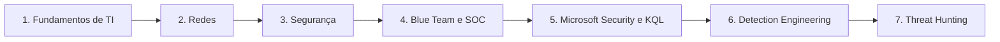

# Caminho das Pedras CyberSecurity

Aprender → Praticar → Documentar → Criar Portfólio.

Laboratório aberto de estudos e documentação em Cybersecurity, com foco em SOC, Blue Team, Microsoft Sentinel, KQL, Detection Engineering e Threat Hunting.

## Objetivo

Reunir uma trilha pessoal de estudo, um laboratório prático e uma base de conhecimento que evoluam para um portfólio verificável. Cada tema conecta conceito, exercício e entrega documentada; resultados reais só serão publicados após execução e revisão.

## Para quem é

Pessoas iniciantes em segurança, estudantes de TI e profissionais que desejam construir base para SOC e Blue Team. Os módulos avançam dos fundamentos até investigação, engenharia de detecção e hunting. Não é necessário ter uma assinatura Azure para começar os estudos e labs locais.

## Comece aqui

1. Leia a [trilha iniciante](14-Roadmap/iniciante.md) e prepare uma VM isolada.
2. Estude [Windows e auditoria](03-Linux-e-Windows/README.md) e execute os Labs 01 e 02 localmente.
3. Aprenda [KQL com dados sintéticos](07-KQL/fundamentos.md). Para consultas com telemetria, configure antes o [Lab 05](12-Labs-Praticos/05-Microsoft-Sentinel/README.md).
4. Copie o [template de lab](12-Labs-Praticos/TEMPLATE-LAB.md), registre evidências anonimizadas e separe resultado esperado de obtido.
5. Avance para correlação, detecção e hunting com testes e limitações documentados.

## Roadmap visual

Consulte o [roadmap com entregas por nível](14-Roadmap/README.md). Linux, Windows, Active Directory, resposta a incidentes e MITRE acompanham a trilha.

## Trilha de estudos

| Módulo | Conteúdo |
| --- | --- |
| 01 — Fundamentos de TI | [Abrir módulo](01-Fundamentos/README.md) |
| 02 — Redes | [Abrir módulo](02-Redes/README.md) |
| 03 — Linux e Windows | [Abrir módulo](03-Linux-e-Windows/README.md) |
| 04 — Segurança da Informação | [Abrir módulo](04-Seguranca-da-Informacao/README.md) |
| 05 — SOC e Blue Team | [Abrir módulo](05-SOC-Blue-Team/README.md) |
| 06 — Microsoft Sentinel | [Abrir módulo](06-Microsoft-Sentinel/README.md) |
| 07 — KQL | [Abrir módulo](07-KQL/README.md) |
| 08 — Detection Engineering | [Abrir módulo](08-Detection-Engineering/README.md) |
| 09 — Threat Hunting | [Abrir módulo](09-Threat-Hunting/README.md) |
| 10 — Incident Response | [Abrir módulo](10-Incident-Response/README.md) |
| 11 — MITRE ATT&CK | [Abrir módulo](11-MITRE-ATTACK/README.md) |
| 12 — Labs práticos | [Abrir módulo](12-Labs-Praticos/README.md) |
| 13 — Certificações | [Abrir módulo](13-Certificacoes/README.md) |
| 14 — Roadmap | [Abrir módulo](14-Roadmap/README.md) |

## Labs disponíveis

| Laboratório | Prática | Situação |
| --- | --- | --- |
| [Lab 01 — Falhas de autenticação (4625)](12-Labs-Praticos/01-EventID-4625/README.md) | Investigar uma falha de autenticação Windows sem assumir que ela é maliciosa. | Roteiro inicial |
| [Lab 02 — Criação de usuário (4720)](12-Labs-Praticos/02-EventID-4720/README.md) | Identificar criação de conta e distinguir ator, alvo e escopo local. | Roteiro inicial |
| [Lab 03 — Sysmon Process Creation](12-Labs-Praticos/03-Sysmon-EventID-1/README.md) | Relacionar processo, pai e linha de comando usando Event ID 1 do Sysmon. | Roteiro inicial |
| [Lab 04 — Falhas seguidas de login com sucesso](12-Labs-Praticos/04-BruteForce-Login-Sucesso/README.md) | Correlacionar falhas anteriores a um sucesso sem confundir ordem, conta ou origem. | Roteiro inicial |
| [Lab 05 — Coleta e investigação no Sentinel](12-Labs-Praticos/05-Microsoft-Sentinel/README.md) | Montar e verificar o caminho entre evento Windows e consulta no workspace. | Roteiro inicial |
| [Lab 06 — Hunt baseado em hipótese](12-Labs-Praticos/06-Threat-Hunting/README.md) | Testar se relações pouco frequentes de PowerShell precisam de investigação adicional. | Roteiro inicial |

**Nenhum desses labs está declarado como executado.** Prints, dados, resultados e aprendizados reais permanecem marcados como TODO. Veja o [índice de labs](12-Labs-Praticos/README.md) para pré-requisitos e ordem de execução.

## Tecnologias utilizadas na trilha

Windows, Linux, PowerShell, Active Directory, Sysmon, Wireshark, Git/GitHub, Azure Monitor/Log Analytics, Microsoft Sentinel, KQL e Sigma. Defender, Entra ID e Microsoft 365 entram como fontes e contexto de investigação. [Cloud Security](04-Seguranca-da-Informacao/cloud-security.md) aborda identidade, responsabilidade compartilhada e custos.

## Microsoft Sentinel e KQL

O [módulo Sentinel](06-Microsoft-Sentinel/README.md) conecta coleta, regras e incidentes. O [catálogo KQL](queries/kql/README.md) contém seis queries comentadas, com fontes, falsos positivos e melhorias. Os exemplos distinguem SecurityEvent de WindowsEvent; valide o esquema real antes de executar.

## Detection Engineering e MITRE ATT&CK

Use o [template de detecção](08-Detection-Engineering/TEMPLATE-DETECCAO.md) para registrar hipótese, telemetria, lógica, severidade, tuning e testes. A [regra Sigma inicial](queries/sigma/README.md) é experimental. O [módulo MITRE](11-MITRE-ATTACK/README.md) ensina mapeamento baseado em comportamento, sem tratar um evento isolado como prova de ataque.

## Threat Hunting e Incident Response

O [módulo Hunting](09-Threat-Hunting/README.md) parte de hipóteses refutáveis. Os [playbooks](playbooks/README.md) organizam a triagem de autenticações e criação de conta; o [módulo de resposta](10-Incident-Response/README.md) cobre preparação, identificação, contenção, erradicação, recuperação e lições aprendidas.

## Certificações

[SC-900](13-Certificacoes/SC-900.md) · [AZ-900](13-Certificacoes/AZ-900.md) · [SC-200](13-Certificacoes/SC-200.md) · [Security+](13-Certificacoes/Security-Plus.md)

Páginas com objetivo, temas, labs relacionados e checklist. Confirme sempre a versão dos objetivos oficiais; a trilha não cobre sozinha todo o programa de uma prova.

## Como utilizar e contribuir

Clone o projeto, escolha uma trilha e produza uma entrega por etapa. Mantenha logs brutos fora do Git. Revise `git diff` e os arquivos preparados antes de publicar; `.gitignore` é uma camada de prevenção, não um detector de segredos.

Correções e novos labs são bem-vindos pelo fluxo de [contribuição](CONTRIBUTING.md). Rode `python scripts/validate_docs.py` para verificar links locais e estrutura dos documentos. Consulte também [fontes](REFERENCIAS.md) e [pendências](TODO.md).

## Status do projeto

- Base didática inicial organizada em 14 módulos.
- Seis roteiros de lab e seis exemplos KQL disponíveis para evolução.
- Templates de lab e detecção, regra Sigma e playbooks manuais incluídos.
- Execução real dos labs, teste de KQL no workspace, conversão Sigma e evidências: pendentes.

O esboço local fornecido orientou a organização; o nome do módulo Sentinel foi padronizado para `06-Microsoft-Sentinel`. O repositório não provisiona infraestrutura e não contém credenciais.

## Uso ético

Material educacional e defensivo. Execute os exercícios somente em ambientes próprios ou expressamente autorizados. Preserve privacidade, respeite o escopo e publique apenas evidências revisadas. Não use as consultas como diagnóstico automático nem implante respostas de contenção sem avaliar o impacto.

## Licença

[MIT License](LICENSE). Marcas e materiais de terceiros permanecem sujeitos aos direitos de seus titulares.
